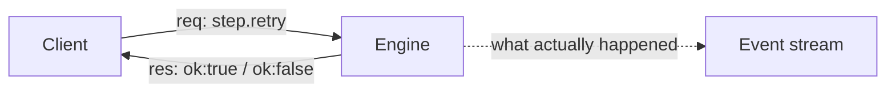

# Control operations

Attach is not read-only: a connected client can ask the engine to *do* something. This is the
reference for the wire shape, the eleven operations this build implements, and the refusal codes.

## Frame shape

A control request and its response are one JSON `api.Frame` each, exchanged over a single
endpoint, `POST /api/control`, correlated by `id`:

```json
{"v":1,"kind":"req","id":"c7","type":"step.retry","payload":{"step":"build"}}
{"v":1,"kind":"res","id":"c7","ok":true}
```

- A response never carries a payload. It only says whether the operation was accepted, and if not,
  why, in `error`. What actually happened shows up in the event stream: that's the only record of
  it.
- A request's payload has exactly one key. A request with any other key is rejected outright.
  `Frame` is plain JSON on purpose, so you can debug it with `curl` alone.



`POST /api/control` is one of six routes:

```
GET  /api/state           a bare RunState
GET  /api/plan            the resolved plan, the same JSON as the run directory's plan.json
GET  /api/logs/{step}     raw log bytes for one step's one stream
GET  /api/stream?from=N   bare Event values as newline-delimited JSON, resuming at seq N
POST /api/control         the Frame request/response above
POST /api/shell           an interactive session on a live step, on a hijacked connection
```

Subscribing and reading logs are not control operations. A [shell session](/docs/attach/shell/) is
`POST /api/shell` instead, since it hijacks the connection and can't be expressed as a frame. Note
that the [stream's](/docs/attach/#snapshot-then-subscribe) resume parameter is `from`, not
`from_seq`.

## The eleven operations

These are the only eleven operations this build supports. Any other `type` value is refused with
`unknown_op`. Each has a declared constant in [`api`](/docs/reference/api/).

| Operation | Argument | What it does |
|---|---|---|
| `run.cancel` | none | Cancels the run. The TUI's `c`/`Ctrl-C` and the CLI's own signal handling (`SIGINT`/`SIGTERM`) issue this, best-effort, with a short timeout |
| `step.retry` | `step` | Retries the named step in place, in the same run, incrementing its attempt count |
| `step.skip` | `step` | Takes a step out of the run. It settles as `skipped_manual` without being dispatched, and so does every step that needs it. See below |
| `breakpoint.set` | `step` | Stops the run before a step. See [Breakpoints](#breakpoints) |
| `breakpoint.clear` | `step` | Releases a held step |
| `run.rerun_from` | `step` | Re-runs a step and everything downstream of it, in a run that is still live. See below |
| `run.pause` | none | Stops the run dispatching anything new. See below |
| `run.resume` | none | Lets it dispatch again |
| `analysis.accept` | `id` | Accepts a [failure analyzer](/docs/analyzers/custom/)'s proposal and performs its remedy |
| `analysis.reject` | `id` | Rejects it; nothing is performed |
| `ws.snapshot` | `step` | Captures that step's workspaces now, for inspection. See [Forcing a snapshot](#forcing-a-snapshot) |

- `step.retry` is a *live* operation. It's different from the [`Retry` policy](/docs/steps/retries/)
  you declare at build time: this is something a human or script asks for after a step has failed
  and exhausted (or never had) an automatic retry. It dispatches one bare attempt directly, so it
  does not re-run the step's `OnFailure`/`Always` handlers. The ledger is the run's permanent,
  append-only event record, and it logs this with a `handler.superseded` event.
- An analysis `id` is the one carried by an `analysis.proposed` event, in the form
  `<step>@<attempt>`. It identifies a proposal, not a step, so a client can't accidentally approve
  a proposal for one step and have it retry another: the engine always retries the step its own
  record says the proposal was about.
- Accepting emits `analysis.applied`; rejecting emits `analysis.rejected`. Once a proposal is
  settled, a second decision on it is refused, so two operators both pressing `a` can't retry a
  step twice.
- Accepting a proposal grants no more power than a client already has. The only remedy this build
  can apply is a retry, using the exact same code path as `step.retry`, including its refusals.
- Every accepted operation also emits a `control.applied` lifecycle event carrying the client's
  identity, so the event stream doubles as an audit trail.

## Refusals are answers, not errors

A refused operation comes back as `ok:false` with a short, machine-readable reason: a code, not a
prose message, so a client can branch on it reliably across releases. An operation either applies
completely or is refused. There's no half-applied state.

| Reason | Meaning |
|---|---|
| `unknown_op` | This build doesn't implement that operation |
| `run_finished` | Nothing is left to act on the request; the run is over |
| `already_cancelled` | The run is already cancelling |
| `run_not_active` | The run is being torn down, so no new work may start |
| `missing_step` | The operation needs a `step` argument and got none |
| `unknown_step` | No such step in this run's plan |
| `step_running` | That step (or, for `run.rerun_from`, something in its closure) is mid-attempt |
| `step_not_failed` | `step.retry` only applies to a step that failed |
| `step_settled` | That step already ran: `step.skip` can't un-run it, and `ws.snapshot` would be a second, later answer to a question its own snapshot already answered |
| `step_not_settled` | `run.rerun_from` has nothing to re-run: that step hasn't run yet |
| `breakpoint_exists` | A breakpoint is already armed on that step |
| `no_breakpoint` | There's no breakpoint on that step to clear |
| `already_paused` | The run is already paused |
| `not_paused` | The run isn't paused, so there's nothing to resume |
| `missing_proposal` | An analysis operation needs an `id` argument and got none |
| `unknown_proposal` | No proposal in this run carries that id |
| `proposal_settled` | Somebody has already accepted or rejected that proposal |
| `no_remedy` | That proposal asked for nothing this build can perform, so there is nothing to apply |
| `no_workspace` | `ws.snapshot` has nothing to capture: that step mounts no workspace, or only cluster-backed ones |
| `snapshot_failed` | The capture itself failed. Not a refusal: nothing was wrong with the request |

## Forcing a snapshot

`ws.snapshot{step}` captures every workspace the named step mounts, right now, and emits one
`ws.snapshot` event per workspace so you can `senro ws pull` the digest and look at the files.

It only works on a step that has **not run yet**. The main use case is a step held at a
breakpoint: the run has stopped there, so nothing is writing to it, and what you capture is
exactly what the step is about to receive.

- A step **mid-attempt** is refused with `step_running`: it's actively writing to the directories
  the capture would read, and a half-written snapshot would be worse than no answer.
- A step that has **settled** is refused with `step_settled`. Its own snapshot, taken when it
  settled, already records what it produced (failures included), and that's the digest `senro ws`
  reports.
- A step with **no workspace**, or only [claim-backed](/docs/executors/kubernetes/) ones whose
  content lives in the cluster, is refused with `no_workspace` rather than silently accepted as a
  no-op.

**A forced capture is never evidence.** It doesn't enter any cache key, doesn't replace a
workspace's recorded state, and doesn't change the plan or what the step's own snapshot will say.
The event carries `"forced": true`, and `senro ws ls`, `ws pull` and `ws diff` skip it, because
those commands report what the run actually produced. The digest stays pinned for the life of the
run, so you can still pull the snapshot later.

The operation name matches the event it causes, just as `breakpoint.set` causes `breakpoint.hit`.
Operations and event types are never mixed on the same channel, so there's no ambiguity.

The capture doesn't block the scheduler's own loop, because a workspace can be gigabytes, and
control requests are served one at a time. The response only arrives once the capture is finished, so
`ok:true` means the snapshot is already in the ledger, not just that the request was accepted.
While a capture runs, the step is treated as busy: a second `ws.snapshot`, a `step.retry`, or a
`step.skip` on it will all get `step_running`.

## What happens below a skipped step

`step.skip` settles the named step as `skipped_manual`. Every step that depends on it, directly or
transitively, also settles as `skipped_manual`, not `skipped_upstream_failed`, and
`ContinueOnError` doesn't rescue them.

That is the rule the engine applies to a step skipped by a `When` condition too. senro
distinguishes two ways a step can stop its dependents:

- **The upstream failed.** Dependents are `skipped_upstream_failed`, the run rolls up as
  `partial`, and `ContinueOnError` is the author's explicit "run anyway" escape hatch.
- **The upstream never ran, but nothing broke.** Dependents inherit the same skip state, the run
  rolls up clean, and `ContinueOnError` doesn't apply here: it promises a dependent survives a
  *failure*, not that it can run against output that was never produced.

A manual skip is always the second case. It doesn't poison the whole graph. Only the transitive
dependents are affected, unrelated branches still run to completion, and the run finishes
`succeeded`.

## Breakpoints

`breakpoint.set{step}` stops the run *before* a step runs. `breakpoint.clear{step}` releases it.
`run.cancel` is the only other way out: a run held at a breakpoint waits indefinitely otherwise.

Nothing inside the engine blocks while it waits. The scheduler simply declines to dispatch that
step, and no parallelism slot is held for it, so the rest of the run keeps making progress
elsewhere.

- The moment the scheduler first withholds the step, it emits `breakpoint.hit` once, naming the
  client that armed it. That's what distinguishes a held step from one still waiting on its
  dependencies: a held step has no `step.started`, no `step.finished`, and no other state change.
  Clients fold this into `StepState.Paused`, and both shipped renderers show it.
- A breakpoint only gates *scheduling*, so it doesn't intercept `step.retry`, which dispatches an
  attempt directly. It does work together with `run.rerun_from`: arm the breakpoint first, then
  rerun.
- A held step is the one state [`ws.snapshot`](#forcing-a-snapshot) is for: nothing is writing the
  step's workspaces, so a capture taken then is exactly what the step is about to be given.

## Pausing the whole run

`run.pause` stops the run from dispatching anything new. `run.resume` releases it. Neither takes
an argument, and `run.cancel` is the only other way out: a paused run otherwise waits
indefinitely.

**A pause is not a breakpoint.** A breakpoint withholds one named step; a pause withholds the
whole plan. The mechanism is the same either way: the scheduler computes what it would dispatch
next and declines, so a paused run answers control requests just as fast as a busy one.

A step already mid-flight is **not** touched. It runs to completion and settles normally, and its
`step.finished` event lands in the stream even while the run is paused. senro has no way to
suspend a running command: there's no checkpoint, and the sandbox, log files, and (on
containers) the daemon process are all still live.

The only thing "pause the running step" could actually mean is *kill it*, and a pause that killed
work would really be a cancel, not a pause. For the same reason, a step's automatic retry policy
keeps running under a pause: that's the step's own execution continuing, not new work starting.

So the promise is the narrow one, **no new work is dispatched**:

- Settling isn't dispatching, so it isn't suppressed by a pause. If a step fails while the run is
  paused, its dependents still settle as `skipped_upstream_failed` right away. If you paused in
  order to retry that step, use `run.rerun_from` to put the dependents back.
- `step.retry` isn't blocked by a pause, just as it isn't by a breakpoint: it dispatches an
  attempt directly. A pause still leaves room for `step.retry`, `step.skip`, and `run.rerun_from`.
- `run.rerun_from` works the other way, because it hands its steps back to the *scheduler* rather
  than dispatching directly. Ask for a rerun while paused, and it's queued, starting once you
  resume.
- You can tell a paused run from a hung one by the `control.applied` event recording the accepted
  `run.pause`. There's no second event, unlike `breakpoint.hit`: a pause takes effect the instant
  it's accepted, with no gap between arming and acting. Clients fold this into `RunInfo.Paused`,
  and the TUI's footer reads `run: paused`.

## Rerunning part of a live run

`run.rerun_from{step}` puts the named step and its transitive dependents back to pending, and
hands them to the scheduler. They run exactly as they did the first time: same parallelism limits,
retry policy, timeouts, cache lookup, and handlers. Nothing outside that set is touched.

- Each re-run step announces itself with `step.retried` under a *new* attempt number. Attempt
  numbers never restart, and both a step's events and its log files are filed under that number
  (`runs/<id>/logs/<step>/<attempt>/{stdout,stderr}`), so the previous run's record stays intact.
- The cache isn't bypassed, and it doesn't need to be. Only a `Pure` step consults the action
  cache, and a pure step's output is by definition a function of its inputs, so serving the
  cached result *is* re-running it. If you want a step's side effects repeated, don't mark it
  `Pure`.
- Handlers run again too, because a rerun is a genuine second execution of the step. The previous
  pass isn't rewritten: `handler.superseded` just marks it as no longer describing the step's
  current outcome.

## Version negotiation

On first contact (`GET /api/state`, before subscribing), a client compares its protocol version to
the engine's. Matching major and minor versions: nothing happens. Matching major but different
minor: a one-time warning, then it proceeds. Different major version: an error naming which side
is out of date, instead of a confusing JSON decode failure:

```
api: engine speaks protocol v2.0, this client speaks v1.0: upgrade your CLI
```

## Where to go next

- **[Security](/docs/attach/security/)**: who is allowed to issue a control operation at all.
- **[The TUI](/docs/attach/tui/)**: the keys that map to these operations.
- **[The browser UI](/docs/attach/browser/)**: which operations `senro ui` offers, and when.
- **[The shell](/docs/attach/shell/)**: `POST /api/shell`, the sixth route.
