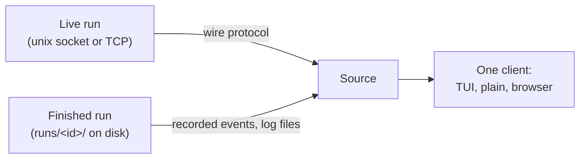

# Attach: the protocol

A `senro` pipeline is an ordinary Go program. `senro attach` is a separate process that connects
to it, renders a terminal UI, sends control operations back, and can open a session inside a live
step. This page covers how the two find each other and what they speak.

## Opting in

A pipeline that never calls `attach.Listen` pays nothing: no goroutine, no socket. Opting in is
one call before `senro.Run`:

```go
att, err := attach.Listen(ctx, attach.Options{
	Bind:          attach.AutoUnixSocket, // <runtime dir>/senro/<pid>.sock; see Discovery below
	Dir:           "",                    // run directory; empty derives runs/<RunID>
	RunID:         "",                    // empty generates one; match senro.WithRunID if you set it
	Pipeline:      p.Name(),              // shown in `senro attach`'s multi-run listing
	WaitForClient: false,                 // block until a client attaches, if true
	ReadOnly:      false,                 // reject control operations and shells, if true
})
if err != nil {
	log.Fatal(err)
}
defer att.Close()

err = senro.Run(ctx, p, senro.WithAttach(att))
```

`Listen` starts an HTTP server on the bound socket, registers the run in a small on-disk registry
so a bare `senro attach` can discover it, and returns an `*attach.Attach`. Its `.Sink()` is what
`senro.WithAttach` hands to the engine: every event the run emits fans out through it.

`Options` has eight fields, all optional; the two not shown are `TLSCertFile` and `TLSKeyFile`
(see [Transport](#transport-unix-socket-or-tcp)). The subtleties:

| Field | Notes |
|---|---|
| `Dir` | The run directory, the same one `senro.WithDir` sets. `GET /api/plan` and `GET /api/logs/{step}` read `plan.json` and `logs/` from it, so a live client sees the same files a post-mortem `senro attach --run <id>` reads. Empty derives `runs/<RunID>`; `att.Dir()` reports which was used |
| `RunID` | Set it to match `senro.WithRunID`, so `senro attach --run <id>` finds the run again after it has finished |
| `Pipeline` | Empty shows the run as `-` in a bare `senro attach`'s multi-run listing |
| `WaitForClient` | Blocks `Listen` until a client subscribes: the only way to debug a pipeline that fails during its own setup, before the first step ever runs |
| `ReadOnly` | Answers every control request with HTTP 403, and refuses a [shell](/docs/attach/shell/) with a 403 before the connection is hijacked. Right for a shared dashboard: watching stays open, driving does not |

## Transport: unix socket or TCP

`Bind` picks the transport by its shape. A filesystem path (or `attach.AutoUnixSocket`, or
nothing at all) binds a unix socket; a `host:port` binds TCP. A value starting with `/`, `./` or
`../` is always a path, however it is spelled.

```go
attach.Listen(ctx, attach.Options{})                       // unix socket, discovered automatically
attach.Listen(ctx, attach.Options{Bind: "/tmp/run.sock"})  // unix socket, your path
attach.Listen(ctx, attach.Options{Bind: "127.0.0.1:0"})    // TCP on a free loopback port
attach.Listen(ctx, attach.Options{Bind: "0.0.0.0:8443",    // TCP, reachable, over TLS
	TLSCertFile: "/etc/senro/tls.crt", TLSKeyFile: "/etc/senro/tls.key"})
```

> **The two are not equivalent.** A unix socket is `0600` in a `0700` directory with a
> peer-credential check; another local user cannot open it at all. A TCP listener is guarded by a
> per-run bearer token and nothing else, and that token can cancel the run, skip steps, and open
> a shell inside a step's workspace.
>
> Loopback binds without TLS. Anything else requires a certificate and is refused without one,
> with no opt-out flag.

`att.Token()` is the credential and `att.Addr()` is the resolved address with the real port. A
bare `senro attach` works on either transport, reading the token from the run's registry entry.
An endpoint with no local registry entry takes the token from `$SENRO_ATTACH_TOKEN` and its
address from a flag: `senro attach --addr 127.0.0.1:8443 --tls`.

[Security](/docs/attach/security/) has the full comparison, and why the honest use of TCP is a
browser on the same machine or a port-forward.

## Discovery

`Listen` writes a small JSON file, `<runtime dir>/senro/<pid>.json`, naming the address, the
transport, the run ID, the pipeline name, and the working directory. For a unix run the socket
sits beside it.

For a TCP run the file also carries the run's bearer token, which is why it is written `0600`
inside a `0700` directory. See [Getting the token](/docs/attach/security/#getting-the-token).

The runtime directory is platform-dependent, and `$XDG_RUNTIME_DIR` is read on Linux only:

| Platform | Runtime directory | Example socket |
|---|---|---|
| Linux, `$XDG_RUNTIME_DIR` set | `$XDG_RUNTIME_DIR` | `/run/user/1000/senro/4711.sock` |
| Linux, unset (common in a container, a `sudo` shell, or a systemd unit without `PAMName`) | `/dev/shm` | `/dev/shm/senro/4711.sock` |
| Linux, unset and no `/dev/shm` | none | `Listen` fails: `neither $XDG_RUNTIME_DIR nor /dev/shm is available to resolve a runtime dir` |
| macOS and everything else | `os.UserCacheDir()` | `~/Library/Caches/senro/4711.sock` |

- A bare `senro attach` reads that registry, reaps entries whose process has died, and attaches to
  the one live entry, or lists them for you to pick with `--pid`.
- `senro attach --run <id>` looks the run up by ID instead: live first over the socket, falling
  back to the recorded run under `runs/<id>/` on disk. See
  [Reading a failed run](/docs/reference/debugging/) for what that directory contains.

## Snapshot, then subscribe

A client attaches with two requests, in order:

```
GET  /api/state                       the current RunState, and the seq it reflects
GET  /api/stream?from=<state.seq+1>   everything that happened since
```

Attaching costs the same however long the run has been going: no replay of a million old events.
The snapshot carries the sequence the subscription resumes from, so there is no diverge race.

## One client, two sources

The client that renders a live run and the client that renders a finished one from disk are the
*same code*, against two implementations of one interface:

```go
type Source interface {
	State(ctx context.Context) (*api.RunState, error)
	Subscribe(ctx context.Context, fromSeq uint64) (<-chan api.Event, error)
	Logs(ctx context.Context, step string, attempt int, stream string, from int64) (io.ReadCloser, error)
	Control(ctx context.Context, req api.Frame) (api.Frame, error)
	Close() error
}
```



The live source speaks the wire protocol. The disk source reads recorded events and log files
directly, answers `Control` with `ErrReadOnly` (there is no engine to send an operation to), and
is otherwise indistinguishable to the renderer. That is what makes the handoff seamless: when the
pipeline process exits under an attached client, it switches sources and scrollback keeps working.

A live source also satisfies a second, optional interface, which is how `senro shell` and the
TUI's `s` key reach a step. The disk source deliberately does not, so a shell against a finished
run is refused with a clear answer rather than a hang. `senro ws pull` is what you want instead.

## Where to go next

- **[The TUI](/docs/attach/tui/)**: the rendered client, its layout and key bindings.
- **[Control operations](/docs/attach/control-ops/)**: the frame protocol and the eleven operations.
- **[The shell](/docs/attach/shell/)**: what a session on a live step can and cannot do.
- **[Security](/docs/attach/security/)**: the two transports and the bearer token.
- **[senro run and attach](/docs/cli/run/)**: the commands, flag by flag.
