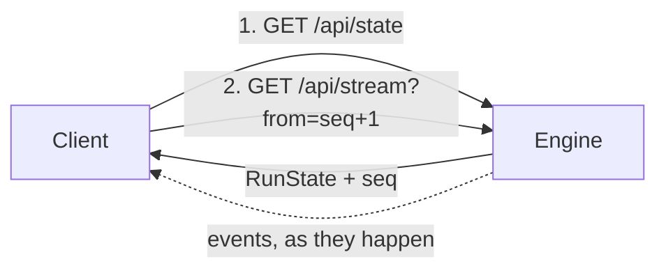
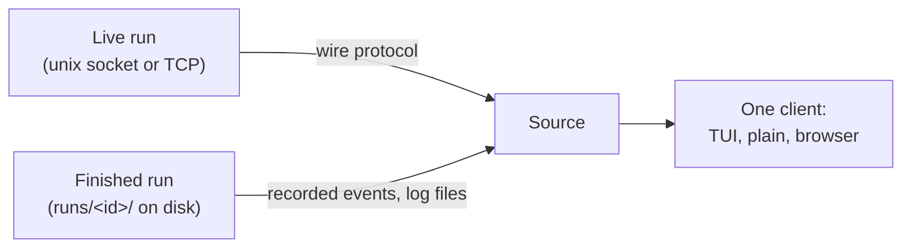

# Attach: the protocol

A `senro` pipeline is just a Go program. `senro attach` is a separate process that connects to
it. It renders a terminal UI, sends control commands back, and can open a session inside a live
step. This page explains how the two find each other, and what they say to each other.

## Opting in

A pipeline that never calls `attach.Listen` costs nothing extra: no goroutine, no socket. To opt
in, add one call before `senro.Run`:

```go
att, err := attach.Listen(ctx, attach.Options{
	Bind:          attach.AutoUnixSocket, // <runtime dir>/senro/<pid>.sock; see Discovery below
	Dir:           "",                    // run directory; empty derives runs/<RunID>
	RunID:         "",                    // empty generates one; match senro.WithRunID if you set it
	Pipeline:      p.Name(),              // shown in `senro attach`'s multi-run listing
	WaitForClient: false,                 // block until a client attaches, if true
	ReadOnly:      false,                 // reject control operations and shells, if true
})
if err != nil {
	log.Fatal(err)
}
defer att.Close()

err = senro.Run(ctx, p, senro.WithAttach(att))
```

`Listen` starts an HTTP server on the bound socket. It also registers the run in a small on-disk
registry, so a bare `senro attach` can find it. It returns an `*attach.Attach`. Its `.Sink()`
method is what you pass to `senro.WithAttach`: every event the run produces goes through it.

`Options` has eight fields, and all are optional. Two aren't shown above: `TLSCertFile` and
`TLSKeyFile` (see [Transport](#transport-unix-socket-or-tcp)). Here's what each field does:

| Field | Notes |
|---|---|
| `Dir` | The run directory: the same one `senro.WithDir` sets. `GET /api/plan` and `GET /api/logs/{step}` read `plan.json` and `logs/` from here, so a live client sees the same files you'd see later with `senro attach --run <id>`. Leave it empty and it defaults to `runs/<RunID>`; `att.Dir()` tells you which was used |
| `RunID` | Set it to match `senro.WithRunID`, so `senro attach --run <id>` finds the run again after it has finished |
| `Pipeline` | Empty shows the run as `-` in a bare `senro attach`'s multi-run listing |
| `WaitForClient` | Blocks `Listen` until a client subscribes. Use this to debug a pipeline that fails during its own setup, before the first step runs |
| `ReadOnly` | Answers every control request with HTTP 403, and refuses a [shell](/docs/attach/shell/) the same way, before the connection is hijacked. Good for a shared dashboard: people can watch, but not drive |

## Transport: unix socket or TCP

`Bind` picks the transport based on its shape. A filesystem path (or `attach.AutoUnixSocket`, or
nothing at all) binds a unix socket. A `host:port` value binds TCP. Anything starting with `/`,
`./` or `../` is always treated as a path.

```go
attach.Listen(ctx, attach.Options{})                       // unix socket, discovered automatically
attach.Listen(ctx, attach.Options{Bind: "/tmp/run.sock"})  // unix socket, your path
attach.Listen(ctx, attach.Options{Bind: "127.0.0.1:0"})    // TCP on a free loopback port
attach.Listen(ctx, attach.Options{Bind: "0.0.0.0:8443",    // TCP, reachable, over TLS
	TLSCertFile: "/etc/senro/tls.crt", TLSKeyFile: "/etc/senro/tls.key"})
```

> **The two are not equivalent.** A unix socket is `0600` inside a `0700` directory, and it checks
> peer credentials, so another local user can't open it at all. A TCP listener is guarded only by a
> per-run bearer token, and that token can cancel the run, skip steps, and open a shell inside a
> step's workspace.
>
> Loopback binds work without TLS. Anything else needs a certificate. There's no flag to skip
> that.

`att.Token()` gives you the credential, and `att.Addr()` gives you the resolved address with the
real port. A bare `senro attach` works on either transport: it reads the token from the run's
registry entry. If there's no local registry entry (for example, over a port-forward), pass the
token in `$SENRO_ATTACH_TOKEN` and the address on a flag: `senro attach --addr 127.0.0.1:8443
--tls`.

See [Security](/docs/attach/security/) for the full comparison, and for why TCP is best used for a
browser on the same machine or over a port-forward.

## Discovery

`Listen` writes a small JSON file, `<runtime dir>/senro/<pid>.json`. It records the address, the
transport, the run ID, the pipeline name, and the working directory. For a unix run, the socket
file sits right next to it.

For a TCP run, the file also carries the run's bearer token. That's why it's written `0600` inside
a `0700` directory. See [Getting the token](/docs/attach/security/#getting-the-token).

The runtime directory depends on the platform. `$XDG_RUNTIME_DIR` is only used on Linux:

| Platform | Runtime directory | Example socket |
|---|---|---|
| Linux, `$XDG_RUNTIME_DIR` set | `$XDG_RUNTIME_DIR` | `/run/user/1000/senro/4711.sock` |
| Linux, unset (common in a container, a `sudo` shell, or a systemd unit without `PAMName`) | `/dev/shm` | `/dev/shm/senro/4711.sock` |
| Linux, unset and no `/dev/shm` | none | `Listen` fails: `neither $XDG_RUNTIME_DIR nor /dev/shm is available to resolve a runtime dir` |
| macOS and everything else | `os.UserCacheDir()` | `~/Library/Caches/senro/4711.sock` |

- A bare `senro attach` reads that registry, removes entries whose process has died, and attaches
  to the one live entry. If there's more than one, it lists them so you can pick with `--pid`.
- `senro attach --run <id>` looks up a run by ID instead. It checks live over the socket first,
  then falls back to the recorded run under `runs/<id>/` on disk. See
  [Reading a failed run](/docs/reference/debugging/) for what that directory contains.

## Snapshot, then subscribe

A client attaches with two requests, in order:

```
GET  /api/state                       the current RunState, and the seq it reflects
GET  /api/stream?from=<state.seq+1>   everything that happened since
```

`RunState` bundles the status of every step in the run as of that instant: the engine's live
equivalent of the snapshot a finished run leaves on disk.

Attaching costs the same no matter how long the run has been going: there's no replay of a
million old events. The snapshot carries the sequence number the subscription resumes from, so
there's no race where the two disagree.



## One client, two sources

The client that renders a live run and the client that renders a finished one from disk are the
*same code*. They run against two implementations of one interface:

```go
type Source interface {
	State(ctx context.Context) (*api.RunState, error)
	Subscribe(ctx context.Context, fromSeq uint64) (<-chan api.Event, error)
	Logs(ctx context.Context, step string, attempt int, stream string, from int64) (io.ReadCloser, error)
	Control(ctx context.Context, req api.Frame) (api.Frame, error)
	Close() error
}
```



The live source speaks the wire protocol. The disk source reads recorded events and log files
directly, and answers `Control` with `ErrReadOnly` (there's no engine to send an operation to).
Otherwise the two look identical to the renderer. That's what makes the handoff seamless: when the
pipeline process exits while a client is attached, the client just switches sources and scrollback
keeps working.

A live source also satisfies a second, optional interface. That's how `senro shell` and the TUI's
`s` key reach a step. The disk source doesn't implement it, so opening a shell against a finished
run is refused with a clear answer instead of hanging. Use `senro ws pull` instead.

## Where to go next

- **[The TUI](/docs/attach/tui/)**: the rendered client, its layout and key bindings.
- **[Control operations](/docs/attach/control-ops/)**: the frame protocol and the eleven operations.
- **[The shell](/docs/attach/shell/)**: what a session on a live step can and cannot do.
- **[Security](/docs/attach/security/)**: the two transports and the bearer token.
- **[senro run and attach](/docs/cli/run/)**: the commands, flag by flag.
