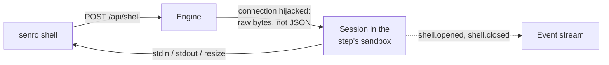

# The shell

A step failed. You have its log and exit code, but the answer is in a file the log never printed.
`senro shell` opens an interactive session inside the step's own workspaces, on the step's own
executor, at the same paths the step saw, while the run is still alive:

```bash
senro shell --step build
```

It's the last piece of the debugging loop: [`senro ws`](/docs/cli/workspaces/) lists a run's
workspaces, writes one out, and compares two of them. This lets you stand inside one instead.

## What happens on the wire

A shell session isn't a control operation like `step.retry`. `POST /api/shell` takes over
("hijacks") the plain HTTP connection and turns it into a raw, two-way byte stream instead of a
JSON request and response. That's why it needs its own route: an open-ended interactive session
can't be squeezed into a single [`Frame`](/docs/attach/control-ops/#frame-shape).



## Pair it with a breakpoint

Pairing a shell with a **breakpoint** is usually what you actually want: stop the run *before* a
step runs, then look at what it was about to run against. Without the breakpoint, you're racing
the step. With it, the workspace stays put for as long as you need.

```bash
# in the TUI: focus the step and press b. The run stops before it and waits,
# making whatever other progress it can, until you press B to release it.
senro shell --step deploy
```

Or stay in the TUI entirely and press **`s`** on the focused step. The TUI releases the terminal,
the run keeps going underneath, and the footer says how the session ended once you leave with
`^D`. The whole loop is `b` to stop before a step, `s` to look, `B` to release it. See
[Control operations](/docs/attach/control-ops/#breakpoints).

## What the session sees

| | |
|---|---|
| **Workspaces** | Every workspace the step mounts, at the same paths, carrying whatever is in them now. |
| **Working directory** | The step's own, so a bare `ls` means what it means in the step. |
| **Executor** | The step's. A container step's session runs inside the same image. |
| **Environment** | The step's declared environment, minus anything naming a secret. |
| **Secrets** | **None.** Never. See below. |

Every mount is read-only, whatever mode the step declared, and on the container and Kubernetes
executors that is enforced by the kernel:

```
sh: can't create /repo/planted.txt: Read-only file system
```

Here's why: a step's workspace snapshot is taken while its sandbox is still open, so the digest in
the event stream, and every cache key computed from it, already describes those exact bytes. A
debugging shell must not be able to change what a run says its steps produced.

> On local and SSH, read-only is intent, not an enforced restriction: neither executor reaches a
> workspace through anything with a per-process mode. The same caveat applies to a step's own
> read-only mounts and to handlers.

## No secrets, ever

A session is delivered **no secrets**: no secret files, no `SENRO_SECRET_*` variables, and not the
alias variable a step declared with `SecretEnv`.

senro delivers a secret as a file and removes it once the step's sandbox closes. A shell session
can stay open indefinitely, so re-delivering a cleaned-up credential would put it back on disk for
as long as the window stays open, and for anyone with access to it. If a failure only reproduces
with the credential present, re-run the step instead. See [Secrets](/docs/secrets/).

Session output is also **not** redacted, unlike a step's. It goes straight to your terminal instead
of into permanent log files, and a redactor that holds back partial matches until more bytes
arrive wouldn't work for something interactive anyway. There's no secret in there to redact
regardless.

## Two kinds of session

By default a session runs against **pipes**, like `docker exec -i` without `-t`: no prompt, no
line editing, no job control, no `Ctrl-C` as a signal. You type a line and the answer comes back.

`--tty` gives you a **real terminal** instead:

```bash
senro shell --step build --tty
```

You get job control, line editing, history, and `^C` delivered as a real signal to the remote
command instead of killing your client. `senro shell` puts your terminal into raw mode and
restores it no matter how the session ends, including on a panic, so a bad session never leaves
your shell without echo.

You have to explicitly ask for a terminal. senro won't upgrade you automatically. A pty is one
device, so a command's stdout and stderr merge irreversibly once you're in one. Picking for you
would silently cost you either job control or separate streams.

### Which executors can host one

| Executor | Shell | Terminal |
| --- | --- | --- |
| Local | Yes | Yes |
| Container | Yes | Yes |
| Kubernetes | Yes | Yes |
| SSH | Yes | **No** |

- Asking for a terminal where none can be hosted is refused with `executor_no_terminal`: a
  different reason from `executor_no_shell`, since only one of these is fixed by dropping `--tty`.
  Nothing in this build actually refuses a shell outright, so you should never see
  `executor_no_shell` in practice; it exists because the capability is still checked at run time.
- **SSH** can't host a terminal, because of window size. senro drives the `ssh` binary over pipes,
  and `ssh` normally gets its window size (and every resize) from its own stdin's terminal. Driven
  from pipes, it has none, so the remote pty would just report `0 0` with no way to fix it.
- **Kubernetes** hosts both, but in a pod of its own: not the step's own pod, because that one has
  the step's secrets projected into it. The shell pod gets the step's image, with the step's
  workspaces staged into it read-only at the same paths, and your command runs in a container held
  open for the session. This costs a second pod and one more workspace transfer, and the image
  needs `sh` (and `tar`, if the step mounts anything). See
  [Kubernetes](/docs/executors/kubernetes/#senro-shell-is-a-pod-of-its-own).

### Resizing

Your terminal's size travels with the request, so the remote terminal is created at the right size
from the start: a pty created with no size reports `0 0`, and a full-screen program reading that
draws nothing. Every later resize (`SIGWINCH`) travels on the same connection, so it's never out
of sync.

### End of input

A terminal has no EOF. `^D` is a byte, not a closed file descriptor. When your input ends, senro
sends the `VEOF` byte, exactly what pressing `^D` would send. A command that ignores it just keeps
going.

For anything a prompt would have been convenient for, pass the command instead:

```bash
senro shell --step build -- sh -c 'ls -la && cat go.mod'
senro shell --step build -- test -f out/binary   # exits with the command's own status
```

The session's exit code becomes `senro shell`'s own exit code, so the last example drops straight
into a script unchanged.

## It needs a live run

A session runs inside a **running** engine's workspace directories, in a sandbox that engine
opens. A finished run has neither:

```
senro shell: no LIVE run named "20260812T151058-540c8ca44b": a session needs the running engine
that owns the run's workspaces. If the run has finished, `senro ws pull 20260812T151058-540c8ca44b
<workspace>` writes its files out instead
```

`ws pull` is the right tool once a run is over. It writes the same files out from the
content-addressed store long after the process has exited. Pressing `s` in the TUI against a run
tailed from disk tells you the same thing. A read-only attach server also refuses a session, before
it's even opened.

## Over TCP, this is a remote shell

A session works over the [TCP transport](/docs/attach/#transport-unix-socket-or-tcp), behind the
same per-run bearer token as every other endpoint:

```bash
export SENRO_ATTACH_TOKEN='...'
senro shell --addr 127.0.0.1:8443 --tls --step build
```

Keep this in mind before binding a port: **anyone holding that token gets a command prompt inside
a step's workspace, from wherever they can reach it.**

- Over a unix socket the boundary is "whoever can already run code as you". Over TCP it is
  "whoever has the token", which over loopback includes any other user who can open the port.
- Blocking just this one route while allowing the rest wouldn't help much: `step.retry` and
  `run.rerun_from` on the same listener already re-run a step's own command. See
  [Security](/docs/attach/security/) for the full comparison, and why a non-loopback bind needs
  TLS.

## What it looks like in the event stream

Every session brackets itself with two events in the run's permanent ledger:

```json
{"seq":41,"type":"shell.opened","step":"build","payload":{"session":"s1","client_id":"c2","cmd":["sh"],"workspaces":["src"]}}
{"seq":57,"type":"shell.closed","step":"build","payload":{"session":"s1","client_id":"c2","exit_code":0,"duration_ns":42000000000}}
```

- Exactly one `shell.closed` follows every `shell.opened`, however the session ends: the command
  exiting, your connection breaking, or the run ending underneath you. A `shell.opened` with no
  matching close means the engine died while somebody was inside it.
- Neither event carries a byte the session produced: your terminal, not the run's record.
- The ledger records that a session existed, whose it was, what it ran, and how it ended. The
  `cmd` field tells "somebody opened a shell" apart from "somebody ran one command": useful if
  you're deciding whether an alert is worth waking up for.
- Both event names were [reserved from the start](/docs/run/event-stream/): adding them was
  an additive change to the protocol.

### If your connection drops

The session ends and the command inside it is killed. This isn't best-effort: the engine actively
watches the connection, because the most common thing an abandoned session leaves behind is a
command that never reads its input (a `tail`, a `sleep`, an editor), which would otherwise run
forever with nobody watching.

`shell.closed` records this as `"error":"client_disconnected"`. If a run finishes while you're
still in a step, your session ends the same way, with `run_ended`. A session can't hold a run open,
and a run can't end while leaving someone inside it.

## Where to go next

- **[Control operations](/docs/attach/control-ops/)**: breakpoints, retry, skip and rerun-from.
- **[The TUI](/docs/attach/tui/)**: the full key list, including `s`.
- **[Security](/docs/attach/security/)**: what it means that this works over TCP.
- **[Reading a failed run](/docs/run/debugging/)**: what to do once there is no live run.
