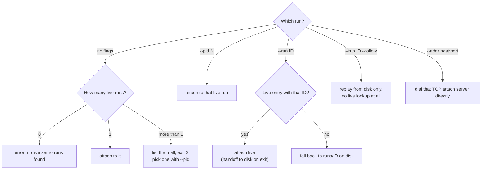

# CLI: run and watch

This page covers the four commands that start a run or connect to one: `senro run`,
`senro attach`, `senro shell`, and `senro ui`. For the full command table and exit codes, see
[CLI](/docs/cli/).

## `senro run`

```bash
senro run <pkg> [--ui=auto|tui|plain|none] [--trigger-event PATH] [-- pipeline-args...]

senro run ./ci                    # build, exec, auto-attach, render
senro run ./ci -- --env=staging   # flags after -- go to the pipeline, not to senro
```

`senro run` builds the named package with `go build` into a temporary binary, then runs it. If the
pipeline registered an attach server (by calling `attach.Listen`, see
[Run options and outcomes](/docs/run/options/)), senro attaches to it and renders the
run exactly like `senro attach` would.

- `--trigger-event PATH` is passed straight to the pipeline binary, which decides for itself
  whether the event applies. `PATH` can be `-` to read from stdin. `--trigger-event=` with no
  value is refused as a typo. If you want no event, just leave the flag off.
- A pipeline that never calls `attach.Listen` still runs, and its exit code is passed through
  as-is. Its stdout and stderr are relayed when the UI mode is `plain` or `none`. Under `tui` (what
  `--ui=auto` picks on a real terminal), they're not connected at all, because the TUI owns the
  terminal. Pass `--ui=plain` if you need to see a non-attach pipeline's output.
- **A Go toolchain must be on `PATH`.** Without one, `senro run` stops before it even builds, with
  `senro run: no Go toolchain found on PATH`. It'll tell you to build the binary yourself and run
  `./pipeline --tui` instead. Running an already-built binary needs no toolchain at all.
- A package that fails to compile stops there too. You'll see `go build`'s own errors, followed by
  `senro run: go build ./ci: exit status 1`, and an exit code of `2`.
- `senro run` sets `$SENRO_FUNC_PKG` on the pipeline process. This lets a `Func` step be
  cross-compiled for another platform without adding anything to the pipeline's source. An
  explicit `senro.WithFuncBuild` overrides it. See
  [A Func step off the coordinator](/docs/executors/func-remote/).

`Ctrl-C` asks the engine to cancel gracefully instead of killing the process outright, so cleanup
and `Always` handlers still get to run. If a pipeline ignores the request, senro kills it after
five minutes so the CLI never hangs forever.

## `senro attach`

```bash
senro attach [--pid <pid> | --run <id> | --addr <host:port>] [--follow] [--tls]
             [--ui=auto|tui|plain|none]

senro attach                       # auto-discover the one live run
senro attach --run 20260812T151058-540c8ca44b --follow   # tail a finished run from disk
senro attach --addr 127.0.0.1:8443 --tls                 # a TCP attach server directly
```

Running `senro attach` with no flags discovers every live run registered on the machine, cleaning
up any whose process has already died, and attaches to the one it finds. If there's more than one,
it won't guess: it lists them all, with pid, run, pipeline, working directory, and start time, so
you can pick one with `--pid`.

That listing is printed to stderr as an error, with exit `2`. If there are no live runs at all,
senro prints `senro: no live senro runs found` along with how to start one, also exit `2`.

Which flag combination you need depends on whether the run you want is still live or already
finished:



| Flag | Behavior |
|---|---|
| `--pid N` | A specific live run by process id. A pid that was registered and whose process has since died gets its own message, not "never existed" |
| `--run ID` | Prefers a live entry with that ID, so you get the live-to-disk handoff on exit for free, and otherwise falls back to the recorded run under `runs/<id>/` |
| `--follow` | Tails a run **from disk only**, no socket needed. Requires `--run`, and skips the live lookup entirely |
| `--addr host:port` | Dials a TCP attach server directly, taking its token from `$SENRO_ATTACH_TOKEN` |
| `--tls` | Says the `--addr` endpoint speaks TLS. Meaningless without `--addr`, and refused there |
| `--ui MODE` | The renderer; see [CLI](/docs/cli/) |

- `--pid` and `--run` can't be used together. `--addr` can't be combined with `--pid`, `--run`, or
  `--follow` either: `--addr` names an endpoint directly, while the other flags search for one.
- `--run <id>` resolves `runs/<id>` relative to your current directory. Run this command from the
  same place the pipeline ran.
- On first contact, the client checks protocol versions. A matching major version is silent. A
  minor version mismatch prints a warning to stderr. A major version mismatch stops the connection
  instead of producing garbled output.

Recorded runs and live sockets both implement the same interface internally, so the client renders
them identically. Replaying a finished run isn't a second-class experience. See
[Attach](/docs/attach/).

## `senro shell`

```bash
senro shell [--pid <pid> | --run <id> | --addr <host:port>] [--tls] [--tty]
            --step ID [-- cmd...]

senro shell --step build                       # a session on the step's workspaces
senro shell --step build -- cat build.log      # one command, non-interactively
senro shell --step build --tty                 # a real terminal
```

`senro shell` opens a session inside a step of a live run. You get its workspaces (read-only), at
the same paths the step saw them, in the step's own working directory, on the step's own executor.
Pair it with a breakpoint to pause a run before a step and inspect what it's about to run against.
See [The shell](/docs/attach/shell/) for the full picture. Here are the essentials:

- **`--step` is required.** A session always runs inside one specific step's workspaces, so
  there's no default to fall back on.
- **No secrets reach a session.** Not the files, not the `SENRO_SECRET_*` variables, not any alias
  a step declared. A session can stay open indefinitely, and senro won't put a credential back on
  disk for that long.
- **Pipes by default, a real terminal with `--tty`.** Without `--tty`, there's no prompt and no
  line editing: you type a line and press enter. With it, you get a real pty, job control, `^C` as
  a signal, and a window size that follows your own.
- **`local` and `container` executors support a terminal; `ssh` does not.** On `ssh`, `--tty` is
  refused outright rather than silently downgraded (`executor_no_terminal`). Either way, a banner
  is printed to stderr, so a redirected stdout only captures what the session itself printed.
- **It needs a live run.** For a finished run, use [`senro ws pull`](/docs/cli/workspaces/)
  instead. If you try `senro shell` against a finished run, it'll tell you and name the run.
- **It reaches a remote run the same way `senro attach` does**: `--addr` plus `--tls`, with the
  token from `$SENRO_ATTACH_TOKEN`. There's no `--token` flag.
- **A read-only attach refuses it.** If the attach server was started with
  `attach.Options{ReadOnly: true}`, a shell request gets a 403. A shared dashboard never hands out
  a command prompt.

Everything after `--` runs instead of the default shell, and the session's exit code is that
command's exit code. That makes `senro shell --step build -- test -f out/app` usable in a script,
just like running the command directly.

Refusals print a short reason and exit `1`, using the same vocabulary as
[control operations](/docs/attach/control-ops/): `unknown_step`, `run_not_active`,
`executor_no_shell` (an executor whose sandbox can't host a session at all; this build has none),
`executor_no_terminal`, and `sandbox_failed`.

## `senro ui`

```bash
senro ui [--pid <pid> | --run <id> | --addr <host:port>] [--tls] [--port N]

senro ui                          # the one live run on this machine
senro ui --addr 127.0.0.1:9944    # a run reached through a port-forward
senro ui --port 8730              # pin the loopback port instead of taking a free one
```

`senro ui` serves a browser view of a live run on loopback. It prints a one-time link to stdout
and keeps running until interrupted. The page itself is a Go client compiled to WebAssembly, and
it processes the run's events using the same logic the TUI does, so the two views never disagree
about what a stream means.

- It offers the same controls as the TUI: cancel, pause, resume, retry, skip, set and clear
  breakpoints, rerun-from, and accept/reject an analysis. `ws.snapshot` is available but has no
  button for it (see [the browser UI](/docs/attach/browser/#controls)). It does not offer
  `senro shell`.
- The run's bearer token stays in this process and never reaches the browser. senro only accepts a
  control request from the page itself, checked by its session cookie and a matching `Origin`.
- **Loopback only**, with no flag to widen that. `--port 0` (the default) picks a free port for
  you.
- There's no `--follow` flag here. A finished run has no attach server to connect to; read one
  with `senro attach --run <id> --follow` instead.

See [The browser UI](/docs/attach/browser/) for more, including where the one-time link's nonce
does and doesn't end up.

## Where to go next

- **[Cache and verify](/docs/cli/cache/)**: `cache gc`, `cache explain`, `verify`.
- **[Workspaces and runs](/docs/cli/workspaces/)**: `ws ls/pull/diff`, `logs fetch`, `func check`.
- **[Reading a failed run](/docs/run/debugging/)**: what to do when one of these reports a
  failure.
