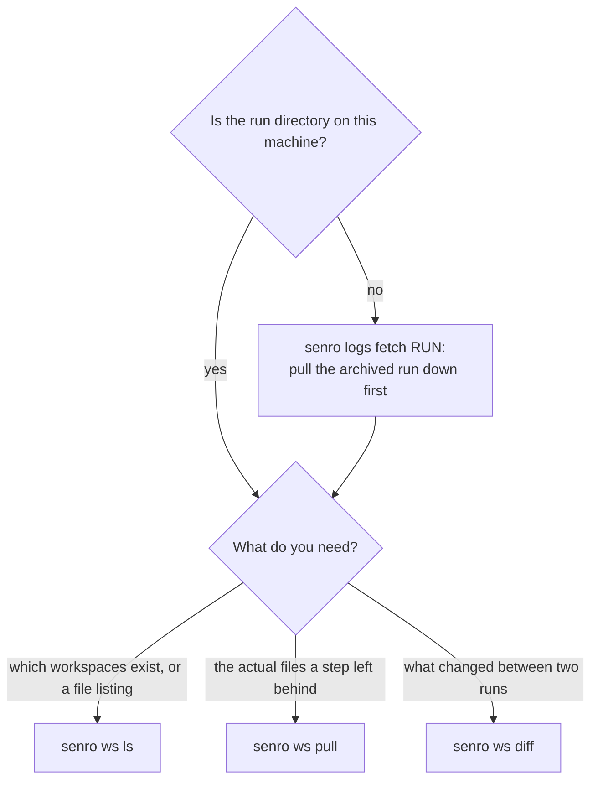

# CLI: workspaces and runs

This page covers `senro runs` and the commands for reading what a run left behind: `ws ls`,
`ws pull`, `ws diff`, `logs fetch`, and `func check`. For the full command table and exit codes,
see [CLI](/docs/cli/).

`--cache-dir` resolves the same way in every command below: the flag if given, else
`$SENRO_CACHE_DIR`, else `os.UserCacheDir()/senro`. It only matters for a run whose pipeline used
`senro.WithCacheDir`.

## `senro runs`

```bash
senro runs [-n LIMIT]

senro runs          # the 20 most recent runs under ./runs, newest first
senro runs -n 100    # more of them
```

Lists what's under `./runs` without your having to already know a run ID: each run's ID, pipeline
name, status, when it started, and how long it took (or `running` for one still in progress).
Every other command on this page and on [Cache and verify](/docs/cli/cache/) takes a `RUN`
argument; this is where that ID comes from when you don't already have it pasted somewhere.

Reads the same `events.jsonl` fold every other view of a run uses, so its status column can never
disagree with what `senro attach --run` would show for the same run. An empty `./runs` prints
`no runs under ./runs` and exits `0`; a directory with no `./runs` at all is a usage error, the
same message `senro attach` and `senro ws ls` give you when they default to "the newest run" and
find nothing to default to.

Which of these to reach for depends on where the run lives and what you're trying to answer:



> **One note that applies to all three `ws` commands.** If a workspace's most recent state came
> from a cache hit, it has no recorded file index; a cache entry only stores a body digest.
> `ws ls` and `ws diff` will report this rather than erroring out. `ws pull` isn't affected, since
> a body digest is all it ever needed.

## `senro ws ls`

```bash
senro ws ls [--cache-dir DIR] [RUN] [NAME]

senro ws ls                                    # every workspace the latest run declared
senro ws ls 20260812T151058-540c8ca44b src     # one workspace's files, from its stored index
```

Lists a run's workspace snapshots: name, content digest, and size, read from the run's own event
log. If you name a workspace, it lists that workspace's files, reading only the index object.
That's what makes it instant regardless of workspace size: `ws ls` never pulls the actual snapshot
body.

- A workspace over 2 GiB is flagged `LARGE`, along with the command to list what's inside it.
- `--cache-dir` only matters for the file-listing form. It points at the storage root that holds
  the index.
- If a `senro cache gc` sweep already collected the index, `ws ls` reports the body digest that's
  still known and exits `2`. Only a failed run's workspaces are protected from being swept.

## `senro ws pull`

```bash
senro ws pull [--cache-dir DIR] [--force] RUN NAME [DEST]
```

Writes a workspace's stored body out to a directory (default `./NAME`), so you can read whatever
files a failed step left behind with ordinary tools. Unlike `ws ls`, both `RUN` and `NAME` are
required here. Since `DEST` is also optional, a bare pair of arguments would otherwise be
ambiguous.

```
pulled workspace "src" from /path/to/runs/20260812T151058-540c8ca44b into /tmp/broken
  body      sha256:1468842d3dcfd3bda403aa4362f2c137b16694b16b055aa80a084a45731fc72d
  restored  7 entries, 71 B
  modes     0644 or 0755 for files, 0755 for directories, 0777 for symlinks: a snapshot carries the executable bit and nothing else
  mtimes    1970-01-01T00:00:00Z on every restored file and directory, fixed so a digest cannot depend on when a compiler ran
  dropped   uid, gid, extended attributes, ACLs, hard links, devices, sockets and fifos are not stored by a snapshot at all, so they are not restored
```

Those last three lines print on every successful pull on purpose. Without them, the first thing
anyone concludes from `ls -l` is that senro mangled their permissions, when it didn't. This
normalization makes a workspace's digest depend on what a file actually contains, not which
machine produced it, which is essential for every cache key downstream. See
[Cache keys](/docs/data/cache-keys/).

- The destination is replaced, not merged into. A merged tree wouldn't actually be the snapshot it
  claims to be. If the destination already holds anything, `ws pull` refuses with exit `2`;
  `--force` replaces it anyway. A destination that exists but isn't a directory is refused even
  with `--force`.
- If a tar entry's path would escape the destination (a `..` component, an absolute path, a
  symlink pointing outside the workspace), the command refuses it: nothing is written, and it
  exits `1`. A snapshot senro produced can't contain such an entry, so seeing one means something
  else altered the body. Extraction stages files beside the destination first and only moves them
  into place once the whole body is read and verified, so a refusal never leaves a
  half-populated directory.
- The reported file count comes from the extraction itself, since the ledger doesn't record one
  for a restored workspace.

## `senro ws diff`

```bash
senro ws diff [--cache-dir DIR] [--json] RUN-A RUN-B [NAME]
```

Answers "what did this step actually do to the tree". It reads the two stored indexes and never
opens a body, so diffing two multi-gigabyte workspaces only costs two small JSON reads.

```
+ added   - removed   M content changed   P mode changed   K kind changed

workspace "src"
  M VERSION        3 B -> 3 B  2d27fbdf -> 81db67b6
  P build.sh       0644 -> 0755
  + cmd/app.bin    0644  4 B  54034ac5
  M current        symlink target VERSION -> build.sh
  - docs/notes.md  0644  10 B  54d048ab
  1 added, 1 removed, 3 modified, 1 mode, 0 kind, 2 unchanged
```

`P` means `chmod +x` with byte-identical content: a real change, and the one most easily missed
just by looking. It's the only permission a snapshot tracks. `K` means the path changed kind
entirely, like a file replaced by a directory or a symlink.

It won't tell you what changed inside a file. Pull both sides with `senro ws pull` for that.

- **It exits `0` whether or not there are differences**, unlike `diff(1)`. Exit `1` means "the run
  failed" everywhere else in this CLI, so it can't be reused here. Exit `2` means at least one
  named workspace couldn't be compared at all; the ones that could be are still reported.
- With no `NAME`, every workspace both runs share is compared. A workspace that only one run has
  is reported, not silently dropped. Naming a workspace that one run doesn't have is a usage
  error, and the error lists what each run does have. The same happens if the two runs share no
  workspace at all.
- A cache-restored workspace is the one case this command can't work around, since avoiding the
  download is the whole point of `ws diff`. It reports this on stderr with exit `2` and points you
  at `senro ws pull`: pull both sides and compare the trees yourself.
- Two snapshots with the same body digest are reported as identical even without reading either
  index, since identical content addresses mean identical trees.

`--json` emits one document: `{"workspaces": [...]}`. Each workspace has `name`, `a`/`b` (with
`run`, `dir`, `digest`, `index`), `identical`, `changes`, `summary`, and where relevant a `note`
(for a one-sided workspace) or `error` (couldn't be compared). Each change carries `path`,
`status`, and an `a`/`b` entry with `kind`, `mode`, `size`, `digest`, and `link`. `mode` is an
octal string (`"0644"`), since a plain number like `420` isn't something anyone would recognize.

## `senro logs fetch`

```bash
senro logs fetch [--force] RUN [DEST]

senro logs fetch 20260812T151058-540c8ca44b   # into ./runs/20260812T151058-540c8ca44b
```

Fetches a run archived in the [shared cache](/docs/run/archiving/) back onto this machine. This
is useful for a run whose CI runner no longer exists. `RUN` here is the run ID it was archived
under, not a path, unlike every other run-taking command on this page.

It reads the same environment variables that the original archiving run used: `SENRO_REMOTE_CACHE`,
then either `SENRO_REMOTE_CACHE_ENDPOINT`, `SENRO_REMOTE_CACHE_REGION`, `AWS_ACCESS_KEY_ID`, and
`AWS_SECRET_ACCESS_KEY` for a bucket, or `SENRO_REMOTE_CACHE_USERNAME` and
`SENRO_REMOTE_CACHE_PASSWORD` for a registry.

Read permission is all it needs (`s3:GetObject` on the prefix, or `pull` on the repository), since
the streams to fetch come from the run's own ledger, never from listing the store.

What it writes is an ordinary run directory, so every other senro command that reads a run works
on it too. `DEST` defaults to `./runs/RUN`, which is exactly the path `senro attach --run RUN`
resolves on its own. The fetch prints that command when it's done:

```
fetched run 20260812T151058-540c8ca44b from s3 bucket acme-senro-cache at s3.eu-west-1.amazonaws.com into /home/you/ci/runs/20260812T151058-540c8ca44b
  ledger    7 steps, run failed
  logs      12 of 12 streams, 84.1 KiB
read it with
  senro attach --run 20260812T151058-540c8ca44b
```

- If `DEST` is somewhere else, the printed command adjusts to match: a `cd` first, or a note
  naming the files if the path is one `senro attach --run` can't resolve on its own. Nothing here
  is guessed.
- If the ledger names a stream the archive doesn't have, that's reported, not treated as an error.
  A step that never wrote to a stream never uploaded it, and there's no way to tell that apart
  here from an upload that didn't finish or one a lifecycle rule expired.
- `DEST` is replaced, not merged into, just like `senro ws pull`'s. A directory holding one run's
  ledger and another run's logs would be an accurate record of neither. A non-empty `DEST` is
  refused with exit `2` unless you pass `--force`; a `DEST` that exists but isn't a directory is
  refused even with `--force`.
- A failed fetch leaves nothing behind. Any directories it created get removed, so you'll never
  find an empty `runs/<id>/` sitting around for `senro attach` to mistake for a broken run.

**The exit code describes the fetch itself, never the archived run.** Fetching the record of a
failed build is still a success, exit `0`. It's `senro attach --run` that turns the archived run's
own outcome into an exit code.

| Condition | Exit | Because |
|---|---|---|
| No shared cache configured, or a variable missing | `2` | Nothing can be fetched until you set them; the message names them |
| The run is not in the store, or the bucket is not there | `2` | The store answered, and no retry changes the answer. Check the run ID, the bucket/prefix or repository, or an expiry rule |
| The store refused the credentials | `2` | Also an answer, and a different thing to fix: the key, the password, the session token, or the policy |
| The store did not answer at all | `1` | Unreachable, timed out, or a 5xx. Nothing is shown to be wrong; try again |
| An object did not match its digest | `1` | Refused rather than written: a log that is not what was uploaded is worse than no log |
| Interrupted | `130` | What was already written stays and is readable, and incomplete |

## `senro func check`

```bash
senro func check [--dir DIR] [packages...]

senro func check                        # walk the module in the current directory
senro func check --dir ./cmd/pipeline   # walk a different module directory
```

Walks a module's dependency graph and reports every package that pulls in cgo, along with the
import chain that pulled each one in. `--dir` defaults to `.`. Exits `1` if it finds any, `0` if
the module is clean (`no cgo in the dependency graph of .`).

A `Func` step running on an ssh host or in a container, targeting a different platform, gets
cross-compiled with `CGO_ENABLED=0`. A cross-compiled binary can't link a C library for a platform
it isn't building on.

A container image is always Linux, so a macOS coordinator cross-compiles for every containerized
`Func` step. senro refuses such a run before it even starts, using this same check, so the two
can't drift apart. Run `func check` in CI to catch this before a deploy does.

Steps on the coordinator, and steps on a target that matches the coordinator's own platform, ship
the binary unchanged and are unaffected. Common causes the report will name: `os/user` (fix by
building with `-tags osusergo`), `net` (`-tags netgo`), and any package wrapping a C library.

See [A Func step off the coordinator](/docs/executors/func-remote/).

## Where to go next

- **[Workspaces](/docs/data/workspaces/)**: what `ws ls`, `ws pull` and `ws diff` are reading.
- **[Archiving a run](/docs/run/archiving/)**: what puts a run's logs in the store.
- **[Reading a failed run](/docs/run/debugging/)**: these commands in a walkthrough.
