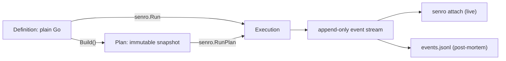

# Concepts

The model senro executes: a pipeline of workflows of steps, resolved into an immutable plan, run
once, and reported as one event stream.

## The vocabulary

| Term | What it is |
|---|---|
| `Pipeline` | A name and a set of workflows: `senro.New("ci")` |
| `Workflow` | A named group of steps: `p.Workflow("verify")` |
| `Step` | One action: a command, or a registered Go function |
| `Plan` | The validated, immutable graph that `Build()` resolves a pipeline into |
| Event stream | The append-only record of everything a run did |

Step ids are unique across the whole pipeline, not per workflow: a plan is flat. The full surface
is on [Steps](/docs/steps/).

## Definition, plan, execution



Your pipeline code builds an immutable graph. Nothing about it executes anything, and your code
never drives a step directly. `senro.Run` takes the `*Pipeline`, calls `Build()` internally to
resolve and validate it into a `Plan`, and executes that:

```go
p := senro.New("ci")
verify := p.Workflow("verify")
verify.Step("test", exec.Command("go", "test", "./..."))

if err := senro.Run(ctx, p); err != nil { // builds p and executes the result
	log.Fatal(err)
}
```

If you already hold a built `*Plan` (you built once to inspect or log the digest),
`senro.RunPlan(ctx, plan)` runs that exact plan rather than re-resolving the pipeline:

```go
plan, err := p.Build() // a validated snapshot; a later Step(...) doesn't touch plan
if err != nil {
	log.Fatal(err)
}
fmt.Println("about to run", plan.Digest())
if err := senro.RunPlan(ctx, plan); err != nil {
	log.Fatal(err)
}
```

Because `Run` builds first, a dangling `Needs`, a duplicate id or an empty command comes back as an
error before anything executes. That error is unwrapped and never a `*RunError`, since a pipeline
that failed to build never produced a run.

> The immutable `Plan` is what lets a second process reason about a run: an attached client reads
> the same `Plan` structure the engine executed, not a live trace of function calls it could never
> observe from outside.

## One event stream is the source of truth

Every observable fact about a run (a step starting, finishing, being retried) is an `api.Event`,
appended in order, never rewritten. The live attach server, the TUI and offline replay all derive
their view from the same function, `(*api.RunState).Apply`: if the TUI shows a step as `failed`, a
`step.finished` event with that state arrived, full stop.

[The event stream](/docs/reference/event-stream/) has the envelope and every event sent today.
[Attach](/docs/attach/) is the protocol built on top of it.

## Two kinds of step

- **A command** (`Exec`) runs anywhere. `exec.Command("go", "test", "./...")` means the same thing
  on any machine and on any of the [four executors](/docs/executors/).
- **Go code** (`Func`) is a typed function registered by name with `senro.RegisterFunc` and turned
  into a step with `senro.Func(name, params)`. See [Func steps](/docs/steps/functions/).

A function's body is compiled into the binary and no plan can describe it, so running one elsewhere
means moving the binary, not the plan. Off the coordinator, senro puts a copy of this binary on the
SSH host, in the container or in the pod and re-enters it as a step child;
[Func off the coordinator](/docs/executors/func-remote/) covers what that costs.

## Everything durable is content addressed

Artifacts, workspaces, cached results and staged binaries live in one content-addressed store, so
parts of the system never hand data to each other directly. Every snapshot and cached result is
addressed by its digest, normalized so the same content hashes the same way on any machine.

- [Workspaces](/docs/data/workspaces/) are named, versioned directories a step mounts, snapshotted
  when the step settles. [Persistent](/docs/data/persistent/) ones survive between runs.
- [The action cache](/docs/data/caching/) is opt-in: a step marked `Pure()` with declared
  `Inputs()` can be skipped on a hit. Nothing is cached by default, so an impure step (a tool that
  can also SSH into production) always runs.
- [The scratch cache](/docs/data/scratch/) restores a mutable directory best-effort by key and
  never enters a cache key, so a miss costs time, never correctness.
- [The shared tier](/docs/data/shared-cache/) puts an S3-compatible bucket or an OCI registry
  behind the store and the action cache. An unreachable store degrades the run to local disk; it
  never fails the run.

## Secrets are resolved once and delivered as files

You declare credentials as a typed struct and hand it to `senro.WithSecrets`; a step asks for one
by field name and receives a file path, never the value.

A plan that would route a resolved value through argv, an environment value, `WorkDir`, `Inputs`,
`Outputs` or a mount is refused before the run starts. Whatever a step does print is redacted. See
[Secrets](/docs/secrets/).

## What is not built yet

- Generated subgraphs, where a running step's own output creates new nodes, and `RunSubgraph`.
  Expansion happens when the pipeline is built, so a fan-out over a list only a running step could
  produce is not expressible.
- `ScopeStep` workspaces. Declared and refused: nothing outlives the step that would read one.

## What is decided, not missing

These look like gaps and are not. Each is a decision with a reason, and none is scheduled.

| Not built | Why |
|---|---|
| [`senro shell`](/docs/attach/shell/) on a finished run | A session needs a live sandbox, and a finished run has none. [`senro ws pull`](/docs/cli/workspaces/) writes the files out instead |
| A shell from the [browser UI](/docs/attach/browser/) | Steering a run and running arbitrary commands on your machine are different propositions. `senro ui` forwards every control operation and not this |
| A remote tier for the [scratch cache](/docs/data/scratch/) | Not because a key could not travel: it renders from repository content. An entry is a whole-tree tarball whose key churns on every lock-file edit, and its prefix fallback ranks by one machine's mtime |
| An affected set over [Bazel or Python](/docs/monorepo/unit-graphs/) | Both would have to answer from incomplete information. A missing edge is a green build for a tree that does not work, so those graphs discover units and stop |
| Windows | Attach's boundary is a kernel peer-credential check with no Windows equivalent implemented. senro fails closed rather than shipping auth it cannot perform |

## Where to go next

- [Quickstart](/docs/quickstart/): the shortest pipeline that exercises all of this.
- [Steps](/docs/steps/): `Pipeline`, `Workflow` and `Step` in full.
- [Executors](/docs/executors/): the four places a step can run.
- [Monorepos](/docs/monorepo/): running only the units a change affects.
- [End states](/docs/steps/states/): why `recovered` is not `succeeded`.
- [The event stream](/docs/reference/event-stream/): the envelope, and events folded into
  `RunState`.
