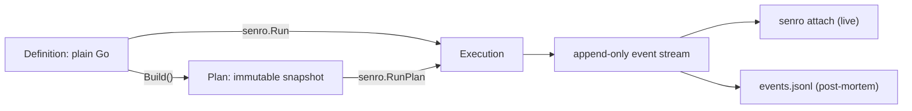

# Concepts

Five ideas. Everything else in the docs is a detail of one of them.

## The vocabulary

| Term | What it is |
|---|---|
| `Pipeline` | A name and a set of workflows: `senro.New("ci")` |
| `Workflow` | A named group of steps: `p.Workflow("verify")` |
| `Step` | One action: a command, or a registered Go function |
| `Plan` | The validated, immutable graph that `Build()` resolves a pipeline into |
| Event stream | The append-only record of everything a run did |

**Step ids are unique across the whole pipeline**, not per workflow, because a plan is flat. The
full surface is on [Steps](/docs/steps/).

## 1. You describe the work; senro runs it

Your code builds a graph. Nothing in it executes anything, and your code never drives a step
directly.

```go
p := senro.New("ci")
verify := p.Workflow("verify")
verify.Step("test", exec.Command("go", "test", "./..."))

if err := senro.Run(ctx, p); err != nil { // builds p, then executes the result
	log.Fatal(err)
}
```



**Because `Run` builds first, mistakes surface before anything executes.** A dangling `Needs`, a
duplicate step id or an empty command comes back as an error, not as a half-finished run.

If you want to inspect the plan before running it, build it yourself:

```go
plan, err := p.Build() // a validated snapshot; a later Step(...) does not touch plan
if err != nil {
	log.Fatal(err)
}
fmt.Println("about to run", plan.Digest())
if err := senro.RunPlan(ctx, plan); err != nil {
	log.Fatal(err)
}
```

The separation is what lets a **second process** watch the run: an attached terminal reads the
same `Plan` the engine is executing, which it could never reconstruct from watching your function
calls.

## 2. One event stream, and nothing else

Every observable fact about a run (a step starting, finishing, being retried) is an `api.Event`,
appended in order, never rewritten.

```jsonl
{"seq":1,"type":"run.started","payload":{"pipeline":"ci"}}
{"seq":2,"type":"step.started","step":"test"}
{"seq":3,"type":"step.finished","step":"test","payload":{"state":"failed","exit_code":1}}
{"seq":4,"type":"run.finished","payload":{"status":"failed"}}
```

The live TUI, the browser UI, and reading `events.jsonl` a week later all build their view by
folding **that same list** through one function. So:

- If the TUI shows `test` as failed, event 3 above arrived. There is no other way for it to know.
- Replaying the file offline gives you byte-for-byte the screen the TUI showed at the time.
- Your own code can fold the same events (`senro.WithSink`) and reach the same conclusions.

That is why there is no "the UI is out of date" state in senro: there is nothing for it to be out
of date with.

[The event stream](/docs/reference/event-stream/) lists the envelope and every event sent today.
[Attach](/docs/attach/) is the protocol built on top of it.

## 3. Two kinds of step

- **A command** (`exec.Command`) runs anywhere. `exec.Command("go", "test", "./...")` means the
  same thing on any machine and on any of the [four executors](/docs/executors/).
- **Go code** (`senro.Func`) is a typed function registered by name, turned into a step by
  `senro.Func(name, params)`. See [Func steps](/docs/steps/functions/).

Both are built, scheduled, retried, cached and handled by exactly the same code.

A function's body is compiled into your binary and no plan can describe it, so running one
elsewhere means moving the binary, not the plan. Off the coordinator, senro puts a copy of your
binary on the SSH host, in the container or in the pod and re-enters it as a step child;
[Func off the coordinator](/docs/executors/func-remote/) covers what that costs.

## 4. Two caches, for two different jobs

Both are opt-in. Neither is on unless you ask.

### The action cache: skip a step entirely

**What it is for:** not running work you have already run. Mark a step `Pure()` and declare its
inputs, and senro hashes those inputs plus the command plus the environment into a key. On a
second run with the same key, the step is **not executed at all** and its recorded outputs are
restored from the store.

```go
verify.Step("build", exec.Command("go", "build", "-o", "bin/app", "./cmd/app")).
	Pure().
	Inputs(artifact.Glob("**/*.go"), artifact.File("go.sum")).
	Outputs(artifact.File("bin/app"))
```

Change one `.go` file and the key changes, so it rebuilds. Change nothing and it is a hit: the
step ends in the state [`cached`](/docs/steps/states/), with `bin/app` restored.

**Nothing is cached by default**, because `Pure()` is a promise only you can make. A tool that
also SSHes into production is not pure, and senro cannot tell. See
[Caching a step](/docs/data/caching/) and [What's in a cache key](/docs/data/cache-keys/).

### The scratch cache: start warm, but never be wrong

**What it is for:** the mutable directories tools keep for their own speed. `~/.npm`, `~/.cargo`,
a Go build cache. You want yesterday's copy if there is one, and you do not care if there is not.

```go
gomod := senro.ScratchCache("gomod",
	senro.Key(`gomod-{{ hashFiles "go.sum" }}`),
	senro.RestoreKeys("gomod-"))

verify.Step("test", exec.Command("go", "test", "./...")).
	Mount(gomod.At("/root/go/pkg/mod"))
```

A scratch cache is restored **best-effort by key** and **never enters a cache key**. `RestoreKeys`
is the fallback: a `go.sum` change misses the exact key but still starts from the last module
cache rather than from nothing.

A miss costs you time and nothing else, and a stale entry cannot make a build produce the wrong
answer, because nothing downstream is keyed on it. See [Scratch caches](/docs/data/scratch/).

### They share one store

Artifacts, workspaces, cached results and staged binaries all live in one content-addressed store:
everything is addressed by the digest of its content, normalized so the same bytes hash the same
way on any machine.

That is what makes the caches shareable. Point `SENRO_REMOTE_CACHE` at an S3-compatible bucket or
an OCI registry and a fresh CI runner starts warm on what another machine already built. An
unreachable store degrades the run to local disk; it never fails the run. See
[Sharing a cache](/docs/data/shared-cache/).

## 5. Secrets are files, not strings

You declare credentials as a typed struct, hand it to `senro.WithSecrets`, and a step asks for one
by field name. What it receives is a **file path**, never the value.

```go
type Config struct {
	RegistryToken secret.String `source:"env:NPM_TOKEN"`
}

cfg, err := mamori.Load[Config](ctx)   // resolved once, before the run
if err != nil {
	return err
}

setup.Step("install", exec.Command("pnpm", "install")).
	SecretEnv("NPM_TOKEN", "RegistryToken")   // env var name, then the struct field

senro.Run(ctx, p, senro.WithSecrets(cfg))
```

Inside the step, `$NPM_TOKEN` holds a **path**, not the token, so the command reads the file:

```sh
npm config set //registry.npmjs.org/:_authToken="$(cat "$NPM_TOKEN")"
```

A [func step](/docs/steps/functions/) does the same through `ctx.Secret("RegistryToken")`.

**Why a file:** argv is world-readable in `/proc`, environment values leak into crash dumps and
child processes, and both end up in logs. A file has an owner and a mode, and it disappears with
the sandbox.

**What senro refuses:** a plan that would route a resolved value through argv, an environment
*value*, `WorkDir`, `Inputs`, `Outputs` or a mount is rejected **before the run starts**, not
redacted afterwards. Whatever a step does print is redacted on the way out. See
[Secrets](/docs/secrets/).

## Where to go next

- [Quickstart](/docs/quickstart/): the shortest pipeline that exercises all of this.
- [Steps](/docs/steps/): `Pipeline`, `Workflow` and `Step` in full.
- [Executors](/docs/executors/): the four places a step can run.
- [Monorepos](/docs/monorepo/): running only the units a change affects.
- [Step states](/docs/steps/states/): why `recovered` is not `succeeded`.
