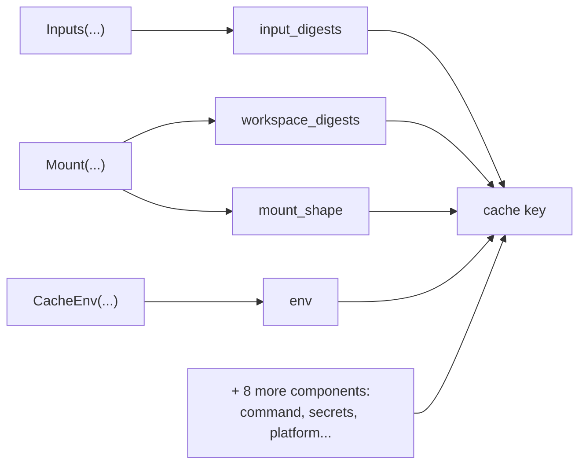

# Cache keys

The [action cache](/docs/data/caching/) skips a step when its key matches a result senro already
has, so the key is what decides whether a step reruns or repeats work you already paid for. Every
key is built from the same twelve components, on every machine, whether the result is stored locally
or in the [shared cache](/docs/data/shared-cache/). This page covers what's in a key, what isn't,
and how to read a miss.

## The twelve components

| Component | What it covers |
| --- | --- |
| `command` | The step's kind, argument vector and working directory |
| `env` | The allowlisted environment, as name plus value digest pairs, never a value |
| `secrets` | The declared secrets' identity: name, source, version and a salted digest, never a value |
| `executor_class` | The executor's cache equivalence class, deliberately not host identity |
| `platform` | The declared platform |
| `input_digests` | The sorted paths and digests of the step's declared inputs |
| `workspace_digests` | The sorted names and digests of the workspaces the step mounts |
| `mount_shape` | The same mounts' name, mode and path, without their content |
| `step_shape` | `NoSnapshot` and the declared `Outputs`, which decide what a saved result contains |
| `func_identity` | A `Func` step's binary digest, registered name and parameter digest |
| `tool_versions` | The declared toolchain fingerprint |
| `version` | The key format's own version |

Each component comes from something you wrote: `Inputs` feeds `input_digests`, `Mount` feeds
`workspace_digests` and `mount_shape`, `CacheEnv` feeds `env`. See
[Caching a step](/docs/data/caching/).



## What never enters a key

- **Any environment variable you didn't name in `CacheEnv`.** The allowlist is all of `env`, and
  even an allowlisted variable enters as a digest of its value, never the value itself.
- **A secret's value, ever.** `secrets` carries a secret's *identity*: its name, source, version and
  a salted digest. That holds for the local cache, the shared cache, a bucket key and a registry tag
  alike. See [Secrets](/docs/secrets/).
- **Host identity.** `executor_class` is an equivalence class, so a fleet of interchangeable
  machines can share entries. If the class were built from hostnames instead, forty machines would
  never share a single entry, and nothing would tell you why. On Kubernetes, the namespace is
  deliberately left out of the class too.
- **A [scratch cache](/docs/data/scratch/)**: not its content, not its key, not its mounts.
- **Which store you use.** A [shared cache](/docs/data/shared-cache/) changes where a result is
  kept, never what it is keyed by. Two machines share an entry only when they would have computed
  the identical thing.
- **How you grouped your steps.** Moving steps between workflows does not change the plan's digest.
  Adding a workflow-level `Needs` does, because that adds real edges. See
  [Ordering](/docs/steps/ordering/).

Two details about `executor_class` are worth knowing. A declared
[`container.User`](/docs/executors/containers/) enters the class, but the default doesn't, since the
default just names the coordinator's own identity rather than anything about the pipeline. And
[`ssh.CacheClass`](/docs/executors/ssh/) is yours to keep accurate: senro has no way to tell that
one host quietly picked up a different toolchain.

## Reading a miss

`senro cache explain` diffs a step's current key against the most recent recorded entry for that
step, field by field:

```
MISS  measure  key e126dad1 (previous 2ba03dd0)
  ✗ input_digests: greeting.txt  86c9c55c → 37e3516a
  ✗ workspace_digests: src  37931680 → d8ded6fe
  ✓ command, env, secrets, executor_class, platform, mount_shape, step_shape, func_identity, tool_versions, version unchanged
```

```sh
senro cache explain                # every Pure() step and scratch cache the latest run touched
senro cache explain build/test     # one step's own key, hit or miss, field by field
```

- Only a step marked `Pure()` has a cache record. A step skipped because a dependency failed never
  reaches the cache and has none either.
- A run with no `Pure()` steps and no scratch cache says so explicitly, rather than printing
  nothing, and still exits `0`.
- `workspace_digests` moving tells you a workspace changed, not what changed inside it.
  [`senro ws diff`](/docs/cli/workspaces/) answers that.
- A key that did **not** change is not proof the step was pure. That is what
  [`senro verify --recheck-pure`](/docs/data/caching/) is for.

Full flags are in [Cache commands](/docs/cli/cache/). A worked example of a miss is in
[Reading a failed run](/docs/run/debugging/).

## Where to go next

- **[Caching a step](/docs/data/caching/)**: declaring the things this page keys on.
- **[Shared cache](/docs/data/shared-cache/)**: the same keys, a second tier.
- **[Persistent workspaces](/docs/data/persistent/)**: the one workspace whose content is measured
  before the run starts.
