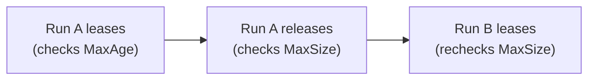

# Persistent workspaces

`Scope(senro.ScopePersistent)` makes a [workspace](/docs/data/workspaces/) survive between runs.
It's one directory on the machine, named after the workspace, and every later run that mounts that
name starts from it. Use it for an expensive tree you don't want to rebuild every run.

```go
mods := senro.Workspace("go-mod-cache",
	senro.Scope(senro.ScopePersistent),
	senro.MaxAge(7*24*time.Hour), senro.MaxSize(4<<30))

verify.Step("test", exec.Command("go", "test", "./...")).
	Mount(src.At("/src", senro.RW), mods.At("/root/go/pkg/mod", senro.RW))
```

It works on every executor, including Kubernetes and SSH. The coordinator (the machine running
senro itself, as opposed to a remote executor target) holds the canonical copy and stages it out to
each target.

## The four rules

### 1. `MaxAge` and `MaxSize` are mandatory, with no default

`Build()` rejects a persistent workspace that's missing either one, and names which one is missing.
An unbounded workspace that outlives a run will fill up a disk silently. The right bound depends on
your pipeline, so senro won't guess one for you.

| Declaration | `Build()` |
| --- | --- |
| `Scope(senro.ScopePersistent)` with both `MaxAge` and `MaxSize` | **Accepted** |
| `Scope(senro.ScopePersistent)` missing either bound | **Refused**, naming the missing one |
| `MaxAge` or `MaxSize` on any other scope | **Refused**: nothing would ever apply it |

### 2. Eviction happens outside every step, never during one

senro checks `MaxAge` when a run leases the workspace (claims it for that run's exclusive use, as
rule 4 below covers), and checks `MaxSize` when the run releases it. It checks `MaxSize` again at the next lease,
against what the previous run recorded. That second check still happens even if a run gets killed.



An eviction clears the whole workspace. Half a dependency tree isn't a useful smaller one. The
eviction emits a `ws.evicted` event with the bound and the measurement, so if a workspace keeps
starting cold, you can see which number to raise.

### 3. Its content is part of the cache key

senro measures the workspace once, before the first step runs, and that digest enters
`workspace_digests` for every step that mounts it. An unchanged workspace shares a key across runs,
so the action cache hits. A changed one misses, and
[`senro cache explain`](/docs/data/cache-keys/) will name `workspace_digests` as what changed.

### 4. One run at a time holds one

If a second run wants the same workspace, it's refused immediately, before any of its steps run.
The error names the run that holds it. senro doesn't make the second run wait, because the lease
covers the whole run, and waiting could mean waiting for someone else's entire pipeline. It also
doesn't give each run its own private copy: that's what a `ScopeRun` workspace is for.

## Name it for what is in it

A persistent workspace is **machine-global and keyed by name alone**. If two pipelines both declare
a workspace called `"cache"`, they share one directory. Name it for what it holds, like
`"go-mod-cache"`, not for the role it plays.

## On Kubernetes it can live in the cluster instead

By default, the tree stays on the coordinator and is staged into each pod, a full transfer on every
attempt. [`k8s.Claim`](/docs/executors/kubernetes/) backs the workspace with a
`PersistentVolumeClaim` you already created instead, so the pod mounts it directly and nothing
needs to be transferred. The trade-off:

- A step that mounts a claimed workspace **can't be `Pure()`**, because the coordinator can't
  measure a tree it can't reach.
- The lease becomes a `coordination.k8s.io` `Lease`, so two coordinators still exclude each other.

`ScopePersistent` and `PersistentVolumeClaim` share a word and nothing else. A persistent workspace
needs no claim, and no cluster at all.

## Where to go next

- **[Workspaces](/docs/data/workspaces/)**: mounting, scopes, snapshots and excludes.
- **[Cache keys](/docs/data/cache-keys/)**: what `workspace_digests` covers.
- **[Kubernetes](/docs/executors/kubernetes/)**: the claim form in full.
