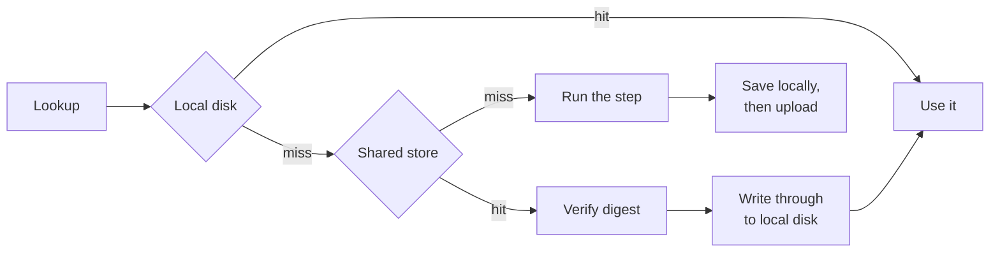

# Shared cache

The local cache is nearly worthless in CI, where every job starts on a fresh runner with an empty
disk. A shared cache points every machine at one store, so a branch build reuses what the trunk
build computed on a runner that no longer exists.

## Turn it on

Point `SENRO_REMOTE_CACHE` at an S3-compatible bucket:

```sh
export SENRO_REMOTE_CACHE="s3://acme-senro-cache"
export SENRO_REMOTE_CACHE_ENDPOINT="https://s3.eu-west-1.amazonaws.com"
export SENRO_REMOTE_CACHE_REGION="eu-west-1"
export AWS_ACCESS_KEY_ID=...          # in CI, normally from an assumed role
export AWS_SECRET_ACCESS_KEY=...
```

or at an OCI registry repository:

```sh
export SENRO_REMOTE_CACHE="oci://ghcr.io/acme/senro-cache"
export SENRO_REMOTE_CACHE_USERNAME="x-access-token"
export SENRO_REMOTE_CACHE_PASSWORD="$GITHUB_TOKEN"
```

That is the whole setup, either way. No code change: a run that was not given a cache in code reads
these variables, the same way it already reads `SENRO_CACHE_DIR`. The scheme picks the backend, and
everything on this page applies to both unless it says otherwise.
[Cache stores](/docs/data/cache-stores/) covers choosing between them.

> The two backends are alternatives, not layers. Setting a variable belonging to the backend you did
> not choose is refused rather than ignored, so a leftover `SENRO_REMOTE_CACHE_ENDPOINT` cannot sit
> there looking meaningful.

## How a lookup works

The shared cache is a **second tier behind the local one**, never a replacement:



Anything fetched is written through to local disk on the way past, so the second run on the same
machine needs no network at all. A save writes to local disk first and then uploads.

- **[Cache keys](/docs/data/cache-keys/) do not change.** A shared cache changes where a result is
  stored, never what it is keyed by.
- **A [scratch cache](/docs/data/scratch/) stays local** and has no remote tier. Its entries are
  whole-tree tarballs re-keyed on every lock-file edit, and its restore-key fallback is decided by
  local recency, so uploading them would cost more than it saved.

## When the store is unreachable

**Nothing fails.** A shared cache that is down, slow, unauthenticated, refusing writes, or serving
rubbish means *no shared cache* and nothing else. The run continues against the local cache alone
and finishes with the exit code it would have had.

It is not quiet about it. One line on standard error:

```
senro: remote cache s3 bucket acme-senro-cache at s3.eu-west-1.amazonaws.com failed on head and is not used for the rest of this run: s3: HEAD senro/v1/cas/sha256/...: dial tcp: connect: connection refused
```

and one `cache.degraded` event in the run's ledger, which the plain renderer prints into your CI
log. After that it stops trying for the rest of the run, so an outage is not a timeout paid on every
one of several hundred objects. A registry behaves identically, through the same code.

One class of problem does **not** degrade: a configuration that could never work. These fail the run
immediately, before the first step, being mistakes in what somebody wrote rather than conditions of
the network:

- No bucket, or an endpoint that is not a URL
- Credentials embedded in the endpoint or the registry host
- A registry target naming no repository, or a repository name a registry could not accept
- `SENRO_REMOTE_CACHE=s3://...` with `SENRO_REMOTE_CACHE_ENDPOINT` missing

> A misconfigured cache that silently degraded would look exactly like a cold one, which nobody ever
> investigates.

## What stops a bad cache

A cache returning the wrong bytes is worse than no cache: the damage is silent and it spreads to
every machine. Two checks stand in the way, and neither is optional or configurable:

- **Every object is verified against the digest it was asked for**, hashed as it is read. A
  truncated download, a substituted error page, an object overwritten by hand: each is a cache
  **miss**, and the step simply runs. The corrupt bytes never reach your workspace or local cache.
- **Every cache entry is verified against the key it was filed under.** A hit skips the step
  entirely, so an entry served under the wrong key would be a build that quietly did not do what it
  was told. The entry carries its own key and is believed only if that key is the one asked for.

Both are reported, and neither switches the cache off: one bad object says nothing about the rest of
the store.

## Two machines finishing at once

Nothing is locked, nothing is coordinated, there is no leader, on either backend:

- **Objects.** Two runners completing the same step write the same object under the same name. The
  name is the content's digest, so both write identical bytes, a single write is atomic at the store,
  and the reader verifies whatever it gets.
- **Cache entries.** Each carries the run that produced it, so **last writer wins**. Both runners ran
  the same action under the same key, so either result is one a later run can legitimately reuse;
  what differs is which run's logs a hit replays.

## Configuration

`SENRO_REMOTE_CACHE` turns the cache on, says where it is, and picks the backend. The rest belong to
one backend or the other, and setting one from the backend you did not choose is an error, not a
no-op:

| Variable | Backend | Meaning |
| --- | --- | --- |
| `SENRO_REMOTE_CACHE` | both | Turns it on: `s3://<bucket>`, `s3://<bucket>/<prefix>`, or `oci://<registry>/<repository>`. Unset means no shared cache |
| `SENRO_REMOTE_CACHE_TIMEOUT` | both | Bounds one request, as a Go duration (`45s`). Default five minutes |
| `SENRO_REMOTE_CACHE_READ_ONLY` | both | `1` reads the cache and never writes it |
| `SENRO_REMOTE_CACHE_ENDPOINT` | bucket | The store's URL, e.g. `https://s3.eu-west-1.amazonaws.com`. Required |
| `SENRO_REMOTE_CACHE_REGION` | bucket | Scopes the request signature. Required. `us-east-1` is the conventional answer for a store with no regions of its own |
| `SENRO_REMOTE_CACHE_PATH_STYLE` | bucket | Overrides bucket addressing. Unset works it out from the endpoint |
| `AWS_ACCESS_KEY_ID` | bucket | The credentials. Standard names, because CI already sets them |
| `AWS_SECRET_ACCESS_KEY` | bucket | |
| `AWS_SESSION_TOKEN` | bucket | Set when the credentials are temporary, the usual case for an assumed role |
| `SENRO_REMOTE_CACHE_USERNAME` | registry | The credential presented to the registry's token endpoint. Both unset means anonymous |
| `SENRO_REMOTE_CACHE_PASSWORD` | registry | |
| `SENRO_REMOTE_CACHE_PLAIN_HTTP` | registry | `1` talks `http` rather than `https`. For a registry on a trusted network with no certificate |

> The registry credentials are senro's own names rather than borrowed ones, because no standard pair
> exists that a CI job already exports for a registry. Docker keeps its credential in a config file
> senro deliberately does not read.

senro reads no credential file and contacts no metadata service. The credentials are whatever the
process was given, read once at the start of the run; a run outlasting a temporary credential
degrades like any other authentication failure.

### In Go

```go
senro.Run(ctx, p, senro.WithRemoteCache(senro.RemoteCache{
    Endpoint: "https://s3.eu-west-1.amazonaws.com", Region: "eu-west-1",
    Bucket: "acme-senro-cache", Prefix: "pipelines",
    AccessKeyID:     os.Getenv("AWS_ACCESS_KEY_ID"),
    SecretAccessKey: os.Getenv("AWS_SECRET_ACCESS_KEY"),
}))

senro.Run(ctx, p, senro.WithRemoteCache(senro.RemoteCache{
    Registry: senro.RegistryCache{
        Host: "ghcr.io", Repository: "acme/senro-cache",
        Username: "x-access-token", Password: os.Getenv("GITHUB_TOKEN"),
    },
}))
```

A registry's fields live in a struct of their own because a bucket and a repository share almost
nothing. `Timeout` and `ReadOnly` stay on `RemoteCache` itself, meaning the same thing on either.
Naming both a bucket and a registry is refused when the run starts.

**Precedence**: an explicit `WithRemoteCache` wins over the environment, since code that says what it
wants should not be overridden by an ambient variable. To read the environment yourself, pass
`senro.RemoteCacheFromEnv()` to `WithRemoteCache`; its zero value configures nothing, so that is safe
whether or not anything is set.

A trunk build filling the cache while pull-request builds read it needs one more variable and a
credential to match. See [Running it in CI](/docs/data/cache-stores/#running-it-in-ci).

## Credentials never travel

A secret never reaches the shared cache, for the same reason it never reaches the local one: a
secret's [identity, not its value](/docs/data/cache-keys/), is what enters a cache key. See
[Secrets](/docs/secrets/).

The store's own credentials never enter a cache key, an object, a bucket key or a registry tag, and
are scrubbed out of any error message on its way into a log or an event. An endpoint or registry host
carrying a credential is refused outright, because both are named in error messages.

## Housekeeping

`senro cache` commands operate on the **local** cache directory: `senro cache gc` prunes your disk
and does not touch the shared store.

senro never deletes from a shared cache, so expiry there is the store's job, and expiring anything
is always safe. Objects are content-addressed and immutable, so
the worst outcome is a miss and the step runs. See [Retention](/docs/data/archiving/#retention) for
the lifecycle rule and why logs usually deserve a longer one than the cache.

## Where to go next

- **[Cache stores](/docs/data/cache-stores/)**: picking a bucket or a registry, and what each costs.
- **[Cache keys](/docs/data/cache-keys/)**: what a key is made of, here and locally.
- **[Archiving a run](/docs/data/archiving/)**: the same store holding a run's logs and ledger.
- **[Caching a step](/docs/data/caching/)**: making a step eligible in the first place.
