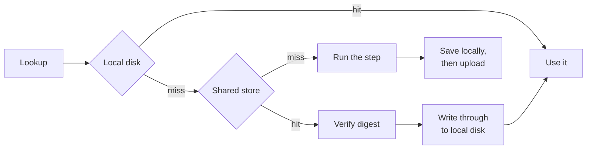

# Shared cache

The local cache is nearly useless in CI, since every job starts on a fresh runner with an empty
disk. A shared cache points every machine at one store instead, so a branch build can reuse what
the trunk build computed, even on a runner that no longer exists.

## Turn it on

Point `SENRO_REMOTE_CACHE` at an S3-compatible bucket:

```sh
export SENRO_REMOTE_CACHE="s3://acme-senro-cache"
export SENRO_REMOTE_CACHE_ENDPOINT="https://s3.eu-west-1.amazonaws.com"
export SENRO_REMOTE_CACHE_REGION="eu-west-1"
export AWS_ACCESS_KEY_ID=...          # in CI, normally from an assumed role
export AWS_SECRET_ACCESS_KEY=...
```

or at an OCI registry repository:

```sh
export SENRO_REMOTE_CACHE="oci://ghcr.io/acme/senro-cache"
export SENRO_REMOTE_CACHE_USERNAME="x-access-token"
export SENRO_REMOTE_CACHE_PASSWORD="$GITHUB_TOKEN"
```

That's the whole setup, either way. No code change needed: a run that wasn't given a cache in code
reads these variables, the same way it already reads `SENRO_CACHE_DIR`. The URL scheme (`s3://` or
`oci://`) picks the backend. Everything on this page applies to both unless noted otherwise.
[Cache stores](/docs/data/cache-stores/) covers choosing between them.

> The two backends are alternatives, not layers. Setting a variable that belongs to the backend you
> didn't choose is refused, not silently ignored, so a leftover `SENRO_REMOTE_CACHE_ENDPOINT`
> can't sit there looking like it's doing something.

## How a lookup works

The shared cache is a **second tier behind the local one**, never a replacement:



Anything fetched gets written through to local disk on the way past, so a second run on the same
machine needs no network at all. A save writes to local disk first, then uploads.

- **[Cache keys](/docs/data/cache-keys/) do not change.** A shared cache changes where a result is
  stored, never what it is keyed by.
- **A [scratch cache](/docs/data/scratch/) stays local** and has no remote tier. Its entries are
  whole-tree tarballs, re-keyed on every lockfile edit, and its restore-key fallback depends on
  local recency. Uploading them would cost more than it would save.

## When the store is unreachable

**Nothing fails.** If the shared cache is down, slow, unauthenticated, refusing writes, or serving
garbage, that just means *no shared cache*. Nothing else happens. The run keeps going against the
local cache alone and finishes with the exit code it would have had anyway.

senro isn't quiet about it. One line on standard error:

```
senro: remote cache s3 bucket acme-senro-cache at s3.eu-west-1.amazonaws.com failed on head and is not used for the rest of this run: s3: HEAD senro/v1/cas/sha256/...: dial tcp: connect: connection refused
```

senro also logs one `cache.degraded` event in the run's ledger, which the plain renderer prints to
your CI log. After that, it stops trying to reach the store for the rest of the run, so an outage
costs one timeout, not one timeout per object across several hundred objects. A registry behaves the
same way, through the same code.

One kind of problem does **not** degrade gracefully: a configuration that could never work. These
fail the run immediately, before the first step runs, because they're mistakes in what someone
wrote, not conditions of the network:

- No bucket, or an endpoint that is not a URL
- Credentials embedded in the endpoint or the registry host
- A registry target naming no repository, or a repository name a registry could not accept
- `SENRO_REMOTE_CACHE=s3://...` with `SENRO_REMOTE_CACHE_ENDPOINT` missing

> A misconfigured cache that silently degraded would look exactly like a cold one, and nobody ever
> investigates a cold cache.

## What stops a bad cache

A cache that returns the wrong bytes is worse than no cache at all: the damage is silent, and it
spreads to every machine. Two checks guard against this, and neither is optional or configurable:

- **Every object is verified against the digest it was asked for**, hashed as it's read. A
  truncated download, a substituted error page, an object overwritten by hand: each of these
  counts as a cache **miss**, and the step just runs. The corrupt bytes never reach your workspace
  or local cache.
- **Every cache entry is verified against the key it was filed under.** A hit skips the step
  entirely, so an entry served under the wrong key would mean a build that silently didn't do what
  it was told. Each entry carries its own key and is only trusted if that key matches the one
  asked for.

Both problems are reported, and neither one turns the cache off, because a single bad object
doesn't say anything about the rest of the store.

## Two machines finishing at once

Neither backend locks anything, coordinates anything, or elects a leader:

- **Objects.** If two runners complete the same step, they write the same object under the same
  name. The name is the content's digest, so both write identical bytes. A single write is atomic
  at the store, and the reader verifies whatever it gets.
- **Cache entries.** Each one carries the run that produced it, so **last writer wins**. Both
  runners ran the same action under the same key, so either result is safe for a later run to
  reuse. The only difference is which run's logs a hit replays.

## Configuration

`SENRO_REMOTE_CACHE` turns the cache on, says where it is, and picks the backend. The rest of the
variables belong to one backend or the other. Setting one that belongs to the backend you didn't
choose is an error, not a no-op:

| Variable | Backend | Meaning |
| --- | --- | --- |
| `SENRO_REMOTE_CACHE` | both | Turns it on: `s3://<bucket>`, `s3://<bucket>/<prefix>`, or `oci://<registry>/<repository>`. Unset means no shared cache |
| `SENRO_REMOTE_CACHE_TIMEOUT` | both | Bounds one request, as a Go duration (`45s`). Default five minutes |
| `SENRO_REMOTE_CACHE_READ_ONLY` | both | `1` reads the cache and never writes it |
| `SENRO_REMOTE_CACHE_ENDPOINT` | bucket | The store's URL, e.g. `https://s3.eu-west-1.amazonaws.com`. Required |
| `SENRO_REMOTE_CACHE_REGION` | bucket | Scopes the request signature. Required. `us-east-1` is the conventional answer for a store with no regions of its own |
| `SENRO_REMOTE_CACHE_PATH_STYLE` | bucket | Overrides bucket addressing. Unset works it out from the endpoint |
| `AWS_ACCESS_KEY_ID` | bucket | The credentials. Standard names, because CI already sets them |
| `AWS_SECRET_ACCESS_KEY` | bucket | |
| `AWS_SESSION_TOKEN` | bucket | Set when the credentials are temporary, the usual case for an assumed role |
| `SENRO_REMOTE_CACHE_USERNAME` | registry | The credential presented to the registry's token endpoint. Both unset means anonymous |
| `SENRO_REMOTE_CACHE_PASSWORD` | registry | |
| `SENRO_REMOTE_CACHE_PLAIN_HTTP` | registry | `1` talks `http` rather than `https`. For a registry on a trusted network with no certificate |

> The registry credentials are senro's own names rather than borrowed ones, because no standard
> pair exists that a CI job already exports for a registry. Docker keeps its credential in a config
> file senro deliberately does not read.

senro reads no credential file and contacts no metadata service. The credentials are whatever the
process was given, read once at the start of the run; a run outlasting a temporary credential
degrades like any other authentication failure.

### In Go

```go
senro.Run(ctx, p, senro.WithRemoteCache(senro.RemoteCache{
    Endpoint: "https://s3.eu-west-1.amazonaws.com", Region: "eu-west-1",
    Bucket: "acme-senro-cache", Prefix: "pipelines",
    AccessKeyID:     os.Getenv("AWS_ACCESS_KEY_ID"),
    SecretAccessKey: os.Getenv("AWS_SECRET_ACCESS_KEY"),
}))

senro.Run(ctx, p, senro.WithRemoteCache(senro.RemoteCache{
    Registry: senro.RegistryCache{
        Host: "ghcr.io", Repository: "acme/senro-cache",
        Username: "x-access-token", Password: os.Getenv("GITHUB_TOKEN"),
    },
}))
```

A registry's fields live in their own struct because a bucket and a repository share almost
nothing. `Timeout` and `ReadOnly` stay on `RemoteCache` itself, and mean the same thing for either
backend. Naming both a bucket and a registry at once is refused when the run starts.

**Precedence**: an explicit `WithRemoteCache` wins over the environment: code that states what it
wants shouldn't be silently overridden by an ambient variable. To read the environment yourself,
pass `senro.RemoteCacheFromEnv()` to `WithRemoteCache`. Its zero value configures nothing, so this
is safe whether or not anything is actually set.

If a trunk build fills the cache while pull-request builds only read it, you'll need one more
variable and a matching credential. See
[Running it in CI](/docs/data/cache-stores/#running-it-in-ci).

## Credentials never travel

A secret never reaches the shared cache, for the same reason it never reaches the local one: only a
secret's [identity, not its value](/docs/data/cache-keys/), enters a cache key. See
[Secrets](/docs/secrets/).

The store's own credentials never enter a cache key, an object, a bucket key, or a registry tag, and
are scrubbed from any error message before it reaches a log or an event. An endpoint or registry
host that embeds a credential is refused outright, since both can appear in error messages.

## Housekeeping

`senro cache` commands operate on the **local** cache directory: `senro cache gc` prunes your disk
and does not touch the shared store.

senro never deletes from a shared cache, so expiry there is the store's job. Expiring anything is
always safe: objects are content-addressed and immutable, so the worst outcome is a miss, and the
step just runs. See [Retention](/docs/data/archiving/#retention) for the lifecycle rule, and why
logs usually deserve a longer one than the cache.

## Where to go next

- **[Cache stores](/docs/data/cache-stores/)**: picking a bucket or a registry, and what each costs.
- **[Cache keys](/docs/data/cache-keys/)**: what a key is made of, here and locally.
- **[Archiving a run](/docs/data/archiving/)**: the same store holding a run's logs and ledger.
- **[Caching a step](/docs/data/caching/)**: making a step eligible in the first place.
