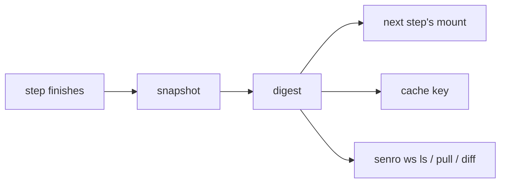

# Workspaces

One step compiles a binary and another step tests it. A `Workspace` is how the first hands its
files to the second: a named, versioned directory that both steps mount. senro snapshots it into a
local content-addressed store (files are keyed by the hash of their contents, so identical files are
only ever stored once) when a step that mounts it finishes, and restores it for the next step that
needs it.

```go
src := senro.Workspace("src", senro.Scope(senro.ScopeRun))

build.Step("compile", exec.Command("go", "build", "-o", "bin/app", "./...")).
	WorkDir("/src").
	Mount(src.At("/src", senro.RW))     // RW: this step writes into the workspace

verify.Step("test", exec.Command("go", "test", "./...")).
	Needs("compile").
	Mount(src.At("/src", senro.RO))     // RO: this step only reads
```

## Mount one

- **`ws.At(path, mode)` always needs a mode.** Use `senro.RW` for a step that writes into the
  workspace, and `senro.RO` for one that only reads it. If a step's declared
  [`Outputs`](/docs/data/caching/) land in a workspace, it needs `RW`.
- **`Mount(...)` accumulates.** One step can mount several workspaces and
  [scratch caches](/docs/data/scratch/) at once.
- **Two mounts at one path are refused.** `Build()` rejects it: `plan: step "s" mounts two things
  at "/src", so which one it sees is undefined`.
- **How strictly `senro.RO` is enforced depends on the executor.** The container executor makes it
  a real read-only bind mount; the local executor detects the write afterwards instead. See
  [Executors](/docs/executors/).
- **A handler can't mount anything of its own.** It automatically gets its parent step's
  workspaces, read-only, at the same paths. Calling `Mount` on a handler is refused. See
  [Handlers](/docs/steps/handlers/).

## Scopes

| Scope | What you get |
| --- | --- |
| `senro.ScopeRun` | The default. One directory for this run, shared by every step that mounts it, gone when the run ends |
| `senro.ScopePersistent` | One directory on this machine that outlives the run. Requires bounds; see [Persistent workspaces](/docs/data/persistent/) |
| `senro.ScopeStep` | One fresh directory **per step**, shared with nobody and discarded with the run. Nothing is snapshotted from one, because no later step reads it |

senro also refuses `MaxAge` or `MaxSize` on any scope other than `ScopePersistent`, since nothing
would ever use them.

## Snapshots

senro snapshots a workspace when a step that mounts it finishes. That snapshot's digest is what a
later step, a cache key, and `senro ws` all use.



- **`NoSnapshot()`** on a step skips this snapshot. Use it when nothing downstream needs the
  step's filesystem output.
- **`senro.Exclude(patterns ...string)`** is a `Workspace` option that keeps matching paths out of
  the snapshot, in addition to the default excludes (`.git` and `node_modules`). For example:
  `senro.Exclude("**/*.log", "tmp/")`.
- **`senro.PreserveSymlinks()`** is a `Workspace` option that keeps real `node_modules`
  directories in the snapshot too, not just symlinks pointing at them. Use it when `node_modules`
  is itself a tree of symlinks into a store, as with pnpm. Most workspaces don't need it.
- **A snapshot stores the executable bit and nothing else.** File modes are normalized, mtimes are
  fixed, and senro doesn't store uid, gid, extended attributes, ACLs, hard links, devices, sockets,
  or fifos. This means a snapshot's digest depends only on file content, not on which machine
  produced it. See [`senro ws pull`](/docs/cli/workspaces/).
- **Excludes apply to transfers too.** On the [Kubernetes](/docs/executors/kubernetes/) and
  [SSH](/docs/executors/ssh/) executors, an excluded path is never sent to the remote target, so it
  can't come back either.
- **You can force a snapshot mid-run.** The
  [`ws.snapshot`](/docs/attach/control-ops/#forcing-a-snapshot) control operation (the TUI's `w`
  key) captures a step's workspaces on demand, useful when you've paused at a breakpoint. The
  event this creates is marked `"forced": true`. The digest is real and `ws pull` works on it, but
  it never enters a cache key, and `ws ls`, `ws pull`, and `ws diff` skip it. That keeps their
  reports matching what the run actually produced.

## Pattern syntax

`*` and `?` match within one path segment. `**` matches across segments. senro uses this same
matcher everywhere: `Exclude`, `artifact.Glob`, and fan-out unit globs. Two rules are easy to miss:

- **A pattern with no `/` matches the whole relative path**, not any depth. This is narrower than
  `.gitignore`: `**/*.log` matches `sub/a.log`, but `*.log` does not.
- **A trailing `/` (meaning "this directory and everything under it") only works in `Exclude`.**
  `artifact.Glob` and unit globs have no directory form, so `tmp/` matches nothing there.

Negation (`!pattern`) isn't supported anywhere. In a `.senroignore` file, a line starting with `!`
is rejected outright, naming the file and line number. Everywhere else, a leading `!` is just
treated as a literal character. So `senro.Exclude("!vendor")` excludes a path that starts with the
character `!`, not "everything except vendor".

## Look at what a run produced

```sh
senro ws ls                                    # every workspace the latest run declared
senro ws pull RUN src /tmp/broken              # the files a failed step left behind
senro ws diff RUN-A RUN-B src                  # what changed between two runs
```

`ws ls` and `ws diff` read stored indexes and never pull the actual files, so both are instant even
on a multi-gigabyte tree. Use `ws pull` when a workspace's last state came from a cache hit, since a
cache entry stores only a body digest, not an index. See
[Workspace commands](/docs/cli/workspaces/).

## Where to go next

- **[Persistent workspaces](/docs/data/persistent/)**: a tree that survives between runs.
- **[Scratch caches](/docs/data/scratch/)**: the best-effort, key-restored sibling.
- **[Caching a step](/docs/data/caching/)**: how a workspace's content reaches a cache key.
- **[Concepts](/docs/concepts/)**: why everything is content-addressed.
