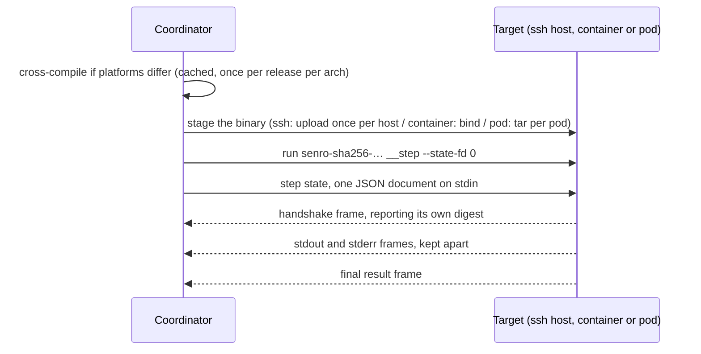

# Func steps off the coordinator

A [`senro.Func` step](/docs/steps/functions/) is a Go function compiled into your pipeline binary,
not a command any shell can run, so a plan can name it but can't describe what it does. Point one at
an SSH host, a container image, or a Kubernetes pod, and senro puts a copy of your pipeline binary
there and re-enters it, rather than trying to ship the function itself. On an SSH host, the function
then runs on that machine's filesystem, against that machine's network:

```go
func HelmUpgrade(ctx senro.Ctx, p DeployParams) error {
	charts, _ := ctx.Workspace("charts")   // a directory on build-07, not on your laptop
	return helm.Upgrade(ctx, p.App, charts.Path("apps", p.App), ctx.Secret("Kubeconfig"))
}

release := p.Workflow("release", senro.On(ssh.Host("deploy@build-07.internal")))
release.Step("deploy", senro.Func("deploy/helm", DeployParams{App: "web"})).
	Mount(senro.Workspace("charts").At("/charts", senro.RO)).
	SecretEnv("KUBECONFIG", "Kubeconfig").Timeout(10 * time.Minute)
```

Point the same step at `container.Image("golang:1.26")` or at `k8s.Pod(ref, k8s.Namespace("ci"))`
instead, and it runs there, in that image's filesystem, as a process of its own. Nothing else in the
pipeline changes.

## What you have to set up

Nothing, if the target's platform matches the coordinator's and your `main` does nothing unusual.
Otherwise there are three things to do: name the package to build and make sure the coordinator has a
Go toolchain (any container or pod step run from macOS needs both, since an image is Linux), call
`senro.StepChild` if your `main` parses flags, and keep cgo out of your module's dependency graph
([below](#cross-compiling-and-the-cgo-constraint)).

**Name the package.** A Go program doesn't record where its own source lives, so tell senro yourself
with `senro.Run(ctx, pipeline(), senro.WithFuncBuild("./ci"))` or the `SENRO_FUNC_PKG` environment
variable. `senro run ./ci` sets this for you, so your local dev loop needs nothing extra. In CI, where
the binary is built once and then run, set the variable in the job or pass the option instead. Without
either, a run that needs a cross-build fails right away, naming both fixes, the same as a missing Go
toolchain would.

**Call `senro.StepChild`** if your `main` would exit on the arguments senro re-enters it with:

```go
func main() {
	if handled, err := senro.StepChild(context.Background()); handled {
		if err != nil { log.Fatal(err) }
		return
	}
	// ... your own main, flag parsing and all
}
```

## What actually happens

A plan records a function's registered name and parameters, not its body: the body is compiled into
your pipeline binary. So running a function elsewhere means putting that binary there and running it.



- **The child is re-entered as `senro-sha256-<digest> __step --state-fd 0`.** The whole step state
  (step id, function name, parameters, workspace directories and secret file paths over there, run id,
  timeout) arrives on stdin as one JSON document. That's because command lines are visible to `ps`,
  and every account on the target could otherwise read them.
- **Frames come back on stdout, length-prefixed**: a handshake, the function's stdout and stderr kept
  apart, and a final result. These go through the same redactor and offset-recording writers a local
  step uses, so `senro logs`, the TUI, and `step.log.appended` look identical either way. The child's
  own stderr is not framed and is captured verbatim: it's the diagnostic channel for a child that
  dies before sending a frame.
- **A `binary.staged` event** closes out the sequence, covered [below](#version-skew-is-fatal-and-staging-is-visible).

Everything else is inherited rather than reimplemented, since the split happens deep in the engine,
after the sandbox already exists: retries, `Timeout`, snapshots, the cache, secrets, handlers,
redaction, traces.

## How the binary gets there

**Over ssh: a transfer, once per host.** The binary lands at
`<workspace root>/bin/senro-sha256-<digest>`, mode `0700`, owned by the connecting account. The path
is the digest, so a second step, run, or coordinator all refer to the same file. senro just checks
whether the host already has it at the right length before uploading. That directory sits alongside
the per-attempt ones, and is beyond the reach of `Close` and the reaper: nothing removes it
automatically, so run `rm -rf ~/.senro/work/bin` yourself to reclaim the space.

**In a container: a read-only bind mount, and no transfer at all**, since the daemon runs on the
coordinator's own machine ([Containers](/docs/executors/containers/)). Two caveats: the image must
not swallow the command (the staged binary is the container's `Cmd`, and `ENTRYPOINT` is left alone,
so an entrypoint that ignores or rewrites its arguments never actually runs it), and since a
container image is Linux, a macOS coordinator cross-compiles for every func step in a container, no
matter how local the daemon is.

**In a pod: a `tar` over the apiserver's `exec` subresource, once per pod.** It lands on an `emptyDir`
at `/senro/bin/senro-sha256-<digest>`, mode `0700`. The step's container starts and holds so the child
can be exec'd into it, which is what keeps the child's stdout and stderr apart, which a pod's merged
log couldn't do, and what gives the step an exit code of its own. The image needs `sh` and `tar`,
exactly as carrying a workspace does ([Kubernetes](/docs/executors/kubernetes/)). A pod's filesystem
doesn't outlive the pod, and senro keeps no cluster object to store a copy in, so this transfer
happens on every attempt and `reused` is always `false`. A genuinely large pipeline binary is the one
thing that makes this executor a worse fit for a func step than an ssh host. `k8s.DelegateSecrets()`
is refused for a func step that declares a secret: delegation hands a source URI to a command to
resolve, but a function reads `ctx.Secret(name)` instead. See
[why the two can't mix](/docs/steps/functions/#why-delegated-secrets-and-func-steps-cannot-mix) for
the two ways around it.

## What your function sees

Your function gets exactly the same [`senro.Ctx`](/docs/steps/functions/) it would see on the
coordinator, just with paths pointing at the target instead:

- **`ctx.Workspace(name)`** is the directory over there (inside the attempt's root on an ssh host, or
  at the mount's declared path in a container or a pod). It's filled before the step runs and read
  back afterward.
- **`ctx.Secret(name)`** is a file path over there: the host's tmpfs where it has one, or
  `/run/senro/secrets` in a container or pod. It's removed when the step ends, reaped if the
  coordinator dies first, and never travels as a value: not in the state document, an argument, or
  an environment variable.
- **`ctx.RunID()`, `ctx.StepID()`, `ctx.Attempt()`** stay the coordinator's values, so an idempotency
  key built from them means the same thing on either side.
- **`TRACEPARENT`** is in the child's environment, naming this attempt's own span. A func step on the
  coordinator is the one case that gets none, since there's no process to give one to.
- **`os.Stdout`**, if you write to it instead of `ctx.Stdout()`, reaches the child's stderr rather
  than corrupting the frames. That's a courtesy, not a contract to rely on.

**`Timeout` actually matters here.** On the coordinator it only bounds how a func step's outcome gets
reported, since nothing can force a Go function to return. Off the coordinator, the function has a
process of its own, which ends itself once the deadline passes.

Declare a timeout on every remote func step. It stops a lost coordinator from leaving a function
running on somebody else's build host. The deadline crosses as a duration rather than a wall-clock
time, so the two machines' clocks don't need to agree.

## Version skew is fatal, and staging is visible

In its first frame, the child reports the digest of the file it actually is, computed from its own
executable. If that disagrees with what senro staged, the step aborts: *"the binary on build-07
reports sha256:9f2c…, and senro staged sha256:41ab… there. Something replaced the staged file, or two
coordinators of different builds are sharing this host's staging directory."*

This is deliberately not retried, since a retry would just re-run the same wrong binary forever. That
digest is also part of the [cache key](/docs/data/cache-keys/) for every func step, so a new release
invalidates func-step results instead of answering from a changed function.

A 40 MiB transfer is affordable once per host per release, not once per step. `binary.staged`, emitted
for every func step, records what you're paying for: digest, platform, strategy, destination, size,
and whether anything actually moved.

```json
{"type":"binary.staged","step":"deploy","payload":{"digest":"sha256:41ab…","platform":"linux/arm64",
  "strategy":"cross-build","target":"ssh://build-07.internal","bytes":41287168,"reused":true,
  "path":"/home/deploy/.senro/work/bin/senro-sha256-41ab…","duration_ns":163490958}}
```

`reused: true` means senro didn't have to move the binary. So an ssh host whose func steps always
report `reused: false` is transferring on every step, which shouldn't happen, and `reused: false`
should never appear at all in a container. In a pod it's always `false`, and honestly so, because every pod
gets a fresh filesystem.

## Cross-compiling, and the cgo constraint

When platforms match, senro ships `os.Executable()` unchanged and compiles nothing. Otherwise it runs
`GOOS=… GOARCH=… CGO_ENABLED=0 go build -tags netgo,osusergo -ldflags '-extldflags=-static' -o <cache>
<your package>`, keyed by the coordinator binary's digest, the package, and the target platform.

The result is cached under your senro cache directory, once per architecture per release rather than
per run. `netgo`, `osusergo`, and the static link mean glibc and musl skew simply can't happen.

`CGO_ENABLED=0` isn't a preference. Cross-compiling with cgo needs a C cross-toolchain per target,
which a pipeline engine can't require of you. So no package anywhere in your module's dependency
graph can compile a cgo file, and the offenders aren't always obvious: `os/user` under some build
configurations, `net` without the `netgo` tag, and anything wrapping a C library.

senro checks this before the run emits a single event, and refuses with the import path and the
dependency chain that pulled the cgo package in:

```
./ci cannot be cross-compiled for another platform: 1 package(s) in its dependency graph compile a cgo
file, and a cross-compile is built with CGO_ENABLED=0, which cannot link their C dependency for the
target
  github.com/acme/ci/internal/db (sqlite3.go)
    via: github.com/acme/ci -> github.com/acme/ci/internal/db
```

This report comes from the same detector that [`senro func check`](/docs/cli/workspaces/) uses, so
the two stay consistent. Run `senro func check ./...` in CI before you depend on this. What it costs
in practice:

- a pure-Go SQLite driver instead of a cgo one
- `os/user` lookups that read `/etc/passwd` rather than calling NSS, which behaves differently under
  LDAP or SSSD
- DNS through Go's own resolver rather than the host's `nsswitch.conf`

If any of that is unacceptable, run the step on the coordinator instead, or make it an `exec` step
calling a binary you built for the host yourself.

> One warning for the case where senro compiles nothing: a pipeline binary built on a glibc machine
> with cgo enabled, then run as a func step in a musl image of the same architecture, fails to start.
> The daemon reports that the file doesn't exist, which is what a missing dynamic loader looks like.
> Build with `CGO_ENABLED=0` if your pipeline drives containers.

## When it goes wrong

| Symptom | Cause |
|---|---|
| `the binary staged on … did not re-enter as a step child` | Your `main` never reached `senro.Run`, usually a flag parser that exits on `__step`. Call `senro.StepChild` first. In a container, an `ENTRYPOINT` that does not exec its arguments |
| The step failed and stdout is empty | Read the step's stderr, unframed and captured verbatim for this: a binary that will not execute, a Go runtime that died before `main`, a shell that could not find the file |
| The daemon reports `/senro/bin/senro-sha256-…` does not exist | A dynamically linked pipeline binary meeting a musl image. See the cgo constraint above |
| In a pod: `sending the step binary into pod …failed (tar exited …)` | The image has no `tar`, or no `sh` to hold the container open. The same two a workspace needs |
| The step settled as `panicked` | A function panicked, exactly as on the coordinator; the stack is in its stderr log, and panics are not retried ([States](/docs/steps/states/)) |
| A function wants to report infrastructure | Wrap the executor's infra sentinel; `retry.OnInfra()` matches it after the round trip |

## Func handlers come along

A [handler](/docs/steps/handlers/) declares no executor of its own, and runs wherever its parent ran.
A `senro.Func` handler is staged and re-entered on that target exactly like a func step.

```go
deploy.Step("apply", exec.Command("./deploy.sh")).
	OnFailure(senro.Handler("collect", senro.Func("ci/collect", CollectParams{})))
```

- It reuses the binary the parent step already staged, so a handler costs no second transfer.
  `binary.staged` still fires for it, with `reused: true`, so a run that's paying for a transfer per
  step stays visible as one.
- `ctx.Failure()` tells it what broke, carried over the wire with the rest of the step state. See
  [Failure handlers](/docs/steps/handlers/#a-handler-can-be-a-go-function).
- The one refusal left: a func handler that declares a delegated secret, for the same reason a func
  step can't. Delegation hands the pod a source URI for the step's own command to resolve, and a
  function has no environment to read it from.

## What is not here

- **Windows targets.** Refused by name, since a staged binary runs through a POSIX shell, gets
  `chmod`ed `0700`, and is reaped with `rm -rf`, none of which works on a Windows host.
- **Garbage collection**, so the ssh staging directory grows by one binary per release.
- **Embedded cross-compiled variants** (`-tags senro_embed`, the air-gapped answer), **pre-built OCI
  images**, and **wrapping `exec` steps** in the same staged binary. All designed, none built yet.
