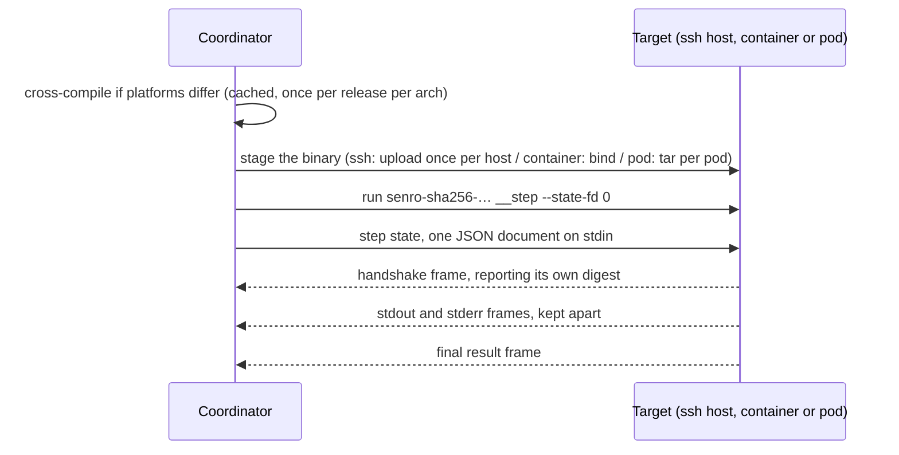

# Func steps off the coordinator

Point a [`senro.Func` step](/docs/steps/functions/) at an SSH host, a container image or a Kubernetes
pod and senro puts a copy of your pipeline binary there and re-enters it. On an SSH host the function
then runs on that machine's filesystem, against that machine's network:

```go
func HelmUpgrade(ctx senro.Ctx, p DeployParams) error {
	charts, _ := ctx.Workspace("charts")   // a directory on build-07, not on your laptop
	return helm.Upgrade(ctx, p.App, charts.Path("apps", p.App), ctx.Secret("Kubeconfig"))
}

release := p.Workflow("release", senro.On(ssh.Host("deploy@build-07.internal")))
release.Step("deploy", senro.Func("deploy/helm", DeployParams{App: "web"})).
	Mount(senro.Workspace("charts").At("/charts", senro.RO)).
	SecretEnv("KUBECONFIG", "Kubeconfig").Timeout(10 * time.Minute)
```

Point the same step at `container.Image("golang:1.26")` or at `k8s.Pod(ref, k8s.Namespace("ci"))`
instead and it runs **there**, in that image's filesystem, as a process of its own; nothing else in
the pipeline changes.

## What you have to set up

Nothing, if the target's platform matches the coordinator's and your `main` does nothing unusual.
Otherwise three things: name the package to build and have a Go toolchain on the coordinator (any
container or pod step from macOS needs both, since an image is linux), call `senro.StepChild` if your `main`
parses flags, and keep cgo out of your module's graph
([below](#cross-compiling-and-the-cgo-constraint)).

**Name the package.** A Go program records nothing about where its own source is, so tell senro with
`senro.Run(ctx, pipeline(), senro.WithFuncBuild("./ci"))` or the `SENRO_FUNC_PKG` environment variable.
**`senro run ./ci` sets it for you**, so the dev loop needs nothing; in CI, where the binary is built
once and then run, set the variable in the job or pass the option. Without either, a run needing a
cross-build fails at second zero naming both fixes, as a missing Go toolchain does.

**Call `senro.StepChild`** if your `main` would exit on the arguments senro re-enters it with:

```go
func main() {
	if handled, err := senro.StepChild(context.Background()); handled {
		if err != nil { log.Fatal(err) }
		return
	}
	// ... your own main, flag parsing and all
}
```

## What actually happens

A plan records a function's registered name and parameters, not its body, which is compiled into your
pipeline binary; running one elsewhere therefore means putting that binary there and running it.



- **The child is re-entered as `senro-sha256-<digest> __step --state-fd 0`.** The whole step state
  (step id, function name, parameters, workspace directories and secret file paths over there, run id,
  timeout) arrives on **stdin** as one JSON document, because `ps` exists and every account on the
  target can read a command line.
- **Frames come back**, length-prefixed on stdout: a handshake, the function's stdout and stderr kept
  apart, and a final result, through the same redactor and offset-recording writers a local step uses,
  so `senro logs`, the TUI and `step.log.appended` are identical either way. The child's own stderr is
  **not** framed and is captured verbatim: the diagnostic channel for a child that dies before a frame.
- **A `binary.staged` event** closes the sequence, [below](#version-skew-is-fatal-and-staging-is-visible).

Everything else is inherited rather than re-implemented, because the split happens deep in the engine,
after the sandbox exists: retries, `Timeout`, snapshots, the cache, secrets, handlers, redaction, traces.

## How the binary gets there

**Over ssh: a transfer, once per host.** The binary lands at
`<workspace root>/bin/senro-sha256-<digest>`, mode `0700`, owned by the connecting account. The path
*is* the digest, so a second step, run or coordinator all name the same file, and senro asks the host
whether it is there at the right length before uploading. That directory is a sibling of the per-attempt
ones and beyond the reach of `Close` and the reaper: nothing removes it, and `rm -rf ~/.senro/work/bin`
reclaims the space.

**In a container: a read-only bind mount, and no transfer at all**, since the daemon is on the
coordinator's own machine ([Containers](/docs/executors/containers/)). Two caveats: the image **must not
swallow the command** (the staged binary is the container's `Cmd` and the `ENTRYPOINT` is left alone, so
one that ignores or rewrites its arguments never runs it), and **an image is linux**, so a macOS
coordinator cross-compiles for every func step in a container however local the daemon is.

**In a pod: a `tar` over the apiserver's `exec` subresource, once per pod.** It lands on an `emptyDir`
at `/senro/bin/senro-sha256-<digest>`, mode `0700`, and the step's container is started *holding* so
the child can be exec'd into it: that is what keeps the child's stdout and stderr apart, which a pod's
merged log could not, and what gives the step an exit code of its own. The image needs `sh` and `tar`,
exactly as carrying a workspace does ([Kubernetes](/docs/executors/kubernetes/)). A pod's filesystem
does not outlive the pod and senro owns no cluster object to keep a copy in, so this is paid **per
attempt** and `reused` is always `false`; a genuinely large pipeline binary is the one thing that makes
this executor a worse home for a func step than an ssh host. `k8s.DelegateSecrets()` is refused for a
func step that declares a secret: delegation is a source URI for a *command* to resolve, and a function
reads `ctx.Secret(name)`.

## What your function sees

Exactly the [`senro.Ctx`](/docs/steps/functions/) it sees on the coordinator, paths pointing at the
target:

- **`ctx.Workspace(name)`** is the directory over there (inside the attempt's root on an ssh host, at the
  mount's declared path in a container or a pod), filled before the step and read back after.
- **`ctx.Secret(name)`** is a file path over there: the host's tmpfs where it has one, or
  `/run/senro/secrets` in a container or a pod. Removed when the step ends, reaped if the coordinator dies first,
  and never travelling as a value: not in the state document, an argument or an environment variable.
- **`ctx.RunID()`, `ctx.StepID()`, `ctx.Attempt()`** stay the coordinator's, so an idempotency key built
  from them means the same thing on either side.
- **`TRACEPARENT`** is in the child's environment, naming this attempt's own span. A func step on the
  coordinator is the one place that gets none: there is no process to give one to.
- **`os.Stdout`**, written to instead of `ctx.Stdout()`, reaches the child's stderr rather than
  corrupting the frames. A courtesy, not a contract.

**`Timeout` actually bites here.** On the coordinator it bounds only how a func step's outcome is
reported, since nothing can force a Go function to return; off the coordinator the function has a
process of its own, which ends itself when the deadline passes.

Declare one on every remote func step: it stops a lost coordinator leaving a function running on
somebody else's build host. The deadline crosses as a duration, not a wall-clock time, so the two
clocks need not agree.

## Version skew is fatal, and staging is visible

The child reports the digest of the file it actually **is**, computed from its own executable, in its
first frame. A disagreement with what senro staged aborts the step: *"the binary on build-07 reports
sha256:9f2c…, and senro staged sha256:41ab… there. Something replaced the staged file, or two
coordinators of different builds are sharing this host's staging directory."*

It is not retried, deliberately, since a retry would re-run the same wrong binary forever. That digest
is also part of the [cache key](/docs/data/cache-keys/) for every func step, so a new release
invalidates func-step results rather than answering from a changed function.

A 40 MiB transfer is affordable once per host per release, not once per step, and `binary.staged`,
emitted for every func step, records which you are paying for: digest, platform, strategy, destination,
size and whether anything actually moved.

```json
{"type":"binary.staged","step":"deploy","payload":{"digest":"sha256:41ab…","platform":"linux/arm64",
  "strategy":"cross-build","target":"ssh://build-07.internal","bytes":41287168,"reused":true,
  "path":"/home/deploy/.senro/work/bin/senro-sha256-41ab…","duration_ns":163490958}}
```

`reused: true` means senro did not have to move the binary, so an ssh host whose every func step reports
`reused: false` is transferring per step, which should not happen, and in a container `reused: false`
should never appear at all. In a pod it is always `false`, and honestly so: every pod is a fresh
filesystem.

## Cross-compiling, and the cgo constraint

Matching platforms ship `os.Executable()` unchanged and compile nothing. Otherwise senro runs
`GOOS=… GOARCH=… CGO_ENABLED=0 go build -tags netgo,osusergo -ldflags '-extldflags=-static' -o <cache>
<your package>`, keyed by the coordinator binary's digest, the package and the target platform.

The result is cached under your senro cache directory: once per architecture per release, not per run.
`netgo`, `osusergo` and the static link stop glibc and musl skew being a category of bug.

`CGO_ENABLED=0` is not a preference: cross-compiling with cgo needs a C cross-toolchain per target,
which a pipeline engine does not get to require. So **no package anywhere in your module's transitive
closure may compile a cgo file**, and the offenders are not obvious: `os/user` under some build
configurations, `net` without the `netgo` tag, and anything wrapping a C library.

senro refuses before the run emits a single event, naming the import path and the chain that pulled it
in:

```
./ci cannot be cross-compiled for another platform: 1 package(s) in its dependency graph compile a cgo
file, and a cross-compile is built with CGO_ENABLED=0, which cannot link their C dependency for the
target
  github.com/acme/ci/internal/db (sqlite3.go)
    via: github.com/acme/ci -> github.com/acme/ci/internal/db
```

That report comes from the same detector [`senro func check`](/docs/cli/workspaces/) prints, so the two
cannot drift apart; run `senro func check ./...` in CI before you depend on this. What it costs in
practice:

- a pure-Go SQLite driver instead of a cgo one
- `os/user` lookups that read `/etc/passwd` rather than calling NSS, which differs under LDAP or SSSD
- DNS through Go's own resolver rather than the host's `nsswitch.conf`

If any of that is unacceptable, run the step on the coordinator, or make it an `exec` step calling a
binary you built for the host yourself.

> One warning for the identity case, where senro compiles nothing: a pipeline binary built on a glibc
> machine with cgo enabled, run as a func step in a musl image of the same architecture, fails to start,
> and the daemon reports the file does not exist, which is what a missing dynamic loader looks like.
> Build with `CGO_ENABLED=0` if your pipeline drives containers.

## When it goes wrong

| Symptom | Cause |
|---|---|
| `the binary staged on … did not re-enter as a step child` | Your `main` never reached `senro.Run`, usually a flag parser that exits on `__step`. Call `senro.StepChild` first. In a container, an `ENTRYPOINT` that does not exec its arguments |
| The step failed and stdout is empty | Read the step's stderr, unframed and captured verbatim for this: a binary that will not execute, a Go runtime that died before `main`, a shell that could not find the file |
| The daemon reports `/senro/bin/senro-sha256-…` does not exist | A dynamically linked pipeline binary meeting a musl image. See the cgo constraint above |
| In a pod: `sending the step binary into pod …failed (tar exited …)` | The image has no `tar`, or no `sh` to hold the container open. The same two a workspace needs |
| The step settled as `panicked` | A function panicked, exactly as on the coordinator; the stack is in its stderr log, and panics are not retried ([States](/docs/steps/states/)) |
| A function wants to report infrastructure | Wrap the executor's infra sentinel; `retry.OnInfra()` matches it after the round trip |

## What is not here

- **Func *handlers* on any non-local step.** A handler inherits its parent's executor and declares none
  of its own, so there is nothing to key the staging to; use an `exec` handler for cleanup on the target
  ([Handlers](/docs/steps/handlers/)).
- **Windows targets.** Refused by name: a staged binary runs through a POSIX shell, is `chmod`ded
  `0700` and reaped with `rm -rf`, none of which reaches a Windows host.
- **Garbage collection**, so the ssh staging directory grows by one binary per release.
- **Embedded cross-compiled variants** (`-tags senro_embed`, the air-gapped answer), **pre-built OCI
  images**, and **wrapping `exec` steps** in the same staged binary: all designed, none built.
