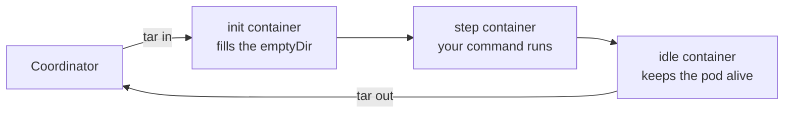

# Kubernetes

`k8s.Pod(ref)` targets a workflow at a Kubernetes cluster. Every step runs as its own pod: one step,
one pod, one container. The step's command becomes the container's command, its output comes back
through the pod's log, and its exit code comes from the container's terminated status.

```go
import "github.com/xavidop/senro/executor/k8s"

runner := k8s.Pod("ghcr.io/acme/runner@sha256:9f2c1e8b…", k8s.Namespace("ci"))

deploy := p.Workflow("deploy", senro.Needs("verify"), senro.On(runner))
deploy.Step("apply", exec.Command("helm", "upgrade", "--install", "web", "./chart"))
```

The digest and the namespace are both required. `Build()` refuses the pipeline if either is missing.

## Configure the cluster

The cluster comes from environment variables read at run start. senro never reads `$KUBECONFIG` or
`~/.kube/config`, and never uses your current context. If none of the variables below are set, the
run fails at the start and tells you what's missing.

| Variable | Required | What it is |
|---|---|---|
| `SENRO_K8S_SERVER` | yes | The apiserver's base URL, `https://10.0.0.1:6443` |
| `SENRO_K8S_CA_FILE` | yes | PEM file holding the cluster's CA. senro will not skip verification |
| `SENRO_K8S_TOKEN_FILE` | one of | File holding a bearer token |
| `SENRO_K8S_TOKEN` | one of | The bearer token inline |
| `SENRO_K8S_CLIENT_CERT_FILE` + `SENRO_K8S_CLIENT_KEY_FILE` | one of | A client certificate and its key |

Prefer the file over the inline token. An environment variable is visible in `/proc/<pid>/environ`,
gets inherited by every child process, and can land in a crash dump. Inside the cluster, point at the
projected files:

```sh
export SENRO_K8S_SERVER=https://kubernetes.default.svc
export SENRO_K8S_CA_FILE=/var/run/secrets/kubernetes.io/serviceaccount/ca.crt
export SENRO_K8S_TOKEN_FILE=/var/run/secrets/kubernetes.io/serviceaccount/token
```

In your namespace, the identity needs `create`, `get`, and `delete` on pods; `get` on `pods/log`; and
`create` on `pods/exec` (this is how workspaces cross over, how a session enters a pod, and how a
`Func` step's binary gets in). It also needs `create`, `patch`, and `delete` on secrets, plus `list`
and `get` on nodes at cluster scope (used to read the execution platform).

## What runs where, at a glance

| Behavior | On this executor |
|---|---|
| Image reference | Must be pinned to a digest, or `Build` refuses it |
| Namespace | Must be stated with `k8s.Namespace`; no fallback to `default`. Two namespaces are two executors |
| Workspaces | Carried into the pod and back, both directions |
| `senro.RO` mounts | **Genuinely enforced**, read-only in the pod |
| Secrets | Files under `/run/senro/secrets`, never fields of the pod |
| Scratch caches | Carried into the pod and back, like a workspace. Two full transfers per step; see below |
| `Func` steps | Yes: the pipeline binary is sent into the pod and re-entered there |
| `senro shell` | Yes, `--tty` included, in a pod of its own |
| stdout and stderr | Merged into one stream, since Kubernetes keeps one log per container |
| The step's command | **Replaces** the image's `ENTRYPOINT`, where the container executor passes it as arguments to one. An image with a wrapper script behaves differently on the two |
| Platform | Read from the cluster's nodes, not the image manifest. Nodes that disagree are refused until you say which you meant with `k8s.Platform("linux", "amd64")` |
| Restarts | senro's alone. `restartPolicy` is `Never`, so the kubelet never restarts a command behind the engine's back |
| Cache class | The image digest and the platform. Never the namespace, never the cluster |

## Workspaces cross into the pod, and come back

A mounted workspace becomes an `emptyDir` volume at the path you declared. It's filled from the
coordinator's copy before your step runs, and read back afterwards, so a Kubernetes step can receive
a workspace a local step filled, and hand its output to a later step. Declaring the mount works the
same way everywhere ([Workspaces](/docs/data/workspaces/)).



Under the hood, this is a `tar` stream over the apiserver's `exec` subresource, in both directions,
the same way `kubectl cp` works. There's no PVC, no reachable content store, and no second
credential involved. A few things follow from that:

- **Every byte crosses the apiserver twice per attempt.** A hundred-megabyte workspace means two
  hundred megabytes on a shared apiserver. For large inputs, it's better to fetch them inside the pod
  under `NoSnapshot()` instead.
- **The step's image needs `sh` and `tar`**, so a distroless image can't carry a workspace. The
  [SSH executor](/docs/executors/ssh/) has the same requirement for a host.
- **The pod gains two extra containers whenever a step mounts a workspace**, and none otherwise: an
  init container fills the volume before your step's container can start, and an idle container keeps
  the pod alive so the result can be read out. Both die with the pod either way.
- **A mount carries exactly what a snapshot carries.** `.git` and `node_modules` are excluded, so
  they're not sent and don't come back. Your copy is replaced rather than merged.
- **An interrupted transfer fails loudly.** The far side's `tar` exit status arrives on its own
  stream, and a stream that ends without one is treated as an error rather than a truncated success
  with the wrong digest cached. The recorded digest is always computed from the copy that actually
  came back.

A [scratch cache](/docs/data/scratch/) crosses the same way and is read back before the run saves it,
so what lands under the key is whatever the pod left behind. Two things differ: nothing is excluded
from a scratch cache (`node_modules` is usually the point of it), and there's no digest, since a
scratch cache never enters a cache key. Think before putting one on a pod: a dependency tree big
enough to be worth caching is often big enough that carrying it across the shared apiserver twice per
step costs more than just downloading it again. If the copy doesn't come back, the run saves nothing
rather than storing the coordinator's stale copy under a key nothing can rewrite.

Two ways to get more out of one. **Across runs and machines**, set `SENRO_REMOTE_SCRATCH` and the
cache is kept in the bucket, so a coordinator with a cold disk fills the pod from the shared copy
instead of from nothing ([Sharing scratch caches](/docs/data/scratch-sharing/)). Note this does not
reduce what crosses the apiserver: the pod is still filled from the coordinator, which now merely has
something to fill it with. **Within one run**, a pod can share a cache with a local or container step
as long as a `Needs` orders the two
([handing one over](/docs/data/scratch/#handing-one-between-a-remote-step-and-a-local-one)).

## Persistent workspaces, with or without a claim

A [persistent workspace](/docs/data/persistent/) works here with no PVC at all by default.
`ScopePersistent` and `PersistentVolumeClaim` share a word and nothing else. The coordinator holds
the canonical copy, fills the pod from it, and reads it back, with the same bounds, lease, and
cache-key rule as a local run.

The cost is a transfer twice per attempt, which hurts most on a large tree. `k8s.Claim` removes that
cost, by naming a claim you've already created:

```go
k8s.Pod(img, k8s.Namespace("ci"), k8s.Claim("build-cache", "senro-build-cache"))
```

The pod mounts the claim directly: no staging container, no reader, nothing carried. senro creates,
binds, resizes, and deletes nothing: storage class, size, and access mode are cluster decisions with
real money attached. You give up three things in exchange:

- **A step mounting a claim can't be `Pure()`.** `Build` refuses it, naming the workspace and the
  claim, because the coordinator can't walk a tree that lives only in the cluster. No `ws.snapshot`
  is emitted either.
- **Exclusion moves into the cluster**, as a `coordination.k8s.io` `Lease` in the namespace. Takeover
  is conditional on the lease's `resourceVersion`, so two racing coordinators still produce one
  winner. But it's unfenced: a holder partitioned from the apiserver can keep writing even after its
  lease is taken.
- **Scheduling gets narrower.** `ReadWriteOnce` ties every mounting pod to one node, so a fan-out
  serializes. `ReadWriteMany` means a networked filesystem and real money, and senro checks neither.
  For an ordinary workspace, a claim isn't the fix for transfer cost.

## Secrets are files, and never fields of the pod

A secret reaches a Kubernetes step the same way it reaches every step: as a file under
`/run/senro/secrets`, with its path in the step's environment ([Secrets](/docs/secrets/)). It's
delivered as a namespaced `Secret`, created for one attempt, projected at mode `0400`, and mounted
read-only.

- **The value is never in the pod spec.** Not in `env`, `envFrom`, a command argument, or an
  annotation. A pod spec is readable by anyone with `get pods`, is what `kubectl describe` prints, and
  is what support bundles and admission webhooks collect, so an `envFrom` value would survive in every
  dump of it forever.
- **The Secret is short-lived**: created for one attempt, marked immutable, and deleted when the
  sandbox closes on every path. It has an `ownerReference` to its pod, so the apiserver's garbage
  collector removes it even if the coordinator is killed first.
- **It's still weaker than a local file.** The value passes through the apiserver and lands in etcd,
  readable by anyone with `get secrets` there, and encrypted at rest only if your cluster has
  configured a provider for that.

The step's declared environment is an ordinary pod field, and so is the
[trace context](/docs/extend/exporter/) (`TRACEPARENT`, and `TRACESTATE` when the run has one). A
traceparent doesn't name a principal or grant any access, so it's fine there.

### Delegating secrets

`k8s.DelegateSecrets()` inverts the default. senro resolves nothing and creates no `Secret`. No value
ever crosses the boundary: each secret's source URI arrives as `SENRO_SECRET_<NAME>_SOURCE`, and the
pod fetches its own secret using its ServiceAccount's identity.

```go
k8s.Pod(img, k8s.Namespace("ci"),
    k8s.ServiceAccount("senro-ci"),   // annotated for IRSA, or bound via Pod Identity
    k8s.DelegateSecrets())
```

(IRSA, IAM Roles for Service Accounts, and Pod Identity are AWS's and Azure's own mechanisms for
letting a ServiceAccount assume a cloud identity without a static credential in the pod; senro
doesn't set either one up for you.)

This is refused without a ServiceAccount, since the namespace's default account is one every other
pod already has. Whatever resolves the URI is up to the step itself. There are three costs:

- **The pod gets a ServiceAccount token**, which senro otherwise refuses it
  (`automountServiceAccountToken: false`), and the step's command can read it. Naming a
  ServiceAccount alone does not turn delegation on by itself.
- **senro can no longer tell you the secret arrived.** A push either delivers a value or fails the
  step. A delegation succeeds as far as senro knows, and can still fail inside your command.
- **The redactor never sees the value**, so it can't scrub it from the step's log.

## What a failure means

If the container actually ran, you get its exit code back, with no error and no retry from
`retry.OnInfra()`. A container that ran reports its code no matter what happened to it:

- the command exited non-zero, whatever the code
- the container was killed for memory (`OOMKilled`, exit 137)
- the command doesn't exist in the image (`StartError`)

These count as infrastructure failures instead, which [`retry.OnInfra()`](/docs/steps/retries/)
retries:

- the image could not be pulled, or the reference is not a valid name
- the container's configuration could not be built (usually a missing mounted secret)
- the pod was evicted, its node stopped reporting, or it was deleted out from under the run
- the apiserver could not be reached, or the run was cancelled
- the pod did not start within five minutes, with the scheduler's own account of why, such as
  `0/12 nodes are available: 12 Insufficient cpu`

## `senro shell` is a pod of its own

A session on a Kubernetes step is a second pod, created when you ask for one: the step's image, the
step's workspaces staged into it read-only at the step's paths, the step's environment and working
directory, and your command exec'd into a container held open for it. `--tty` works too, and the pty
belongs to the container runtime, so your window size travels the same connection your input does.

This is deliberately not the step's own pod. The step's pod projects the step's `Secret` and carries
its `SENRO_SECRET_*` paths, so a session there would hand you a credential the engine is supposed to
withhold. It also mounts workspaces the way the step asked for them, so a session there could rewrite
bytes the run's digests already describe.

What it costs: capacity for a second pod, one more workspace transfer across the apiserver, and `sh`
in the image (plus `tar` when the step mounts anything): the same requirements as carrying a
workspace. A claim-backed workspace is mounted by the session's pod too, so a `ReadWriteOnce` claim
held on another node leaves the session pending until the pod can be scheduled beside it. No new RBAC
is needed: `create` on `pods/exec` is already required to move a workspace.

Once the run is over, there's nothing left to open a session in, on this executor or any other:
`senro shell` needs the live engine that owns the workspaces. Use `senro ws pull` to write the files
out instead ([The shell](/docs/attach/shell/)).

## `Func` steps run in the pod

A [`senro.Func` step](/docs/steps/functions/) targeted at a pod runs in the pod. A function's body is
compiled into your pipeline binary, so senro sends that binary in and re-enters it as a step child,
exactly as it does over ssh and in a container
([Func off the coordinator](/docs/executors/func-remote/) covers the whole mechanism).

What's specific to this executor:

- **The binary crosses as a `tar` over `pods/exec`**, the same transport a workspace already uses,
  landing in an `emptyDir` at `/senro/bin`. No new RBAC, no registry, no reachable content store, and
  senro doesn't build your image.
- **The step's container starts and holds, and the child is exec'd into it.** That's what keeps
  stdout and stderr apart, which a pod's log can't do on its own (the child's protocol is framed on
  stdout, with unframed diagnostics on stderr), and it's what gives the step an exit code of its own.
- **The image needs `sh` and `tar`**, exactly as carrying a workspace does, and it must be able to run
  a static Linux binary for the node's architecture. senro cross-compiles with `CGO_ENABLED=0`,
  `-tags netgo,osusergo`, and a static link, so no dynamic loader is involved and a musl image works
  fine. A macOS coordinator therefore cross-compiles for every func step in a pod, and needs
  `senro.WithFuncBuild("./ci")` and a Go toolchain.
- **One transfer per pod, which means per attempt.** A pod's filesystem doesn't outlive it, and senro
  keeps no cluster object to store a copy in, so `binary.staged` reports `reused: false` every time,
  unlike ssh, where the binary is staged once per host. The cross-compile itself is still cached,
  once per architecture per release.
- **`k8s.DelegateSecrets()` is refused for a func step that declares a secret.** Delegation delivers a
  source URI in the pod's environment for the step's own command to resolve, but a function reads
  `ctx.Secret(name)`, the path of a file senro wrote. `Build()` catches this rather than handing the
  function an empty string. See
  [why the two can't mix](/docs/steps/functions/#why-delegated-secrets-and-func-steps-cannot-mix) for
  the two ways around it.

## Pod tuning

Resource requests and limits, a node selector, tolerations, and image pull secrets are all unset by
default: the pod gets whatever the namespace and the scheduler would otherwise give it. Four options
on `k8s.Pod` declare them.

```go
k8s.Pod(img, k8s.Namespace("ci"),
	k8s.Resources(
		map[string]string{"cpu": "500m", "memory": "256Mi"}, // requests
		map[string]string{"cpu": "1", "memory": "512Mi"},    // limits
	),
	k8s.NodeSelector(map[string]string{"disktype": "ssd"}),
	k8s.Toleration("dedicated", "Equal", "ci", "NoSchedule"),
	k8s.ImagePullSecrets("regcred"),
)
```

`k8s.Resources` takes Kubernetes quantity strings exactly as the apiserver does (`"500m"`, `"256Mi"`);
senro parses neither map, so a malformed one is reported by the apiserver rejecting the pod, not by
`Build()`. It applies to the step's own container only: senro's staging and reader containers are its
own plumbing, not part of what the pipeline asked to run, and a limit sized for the step would starve
them.

`k8s.Toleration` is called once per taint the target nodes carry; each call appends one. `Operator` is
`"Equal"` (`Value` must match) or `"Exists"` (`Value` is ignored).

`k8s.ImagePullSecrets` names a Secret that must already exist in the target namespace; senro creates,
resizes, and deletes nothing, the same restraint as `k8s.Claim`. It is distinct from
`container.RegistryAuth`, which this executor refuses at `Build()`: that credential is resolved by
senro and pushed for the container executor to pull with directly, while this is a reference the
node's own kubelet resolves, the ordinary way a pod pulls a private image.

All four are part of the executor's instance key: two targets naming one image but disagreeing about
any of them are two executors, not one sharing a resolve.

## What is not here

- **A [scratch cache](/docs/data/scratch/) shared with a step on the coordinator's own filesystem
  when nothing orders the two.** Refused at `Build()`: a local or container step writes that
  directory while it runs, and a pod tarring the same directory at that same moment would send a
  half-written tree and then save it under a key nothing can rewrite. A `Needs` between them removes
  the same moment and the share is allowed, handing the cache from whichever runs first to whichever
  runs second. Two pods can still share one freely, ordered or not.

If a coordinator is killed before cleaning up, every object senro creates is still findable. Each
one carries the step's full id as the annotation `senro.dev/step-id`:

```sh
kubectl -n ci get pods,secrets -l senro.dev/managed=true
kubectl -n ci get pods -l senro.dev/run=<run id>
```

> senro ignores kubeconfig because it typically holds dozens of contexts, mostly pointed at
> production, with whichever one you last used selected. An executor that defaulted to it could
> deploy to the wrong cluster. The namespace isn't part of the cache class because the same bytes
> come out of `ci` as out of `ci-staging`, and a class built from where you happened to run would mean
> a fleet never shares a cache entry.
