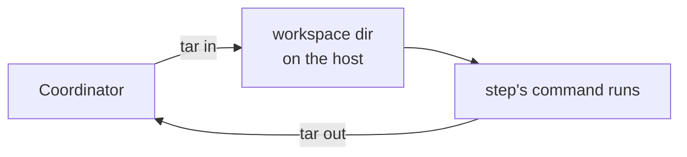

# SSH

`ssh.Host(dest)` targets a workflow at a remote machine. Every step runs as a process on that host:
the step's command becomes the process, its output comes back on the connection's two streams, and
its exit code comes from the host.

```go
import "github.com/xavidop/senro/executor/ssh"

builder := ssh.Host("deploy@build-07.internal", ssh.CacheClass("ubuntu-24.04/amd64/go1.26"))
release := p.Workflow("release", senro.Needs("verify"), senro.On(builder))
release.Step("restart", exec.Command("systemctl", "restart", "web"))
```

## Point a workflow at a host

senro shells out to the `ssh` binary already on the machine running the pipeline. It embeds no SSH
implementation of its own, and there's no key, password, or host key anywhere in a senro pipeline.

**The destination you write is the destination you'd type yourself.** `ssh.Host("build-07")`
connects to exactly what `ssh build-07` connects to: your `~/.ssh/config` (`Host`, `Match`,
`Include`), your `known_hosts` (hashed entries, `@cert-authority` lines, host certificates), your
`ProxyJump` and `ProxyCommand` bastions, your agent, hardware keys, PKCS#11 tokens, and any wrapper in
front of `ssh`. If it works from your shell, it works here.

senro adds `-T` (pipes rather than a terminal) and exactly one hardening option of its own,
`-o BatchMode=yes`. It overrides none of your own settings: the only other options it passes are the
[multiplexing](#connection-multiplexing) ones, and only when you haven't configured any yourself.

`BatchMode` means a coordinator with no terminal fails instead of hanging on a passphrase prompt, and
an unknown host key is refused instead of prompting, since nobody is there to answer. senro never
passes `StrictHostKeyChecking` in either direction: `no` would hand a step's credentials to whatever
answered, and `yes` would override an operator who deliberately chose `accept-new`.

> A host new to your `known_hosts` fails the run with `ssh`'s own message. Add it the way you always
> do. That's intended behavior, not a rough edge.

## What the host needs

A POSIX shell, `tar`, and the ordinary utilities around them (`mkdir`, `rm`, `cat`, `printf`, `uname`,
`nohup`, `sleep`). Nothing gets installed and no package manager runs. senro doesn't need root:
everything it creates lives under `~/.senro/work` in the account's own space, or wherever you point it
with `ssh.Host("build-07", ssh.WorkspaceRoot("/var/lib/senro/ws"))` on a fleet with small home
directories.

## What runs where, at a glance

| Behavior | On this executor |
|---|---|
| Workspaces | Carried to the host and back, both directions, as `tar` over the connection |
| `senro.RO` mounts | A request, not enforceable remotely; writes through one are caught on read-back |
| Secrets | Files on the host, delivered over stdin, removed at step end, reaped after six hours |
| Scratch caches | Carried to the host and back, like a workspace. Two full transfers per step |
| `Func` steps | Supported; the binary is staged once per host per release |
| `senro shell` | Supported. `--tty` is refused with `executor_no_terminal` |
| Connections | One per host for the whole run, over an OpenSSH control master, unless you opt out |
| Environment | `env -i` with your declared variables plus the host's own `PATH` |
| Cache class | `ssh/<os>/<arch>` by default; declare `ssh.CacheClass` for a fleet |

## Where things land on the host

Each step attempt gets its own directory, named after the run, step, attempt and a random nonce:

```
~/.senro/work/<run>-<step>-<attempt>-<nonce>/
    ws/<mount>/     the step's workspaces
    status          the command's exit code
    pid             the wrapper's process id
```

- **A mount lives inside the attempt directory**, not at the host's root. `At("/src")` becomes
  `<attempt>/ws/src`, since senro isn't root on the host and won't pretend it can create `/src`.
- **`WorkDir` resolves against mounts.** `WorkDir("/src")` alongside a mount at `/src` resolves to
  that mount's directory. A working directory that no mount touches is used as written, so
  `WorkDir("/opt/app")` means `/opt/app` on the host, which is what makes an ordinary deploy step work.
- **Nothing survives a run** except what a step itself creates, plus a `Func` step's staged binary,
  which sits alongside the attempt directories rather than inside one.

## Workspaces cross the connection, in both directions

A mounted workspace is filled on the host before the step runs, and read back afterwards, as `tar`
over the connection: a file you send is there, a file the step writes comes back, and a file the step
deletes is gone from your copy too. Declaring one works the same way everywhere
([Workspaces](/docs/data/workspaces/)).



- **A mount carries exactly what a snapshot carries.** Paths excluded from snapshots (`.git` and
  `node_modules` by default) aren't sent, don't come back, and so aren't in your workspace directory
  afterwards. A step that needs the repository's history on the far side should fetch it there
  itself.
- **The upside of that same rule**: your directory ends up exactly matching its recorded digest,
  where the local and container executors leave the excluded paths sitting alongside it.
- **The bytes cross twice per step, on every attempt.** There's no incremental transfer and no
  resumption: a one-gigabyte workspace costs a gigabyte each way.
- **A read-only mount is read back and hashed, but never written over your copy.** A remote step that
  wrote through one is caught and reported rather than carried home. As with the local executor,
  read-only is a request senro can't enforce on a far-side directory the step actually owns.

A [scratch cache](/docs/data/scratch/) crosses the same way and is read back before the run saves it,
so what lands under the key is whatever the host left behind. Two things differ: nothing is excluded
from a scratch cache (`node_modules` is usually the point of it), and there's no digest, since a
scratch cache never enters a cache key. It still costs the same two transfers per step, so a
multi-gigabyte dependency tree can be slower to carry over than to just download again. If the copy
doesn't come back, the run saves nothing rather than storing your stale copy under a key nothing can
rewrite.

## Secrets are files on the host, and they are removed

A secret's value crosses as bytes on the connection's standard input, into a file created under
`umask 077` inside a directory senro creates at `0700`. The step learns the path through its
environment, as on every executor. The value is never an argument (visible to `ps`, auditd's `execve`
rules, or shell history), never an environment variable (`/proc/<pid>/environ`), and never sent via
`SendEnv`.

The file lives in the host's own runtime directory, chosen in this order, and deliberately never in
the attempt directory that senro reads back, because a credential must never be something that could end up
in a snapshot:

1. `$XDG_RUNTIME_DIR`, when set and a directory. Per-user and tmpfs-backed.
2. `/dev/shm`, tmpfs by definition. senro creates a `0700` directory inside it.
3. `$TMPDIR`, or `/tmp`. Disk-backed, and senro doesn't claim otherwise.

**When it goes away.** `Close` removes it at the end of the step, on every path, including a kept
sandbox. Where the host has `shred`, the file is shredded first; elsewhere it's just removed. A
detached reaper, armed before anything is written, covers the case where the coordinator dies first:
it fires after six hours, and a step that outlives it loses its credential files and fails loudly on
the next read.

Steps on one host share an account, so a step can read another step's secret directory. This is the
weakest isolation of the four executors ([Secret channels](/docs/secrets/channels/)).

## The cache class is not the hostname

Left undeclared, `Class()` reports `ssh/<os>/<arch>`, read from the host with `uname`. It's
deliberately not the hostname: a class built from host identity would mean a fleet of forty identical
machines never shares a cache entry, and nothing would tell you why.

Declare what actually makes two hosts interchangeable, with `ssh.CacheClass("ubuntu-24.04/amd64/go1.26")`
on both, and they share cache entries without senro contacting either one. Keeping the class honest
is on you: senro can't tell that `build-07` quietly picked up a different Go toolchain.

## What a failure means

`ssh` exits with the remote command's status, or with 255 for its own failures, so a bare 255 could
mean either "the connection broke" or "your command exited 255".

senro resolves the ambiguity on the host: a wrapper writes the command's real status to a file before
exiting with it. On any code but 255, senro trusts the code directly. On 255, it opens one extra
session to read the file. If the file is present, the command ran and the file is the verdict. If
it's missing, nothing ran, and this counts as infrastructure.

You get the command's exit code back, with no error and no retry from `retry.OnInfra()`, when:

- the command exited non-zero, whatever the code, including 255
- the command doesn't exist on the host (exit 127)
- the command was killed on the host, by the OOM killer or anything else (exit 128 + signal)

It counts as an infrastructure failure, which [`retry.OnInfra()`](/docs/steps/retries/) retries,
when:

- the host could not be reached, authentication failed, or the host key did not verify
- the connection dropped before the command recorded a status
- the step's working directory does not exist on the host
- a workspace could not be sent or read back
- the run was cancelled

## Traps

- **A login banner can land in your step's output.** Shells that print from startup files share your
  command's stream even non-interactively. senro's own scripts read only marked lines and are immune
  to this, but your step's output is not. Silence a printing `.bashrc`, or expect the banner to show
  up.
- **A step gets the environment you declared, and nothing else**: `env -i` with the plan's variables
  plus the host's own `PATH`. It can't inherit the remote login environment, so it won't pick up
  `SSH_AUTH_SOCK` and hand a build step your keys. The [trace context](/docs/extend/exporter/) travels
  on that same list, visible in `ps` like every declared variable, which is why a secret crosses as
  stdin bytes instead.
- **Every phase opens its own session** (host prep, each workspace, each secret, the command,
  read-back, cleanup, a `Func` step's binary check and push), all riding the same
  [connection per host](#connection-multiplexing).
- **Cancelling a run doesn't guarantee the remote command is dead.** senro closes the session and
  signals the wrapper's recorded pid, and `sshd` tears the session down, but a command that detached
  from its session outlives all three. This is not the same guarantee as deleting a pod.
- **senro depends on a binary it doesn't control.** An `ssh` old enough to lack an option, or a
  wrapper named `ssh` that does something else, changes what a step does.

## `Func` steps run here too

A registered Go function runs on the host's filesystem, against its network. senro stages your
pipeline binary at the content-addressed `<workspace root>/bin/senro-sha256-<hex>` and re-enters it
there, once per host per release rather than per step. A differing platform costs a
`CGO_ENABLED=0` cross-compile ([Func steps off the coordinator](/docs/executors/func-remote/)).

## Connection multiplexing

A run pays for connection setup once per host, not once per command: the first session opens an
OpenSSH control master (OpenSSH's own name for a shared connection that later sessions multiplex
over, the same thing `ControlMaster`/`ControlPath` configure in `ssh_config`), and every later
session rides it, so a step costs a handshake instead of six.

- **The control socket is guarded like a session**, because opening it is one: a random name in the
  same private (`0700`) runtime directory as the attach socket. senro closes the master when the run
  ends, on every path, and its `ControlPersist` setting removes it if the coordinator is killed first.
- **Your configuration wins.** If your `ssh_config` already resolves a `ControlPath` for the
  destination, senro adds no multiplexing option at all, and yours stays in force, the same as with
  host key policy. It checks this with `ssh -G`, which connects to nothing.
- **A master that won't open isn't fatal.** The run carries on with a connection per command and says
  so once on standard error. `ssh.Host(dest, ssh.NoMultiplexing())` chooses that deliberately, for a
  fleet where one shared connection is the wrong trade-off.
- **One broken master fails the commands riding it.** They retry as infrastructure failures, and the
  next one opens a new master.
- **`sshd`'s `MaxSessions` (default 10) caps how many steps share a connection.** senro keeps at most
  8 on the master and gives anything over that its own connection, so parallelism is never capped by
  this setting.
- **The cap is 8 rather than 10 because exceeding it doesn't fail a step.** `ssh` prints `Session open
  refused by peer` into that step's own stderr and then succeeds on a fresh connection. Lower
  `MaxSessions` below 8 on a host and that line starts appearing in your logs.

## What is not here

- Bastion support beyond the `ProxyJump` and `ProxyCommand` you already have.
- A host-facts cache across runs: `uname` is read once per host per run.
- Incremental workspace transfer, and a disk-space check before one.
- A terminal for `senro shell`, refused with `executor_no_terminal`, because `ssh` driven from pipes
  has no window size to give a remote pty ([Shell](/docs/attach/shell/)).
- A [scratch cache](/docs/data/scratch/) shared with a step on the coordinator's own filesystem,
  refused at build time: a local or container step writes that directory while it runs, and an ssh
  step tarring the same directory would send a half-written tree and then save it under a key nothing
  can rewrite. Two ssh steps can still share one freely.
