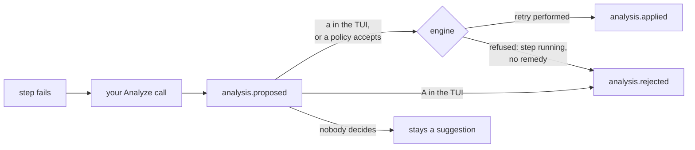

# Writing a failure analyzer

An `Analyzer` is handed a failed step and returns an explanation, which senro puts back into the
run's event stream under a gate. Reach for one when you want a model, a log classifier or a runbook
lookup to say why something broke.

senro holds no API key and takes no dependency on any provider. It produces a correct, complete,
already-redacted description of the failure; turning that into an explanation is a call to an SDK
you already have.

## The interface

```go
package senro

type Analyzer interface {
	Analyze(context.Context, api.Failure) (api.Proposal, error)
}

func WithAnalyzer(a Analyzer, opts ...AnalyzeOption) Option
```

An implementation imports `github.com/xavidop/senro/api` and nothing else of senro's, which the test
suite checks mechanically. The two types it moves are [below](#what-you-are-handed).

## The smallest one that works

```go
func (Analyzer) Analyze(ctx context.Context, f api.Failure) (api.Proposal, error) {
	switch {
	case strings.Contains(f.LogTail, "i/o timeout"):
		return api.Proposal{
			Summary: f.Step + " failed on the network, not on its own work",
			Remedy:  api.RemedyRetry,
		}, nil
	case strings.Contains(f.LogTail, "no space left on device"):
		// No remedy, deliberately: retrying a full disk fails identically.
		return api.Proposal{Summary: f.Step + " filled the disk"}, nil
	}
	return api.Proposal{}, nil // no Summary: no comment, and no event
}
```

A real analyzer replaces the switch with one call to its provider, prompted from `f.Step`, `f.Cmd`,
`f.ExitCode` and `f.LogTail`. Nothing else changes.

## What you are handed

`api.Failure`, and no handle it could use to go and read more:

```go
type Failure struct {
	RunID, Pipeline, Step string
	Attempt               int
	State                 State  // failed, timed_out or panicked
	ExitCode              int
	Error                 string
	Duration              time.Duration
	Cmd, Needs            []string
	LogTail               string
}
```

That it is a flat list is the point: every field leaves the machine for an API senro has never heard
of, so the decision about what may leave is made here, once, reviewable and tested. A step
**skipped** because something upstream failed is never offered.

## What you return

```go
type Proposal struct {
	Summary string  // one line, and the one thing a person reads first
	Detail  string  // the reasoning, as long as it needs to be
	Remedy  Remedy  // at most one thing to DO, from a closed vocabulary
}

const (
	RemedyNone  Remedy = ""       // explain, ask for nothing
	RemedyRetry Remedy = "retry"  // run the failed step again
)
```

`RemedyRetry` is in the vocabulary because **it grants nothing new**: retrying a settled step is
already a [control operation](/docs/attach/control-ops/) that refuses when the step is running or
was never reached, and an accepted proposal takes exactly that code path, refusals included.

Everything else is refused, and these are refusals rather than unbuilt features:

- **Editing a workspace file**: a patch from an API is untrusted text, and writing it to disk is
  arbitrary code execution at the next step that reads it.
- **Rewriting a command**: a run in which `Cmd` is not what ran has a ledger describing a different
  pipeline.
- **Injecting an environment variable**: it changes what the step is and what its cache key means,
  and nobody reviewed the value.

`Detail` is free text senro neither parses nor acts on, so an analyzer can still *say* all of those;
"apply this patch" is advice a person applies themselves.

## The contract

### What you must guarantee

- **`Summary` or nothing.** A proposal without one is discarded, so "no comment" is a legitimate
  answer that costs the run no event at all.
- **Exactly the vocabulary.** An unrecognised remedy (`"patch"`, `"RETRY "`) is treated as no
  remedy, with no trimming and no case folding. Normalising would be senro guessing what a model
  meant, at the one point where a wrong guess causes work to happen.
- **Do not expect a second call.** `WithAnalyzer` is not repeatable, because two analyzers would
  mean two proposals per failure competing for one gate. To use two, write an `Analyzer` that
  consults both and returns one answer.

### What senro guarantees you

- **Already redacted.** `LogTail` is the tail buffer downstream of the writer that redacts the log
  file, and every other field is plan data and attempt numbers that pass through the payload
  redactor into `step.started` and `step.finished`. A second redactor would be a second
  implementation of a guarantee that already holds. `LogTail` is also **bounded** to the last few
  kilobytes, so a step that printed a gigabyte cannot become a gigabyte-sized request body.
- **Being slow costs the run nothing.** Unlike `Sink.Emit`, `Analyze` never runs on the engine's
  goroutine or holds the ledger lock. Offering is a channel send onto a bounded queue right after
  `step.finished`; a full queue **drops** the offer and counts it, and no scheduling decision waits.
- **Bounded twice.** One call is bounded by `senro.AnalyzeTimeout` (30s), on a context derived with
  `context.WithoutCancel`, because a cancelled run is frequently the one whose failure most wants
  explaining. Shutdown waits once, bounded by `senro.AnalyzeGrace` (10s), then cancels, then abandons.
- **No confidence score, deliberately.** It invites the one policy nobody should write (apply
  anything above a threshold), and senro cannot define, compare or validate the number.

### What happens on error

Returning an error is the same as no comment: no proposal, the error named in the shutdown report,
and the run's own error unchanged. A run did not fail because somebody's API was down. A panic is
recovered into an ordinary error; it is still a bug in your analyzer.

The shutdown wait happens **before** `run.finished`, unlike a notifier's flush, because an
analyzer's outstanding work explains a step that failed earlier and the ledger is still open for it.
What still does not fit goes to standard error, redirected with `senro.AnalyzeReportWriter`, as does
a failed step your analyzer never answered about:

```
senro analyze: 1 proposal arrived after this run's event stream closed, so it is
reported here instead of in the ledger:
  claude: deploy attempt 2: the cluster rejected the manifest's apiVersion
```

## The gate

**A proposal never applies itself.** `analysis.proposed` is a suggestion and nothing else, until one
of exactly two deciders acts.



**An attached client** is the default and the whole point: `a` accepts the focused step's proposal
and `A` rejects it in [the TUI](/docs/attach/tui/), over the `analysis.accept` and `analysis.reject`
[control operations](/docs/attach/control-ops/). Each takes one `id`, which is `<step>@<attempt>`
and rides on every `analysis.proposed`. It names a proposal, never a step: the step an accepted
proposal retries is the one the **engine's** record says it was about, and deciding twice is refused
(`proposal_settled`) rather than silently repeated.

**A policy you configured** is the one way to defeat the gate, spelled this way on purpose: acting
on a model's word unattended should take a line somebody would notice in code review.

```go
senro.WithAnalyzer(a, senro.AcceptWithoutHumanApproval(
	func(f api.Failure, p api.Proposal) bool {
		return p.Remedy == api.RemedyRetry && f.Attempt == 1
	}))
```

Even then, the policy is bounded three ways:

- It is asked **only** about a proposal whose remedy senro can perform, never about an advisory one.
- It chooses **whether**, never **what**, since the vocabulary stays closed.
- Everything it applies is recorded with `policy: true`, so a run nobody watched can be identified
  from the ledger alone.

It applies **at most once per step per run**, or the loop is unbounded: apply, retry, fail,
propose, apply, forever. That bound is on *applying*, never on *explaining*, so the second failure
is still analyzed and proposed and an attached operator can still accept it.

Three events carry all of this. `analysis.proposed` (`api.AnalysisProposedBody`) says a program
explained a failure; `analysis.applied` and `analysis.rejected` (both `api.AnalysisDecisionBody`)
say a decider accepted or declined, the second also covering a refusal by the engine.

The step and attempt are on the **envelope**, so a client routes one without decoding a payload. A
run with no analyzer emits none of them, and a proposal nobody decided about is exactly one event.

## Wire it into a run

One option: `senro.Run(ctx, pipe, senro.WithAnalyzer(myAnalyzer, senro.AnalyzerName("claude")))`.

## The worked example

[`examples/extensions/fakeanalyzer`](https://github.com/xavidop/senro/tree/main/examples/extensions/fakeanalyzer)
is the analyzer above in full, whose provider is a switch statement, so it runs with no network and
no key while demonstrating identical wiring. `go run ./examples/analyze` explains both failures and
applies nothing, because nobody approved anything. With `-auto` a policy is configured:

```
  proposed  audit@1      audit filled the disk
                         no remedy: a person has to look at this
  proposed  fetch@1      fetch failed on the network, not on its own work
  applied   fetch@1      by a configured policy, with no human involved
```

`audit` is the step that matters. It failed, it was explained, and **nothing was applied to it** even
with the policy wide open, because the analyzer proposed no remedy for a full disk. An analyzer worth
having has to be able to say "a person needs to look at this".

To test yours, feed it a `Failure` and assert on the `Proposal`. You need no engine and no network.

For a real provider behind the same interface, you do not have to write one:
**[`contrib/genkitanalyzer`](/docs/extend/analyzer-genkit/)** is a shipping package that explains a
failure with one [Genkit](https://genkit.dev) call, taking the Genkit instance you configured. It
lives in its own module, so senro's own dependency graph carries no AI SDK.

## Where to go next

- **[An AI analyzer](/docs/extend/analyzer-genkit/)**: `contrib/genkitanalyzer`, this interface
  backed by a real model.
- **[Control operations](/docs/attach/control-ops/)**: `analysis.accept` and `analysis.reject`.
- **[The TUI](/docs/attach/tui/)**: `a` and `A`, and what the footer shows before you press one.
- **[Reading a failed run](/docs/reference/debugging/)**: what senro tells you without any analyzer.
