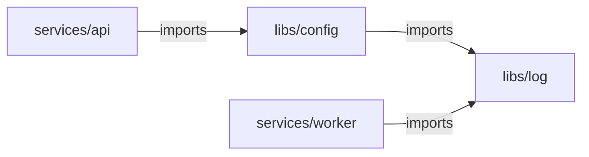

# Running only what changed: `Affected`

`.Affected(src)` on an `ExpandBuilder` narrows the fan-out to the units a change reaches: the ones
owning a changed file, plus everything depending on them at any depth.

```go
import (
	"github.com/xavidop/senro/change"
	"github.com/xavidop/senro/unit/gowork"
)

verify.Expand("test", gowork.Modules()).
	Affected(change.FromTrigger(ev)).
	Template(func(u senro.Unit) *senro.StepBuilder {
		return senro.NewStep(exec.Command("go", "test", "./...")).WorkDir(u.Dir)
	})
```

It needs a graph that knows about dependencies. Six do: `gowork`, `cargo`, `jswork`, `maven`,
`gradle`, and `bazel.Query()`. Three don't: `glob`, `pyproject`, and `bazel.Packages()`. Using
`Affected` with one of those three is **rejected at build time**, rather than silently running
everything. See [The shipped unit graphs](/docs/monorepo/unit-graphs/).

## The rule

A unit runs if the change touched a file it owns, **or** if it depends, at any depth, on a unit
that did. In the [example
workspace](https://github.com/xavidop/senro/tree/main/examples/monorepo):



`services/api` never imports `libs/log` directly, but a change to `libs/log` still runs it,
through `libs/config`. That transitive hop is the whole point of the feature, and exactly where a
one-level implementation would quietly get it wrong.

```sh
go run ./examples/monorepo --trigger-event examples/monorepo/events/push-api.json
# 1 step:  services/api. Nothing imports it.
go run ./examples/monorepo --trigger-event examples/monorepo/events/push-config.json
# 2 steps: libs/config and services/api. worker does not import config.
go run ./examples/monorepo --trigger-event examples/monorepo/events/push-log.json
# 4 steps: everything.
```

## What changed: the `change` package

`github.com/xavidop/senro/change` answers "what did this run change". Four sources:

| Source | What it reports |
|---|---|
| `change.FromTrigger(ev)` | What the event that started the run recorded. See below. |
| `change.Paths("a/x.go", ...)` | A literal list, for callers with their own idea of what changed, and for tests. |
| `change.Everything()` | Every unit runs. |
| `change.Ignoring(src, "docs/**")` | `src`, with matching paths dropped. |

`change.Paths()` with no arguments means **"nothing changed,"** not "everything." Use
`change.Everything()` for that. They're different answers.

### `FromTrigger` consumes the base, it does not invent one

A [trigger](/docs/triggers/) has already decided what changed. `FromTrigger` just reads what it
recorded, in this order:

1. **No event at all** means everything runs. This is the local loop: running `./pipeline` with
   no `--trigger-event` builds everything. If a dispatcher forgets the flag, it over-runs visibly
   instead of silently skipping work.
2. **Mode `all`** means everything runs: a default-branch push, a tag, or a scheduled run covers
   the whole repository by definition.
3. **A base with both ends set** is `git diff <before> <after>`.
4. Otherwise **the event's own changed-file list**, if it carried one. GitHub sends one on a push
   to an existing ref and none on a pull request.
5. Otherwise **everything**.

senro never computes a merge base, resolves a ref, or picks a "since" on its own. A guessed base
would be a base nobody actually declared. A few details worth knowing:

- **The base wins over the event's file list.** A GitHub push payload truncates its `commits`
  array at twenty, so its file list under-counts a large push. Two commit ids, by contrast, are
  exact.
- **The diff is two-dot**, not three-dot. Three-dot needs a merge base, and a shallow CI clone
  often can't compute one. For a pull request whose base branch has moved on, two-dot reports that
  drift as changed too, which can mean more units than strictly necessary, but never fewer.
- **Renames are turned off**, so a moved file is reported at both its old and new path.
- **A base commit not in the clone is a loud error**, not a fallback:

```
change: git diff --name-only --no-renames -z <from> <to> -- in .: exit status 128:
fatal: bad object <from>; if the base commit is not in the clone, deepen the checkout
(fetch-depth: 0) so the diff has something to compare against
```

This is the expected result of a shallow checkout. An unchecked git failure would eventually be
read as "nothing changed," reporting a green run without anything having compiled.

## Where it deliberately runs too much

A wrong affected set is worse than no affected set at all. An extra unit just costs CI minutes,
but skipping a unit that a change actually broke reports a green build for a broken tree. So
whenever it's unclear, senro runs more, not less:

- **A file no unit owns** affects every unit: a `Makefile`, a CI workflow or a linter config above
  every module can change what all of them build.
- **An uncompiled file at a module's root** affects every unit of that module: `go.mod`, `go.sum`,
  a `.golangci.yml`, a `Dockerfile`. A `.go` file at the same level is compiled into the root
  package and attributed to it alone.
- **`go.work` and `go.work.sum`** affect every unit; they decide which module path resolves where.
- **Anything else** belongs to the nearest unit at or above its directory, without crossing into
  another module. If a file is inside a module that has no unit above it, it belongs to every unit
  in that module.
- **A deleted file** is resolved from its path alone: nothing checks the working tree. If a whole
  package is deleted, it's owned by nothing, so the answer is everything. That's the only answer
  that can't accidentally skip the importer whose build just broke.
- **A change source that cannot tell what changed** says everything, never nothing.

### `Ignoring`, and the one way to get this wrong

`change.Ignoring` is the one thing here that deliberately runs *less*, and that's your call, not
senro's:

```go
Affected(change.Ignoring(change.FromTrigger(ev), "docs/**", "*.md"))
```

A typo fix in `docs/` can't break a Go build. But a pattern that also matches something that *can*
change a build, since `*.yml` catches a linter config as well as docs front matter, can turn a broken
build green. Write the narrowest pattern that does the job. An `Everything()` set passes through
`Ignoring` untouched, since filtering "build everything" would quietly turn into "build nothing".

## A plan-time filter, not a run-time skip

Unaffected children are **not in the plan** at all. They're not skipped steps, they don't show up
in the UI, nothing settles for them. That's different from [`When`](/docs/steps/conditions/),
which prunes a node that the plan does contain.

- Two runs of the same commit against the same base produce the same plan and digest, and a
  re-run reconstitutes exactly the same children.
- An empty affected set materializes no children: the group is declared,
  `plan.expansion_skipped` is emitted, and the run is `succeeded`, same as a `glob` that matched
  nothing.
- **`MaxNodes` is still checked against the whole graph**, not the narrowed set.

## What is not here

- **Anything that guesses.** senro won't resolve a ref, compute a merge base, or shell out to
  `git` to figure out what a run is probably about. It uses the base the event recorded, or it
  builds everything.

## Where to go next

- **[The shipped unit graphs](/docs/monorepo/unit-graphs/)**: which graphs answer this, and why the
  others decline.
- **[Triggers](/docs/triggers/)**: where the mode and the base come from.
- **[Trigger events](/docs/triggers/events/)**: the event file and the per-provider traps.
- **[Reading a failed run](/docs/reference/debugging/)**: `run.json` records the mode and base
  consumed.
- **[Implement a unit graph](/docs/monorepo/unit-graphs/custom/)**: teach senro a layout no shipped graph
  fits.
