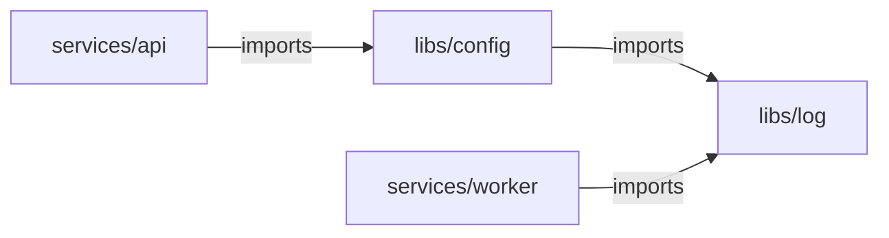

# Running only what changed: `Affected`

`.Affected(src)` on an `ExpandBuilder` narrows the fan-out to the units a change reaches: the ones
owning a changed file, plus everything depending on them at any depth.

```go
import (
	"github.com/xavidop/senro/change"
	"github.com/xavidop/senro/unit/gowork"
)

verify.Expand("test", gowork.Modules()).
	Affected(change.FromTrigger(ev)).
	Template(func(u senro.Unit) *senro.StepBuilder {
		return senro.NewStep(exec.Command("go", "test", "./...")).WorkDir(u.Dir)
	})
```

It needs a graph that knows dependencies. Five of the eight shipped graphs do (`gowork`, `cargo`,
`jswork`, `maven`, `gradle`); `glob`, `pyproject` and `bazel` do not, and `Affected` over one of
those is **refused at build time** rather than quietly running everything. See
[The shipped unit graphs](/docs/monorepo/unit-graphs/).

## The rule

A unit runs if the change touched a file it owns, **or** if it depends, at any depth, on a unit
that did. In the [example
workspace](https://github.com/xavidop/senro/tree/main/examples/monorepo):



`services/api` never imports `libs/log`, but a change to `libs/log` still runs it, through
`libs/config`. That transitive hop is what the feature is for, and where a one-level
implementation quietly fails.

```sh
go run ./examples/monorepo --trigger-event examples/monorepo/events/push-api.json
# 1 step:  services/api. Nothing imports it.
go run ./examples/monorepo --trigger-event examples/monorepo/events/push-config.json
# 2 steps: libs/config and services/api. worker does not import config.
go run ./examples/monorepo --trigger-event examples/monorepo/events/push-log.json
# 4 steps: everything.
```

## What changed: the `change` package

`github.com/xavidop/senro/change` answers "what did this run change". Four sources:

| Source | What it reports |
|---|---|
| `change.FromTrigger(ev)` | What the event that started the run recorded. See below. |
| `change.Paths("a/x.go", ...)` | A literal list, for callers with their own idea of what changed, and for tests. |
| `change.Everything()` | Every unit runs. |
| `change.Ignoring(src, "docs/**")` | `src`, with matching paths dropped. |

`change.Paths()` with no arguments is **"nothing changed"**, not "everything"; use
`change.Everything()` for the second. They are different answers.

### `FromTrigger` consumes the base, it does not invent one

A [trigger](/docs/triggers/) already decided what changed, and `FromTrigger` reads exactly what it
recorded. In order:

1. **No event at all** is everything. That is the local loop: `./pipeline` with no
   `--trigger-event` builds everything, and a dispatcher that forgot the flag over-runs visibly.
2. **Mode `all`** is everything: a default-branch push, a tag and a scheduled run cover the
   repository by definition.
3. **A base with both ends set** is `git diff <before> <after>`.
4. Otherwise **the event's own changed-file list**, if it carried one. GitHub sends one on a push
   to an existing ref and none on a pull request.
5. Otherwise **everything**.

It never computes a merge base, resolves a ref, or picks a "since" of its own: a base senro
guessed would be a base nobody declared. Details that matter:

- **The base wins over the event's file list.** A GitHub push payload truncates its `commits` array
  at twenty, so its file list under-counts a large push; two commit ids are exact.
- **The diff is two-dot**, not three-dot. Three-dot needs a merge base, which a shallow CI clone
  often cannot compute. For a pull request whose base branch moved on, two-dot reports the drift as
  changed too: more units than strictly necessary, never fewer.
- **Renames are turned off**, so a moved file is reported at both its old and new path.
- **A base commit not in the clone is a loud error**, not a fallback:

```
change: git diff --name-only --no-renames -z <from> <to> -- in .: exit status 128:
fatal: bad object <from>; if the base commit is not in the clone, deepen the checkout
(fetch-depth: 0) so the diff has something to compare against
```

That is the ordinary consequence of a shallow checkout. An unchecked git failure would eventually
become "nothing changed" and report a run green without compiling anything.

## Where it deliberately runs too much

A wrong affected set is worse than no affected set: an extra unit costs CI minutes, but skipping a
unit a change broke reports a green build for a broken tree. So every branch that could go either
way runs more:

- **A file no unit owns** affects every unit: a `Makefile`, a CI workflow or a linter config above
  every module can change what all of them build.
- **An uncompiled file at a module's root** affects every unit of that module: `go.mod`, `go.sum`,
  a `.golangci.yml`, a `Dockerfile`. A `.go` file at the same level is compiled into the root
  package and attributed to it alone.
- **`go.work` and `go.work.sum`** affect every unit; they decide which module path resolves where.
- **Anything else** belongs to the nearest unit at or above its directory, without leaving its
  module. A file inside a module with no unit above it belongs to every unit of that module.
- **A deleted file** is answered from its path alone; nothing stats the working tree. A deleted
  whole package is owned by nothing, so the answer is everything, the only answer that cannot skip
  the importer that just broke.
- **A change source that cannot tell what changed** says everything, never nothing.

### `Ignoring`, and the one way to get this wrong

`change.Ignoring` is the single thing here that deliberately runs *less*, and it is your call, not
senro's:

```go
Affected(change.Ignoring(change.FromTrigger(ev), "docs/**", "*.md"))
```

A `docs/` typo fix cannot break a Go build. But a pattern matching something that *does* change a
build (`*.yml` catches a linter config as well as docs front matter) turns a broken build green;
write the narrowest pattern that does the job. An `Everything()` set passes through untouched,
since filtering "build everything" would quietly become "build nothing".

## A plan-time filter, not a run-time skip

The unaffected children are **not in the plan**: not skipped steps, not in the UI, nothing settles
for them. That is deliberately different from [`When`](/docs/steps/conditions/), which prunes a
node the plan contains.

- Two runs of the same commit against the same base produce the same plan and digest, and a re-run
  reconstitutes exactly the same children.
- An empty affected set materializes no children: the group is declared, `plan.expansion_skipped`
  is emitted, and the run is `succeeded`, same as a `glob` that matched nothing.
- **`MaxNodes` is still checked against the whole graph**, not the narrowed set.

## What is not here

- **An affected set from a Bazel workspace.** `bazel.Packages` discovers packages and stops there.
- **Anything that guesses.** senro will not resolve a ref, compute a merge base or shell out to
  `git` to work out what a run is probably about. It consumes the base the event recorded, or it
  builds everything.

## Where to go next

- **[The shipped unit graphs](/docs/monorepo/unit-graphs/)**: which graphs answer this, and why the
  others decline.
- **[Triggers](/docs/triggers/)**: where the mode and the base come from.
- **[Trigger events](/docs/triggers/events/)**: the event file and the per-provider traps.
- **[Reading a failed run](/docs/reference/debugging/)**: `run.json` records the mode and base
  consumed.
- **[Implement a unit graph](/docs/extend/unit-graph/)**: teach senro a layout no shipped graph
  fits.
