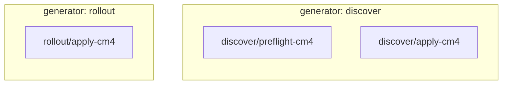
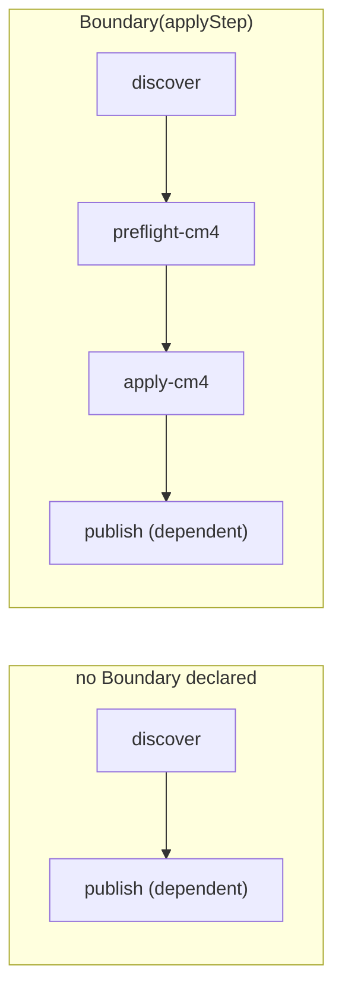

# Generate a subgraph

`Expand` fans out over a list senro can discover **before the run starts**, by globbing the tree.
A generator fans out over a list that only exists **after something has run**: the resources
`terraform plan` says changed, the clusters an API reports right now, the shards a timing tool
just computed.

Without one, that work goes in a loop inside a single step:

```sh
for c in $(list-clusters); do ./preflight "$c" && ./apply "$c"; done
```

senro can't see inside that loop. It's one step, so it gets one cache entry, one log, one state,
and one retry. All forty clusters deploy under one name. One failure ends the whole loop, and
retrying means retrying every cluster.

A generator turns the same work into real steps:

```go
l.Step("discover", exec.Command("./bin/list-clusters")).
    Mount(ws.At("/src", senro.RO)).
    Generates(senro.Generate(func(ctx senro.GenCtx) (*senro.Fragment, error) {
        var cs []Cluster
        if err := ctx.OutputJSON("clusters.json", &cs); err != nil {
            return nil, err
        }
        f := senro.NewFragment()
        for _, c := range cs {
            pre := f.Step("preflight-"+c.Name, exec.Command("./preflight", c.Name))
            f.Boundary(f.Step("apply-"+c.Name, exec.Command("./apply", c.Name)).Needs(pre.ID()))
        }
        return f, nil
    }))
```

Each generated step is an ordinary step. It gets its own state, log, cache entry, and retry,
scheduled under the run's `MaxParallel`. Retrying one cluster retries just that cluster.

## Ids are hierarchical

A fragment names its steps **relatively**, and senro prefixes each one with the generator's id.
The fragment above produces `discover/preflight-cm4` and `discover/apply-cm4`.

That's what lets a fragment be written once, without knowing where it will sit in the graph. It's
also why two different generators can both produce an `apply` step without colliding: the prefix
makes the full id unique even when the relative name repeats.



## The boundary is what dependents wait for

A step that `Needs` the generator waits for the generator to **finish**, but that's the moment
the generated work *starts*, not when it's done. `Boundary` tells senro what "done" actually
means:

```go
f.Boundary(applyStep)
```

Every existing dependent of the generator now also depends on the boundary steps. If you declare
no boundary, those dependents wait only on the generator itself. That's the right answer when
nothing downstream consumes what the generator produced.



An empty fragment is legal. It means "nothing to do here," and the generator's dependents run
rather than being skipped.

## Any language can write one

The Go closure is one way to write a generator. The other is a file, so a shell script, a Python
tool, or a Terraform wrapper can produce a subgraph too:

```go
l.Step("plan-infra", exec.Command("terraform", "plan", "-json", "-out=tf.plan")).
    Mount(ws.At("/src", senro.RW)).
    Generates(senro.GenerateFromJSON("fragment.json"))
```

The file is the public schema: plan nodes plus a boundary list.

```json
{
  "version": 1,
  "nodes": [
    {"id": "apply-vpc", "kind": "exec", "cmd": ["terraform", "apply", "-target=vpc"]},
    {"id": "apply-db",  "kind": "exec", "cmd": ["terraform", "apply", "-target=db"],
     "needs": ["apply-vpc"]}
  ],
  "boundary": ["apply-db"]
}
```

Both forms go through exactly the same validation. A Go fragment is serialized to this same
schema before the engine reads it, so the two never drift apart in what they accept.

The file path resolves against the same root a step's `Outputs` do. That means a generator step
has to mount a workspace: a step with no workspace has nowhere for senro to read what it
produced from.

## Your generator doesn't have to be deterministic

When a generator produces a fragment, senro **records it** in the content store (the same
content-addressed store that holds cached step outputs) and saves its digest in the generator's
cache entry. A cached generator doesn't run again at all. Its subgraph
is restored from that recording.

So a generator can call an API, read a clock, or iterate a map. It doesn't need to be
reproducible, because a re-run doesn't depend on it producing the same answer twice. It depends
on the recording.

Many workflow engines forbid this, and require deterministic code so replay works. senro takes a
different approach: it records the answer instead of recomputing it.

Two consequences follow from that:

- If a cache entry's recorded fragment has been garbage collected, that cache hit is no longer
  usable. senro re-runs the generator instead of serving a run with the work missing.
- `run.rerun_from` on a generator replays what it produced. The generated nodes are already in the
  graph, so re-running the generator re-runs them instead of creating a second copy.

## Fragments only add

A fragment can add nodes, add edges between its own nodes, and attach its boundary to the
generator's existing dependents. It cannot modify, remove, or re-parent anything already in the
run, and its steps can only depend on its own steps.

That rule keeps the splice safe: every cache key already recorded, and every attached client's
view of the run, stays valid across it. If a fragment breaks any of this, senro refuses it
**entirely**, and the generator step fails. Nothing is ever half-applied, because a half-applied
fragment would be a graph no re-run could reproduce.

## Generators are bounded

A generated step can itself be a generator. Two limits stop that from turning into a fork bomb
holding your deploy credentials:

| Limit | Default | What it bounds |
| --- | --- | --- |
| `MaxDepth` | 3 | How deep generators may nest |
| `MaxNodes` | 5000 | Nodes in the whole run, the plan's own included |

Exceeding either limit fails the run, and names the whole generator **chain** responsible, not
just the last step in it.

## When to reach for what

1. **`When`** if the work is already in the graph and you need to skip it.
2. **`Expand`** if the list can be discovered from the tree before the run.
3. **A generator** if the list only exists once a step has run.

Generators are the most powerful option, and the hardest to reason about. Since the node count
isn't known in advance, senro shows counts of the nodes it knows about rather than a completion
percentage it would otherwise have to revise downward.

## When a loop is not a graph

Some control flow can't be drawn as a DAG at all: "roll out one cluster at a time until quorum,
then stop" depends on what earlier steps did. For that, a registered function can run a graph
itself:

```go
senro.RegisterFunc("deploy/rolling", func(ctx senro.Ctx, p RollParams) error {
    for _, c := range p.Clusters {
        f := senro.NewFragment()
        f.Step("apply-"+c.Name, exec.Command("./apply", c.Name))
        if err := senro.RunSubgraph(ctx, f); err != nil {
            return err
        }
        if quorumReached(ctx) {
            return nil
        }
    }
    return errNoQuorum
})
```

`RunSubgraph` blocks until the nested graph finishes, and returns its failure. So a rollout that
couldn't complete fails the step that was running it.

This is deliberately weaker than a generator, and it's worth understanding the trade-off. A
generator describes work and hands it to the scheduler, which is why its nodes are ordinary steps
you can cache and retry individually. A subgraph is work the function itself is doing: it belongs
to that one step, so the cache and re-run granularity is the whole subgraph, and re-running means
re-running the step. You can't use `senro rerun --step` to jump into the middle of one.

Use a generator whenever the work is a graph. Use this only when it genuinely isn't.

A subgraph runs on the coordinator. A func step running on a remote host can't start one, because
it's a staged binary on the far side of a transport, and the engine lives back on the coordinator.
If you call `RunSubgraph` from a remote step, it tells you so by name.

## Where to go next

- **[Fan out with `Expand`](/docs/monorepo/fan-out/)**: the plan-time fan-out to prefer when it fits.
- **[Caching a step](/docs/data/caching/)**: what makes a generator cacheable, and what a recorded fragment costs.
- **[`senro rerun`](/docs/cli/rerun/)**: replaying a recorded subgraph, and `--regenerate`.
