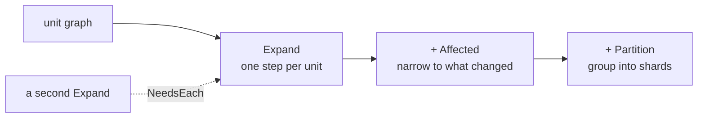

# Monorepos

One repo, many units: packages, modules, crates, services. senro has four tools built for that
shape, and each one solves a different problem. This page helps you pick the right one.

```go
import (
	"github.com/xavidop/senro"
	"github.com/xavidop/senro/change"
	"github.com/xavidop/senro/exec"
	"github.com/xavidop/senro/unit/gowork"
)

verify := p.Workflow("verify")
verify.Expand("test", gowork.Modules()).
	Affected(change.FromTrigger(ev)).
	MaxParallel(4).
	Template(func(u senro.Unit) *senro.StepBuilder {
		return senro.NewStep(exec.Command("go", "test", "./...")).WorkDir(u.Dir)
	})
```

One step per Go module. Only the modules this run's change actually reaches. Four at a time.

## The four tools

| Tool | The problem it solves |
|---|---|
| [`Expand`](/docs/monorepo/fan-out/) | Writing one `Step` per package stopped scaling. One step per unit, discovered from the tree. |
| [`Affected`](/docs/monorepo/affected/) | Every change runs every unit. Run only the units a change reaches, plus everything depending on them. |
| [`NeedsEach`](/docs/monorepo/needs-each/) | One slow module holds up every other module's tests. One edge per unit instead of a barrier. |
| [`Partition`](/docs/monorepo/partition/) | Fifty units and eight machines. Fewer steps than units, balanced by how long each one took last time. |

They work together. A single expansion can be narrowed with `Affected`, ordered per unit against
another expansion with `NeedsEach`, and split into shards with `Partition`, all at once.



## Which one is your problem?

- **"I keep adding the same step for each new package."** Start with
  [`Expand`](/docs/monorepo/fan-out/) and stop there. It's useful on its own.
- **"CI takes twenty minutes to tell me a docs typo is fine."** Use
  [`Affected`](/docs/monorepo/affected/), over a graph that reads your ecosystem's manifests.
- **"The fan-out is fast, but the step after it waits for the slowest child."** Use
  [`NeedsEach`](/docs/monorepo/needs-each/).
- **"Fifty tiny steps, each paying for its own container pull."** Use
  [`Partition`](/docs/monorepo/partition/).

## What a unit is

A **unit graph** discovers units and, optionally, tells you who depends on whom. senro ships eight
of them. Five of those can compute an affected set; the other three won't guess, so they refuse
if you try. The full list, and the catch for each ecosystem, is in
[The shipped unit graphs](/docs/monorepo/unit-graphs/).

If none of the shipped graphs fit your layout, you can write your own. See
[Implement a unit graph](/docs/monorepo/unit-graphs/custom/).

## Where to go next

- **[Fan out with `Expand`](/docs/monorepo/fan-out/)**: `Template`, child ids, `MaxParallel`,
  `MaxNodes`.
- **[Per-unit edges](/docs/monorepo/needs-each/)**: `NeedsEach` and how it differs from a barrier.
- **[Partition](/docs/monorepo/partition/)**: shards and the duration history.
- **[Running only what changed](/docs/monorepo/affected/)**: `Affected` and the `change` package.
- **[Triggers](/docs/triggers/)**: where the change a run consumes comes from.
