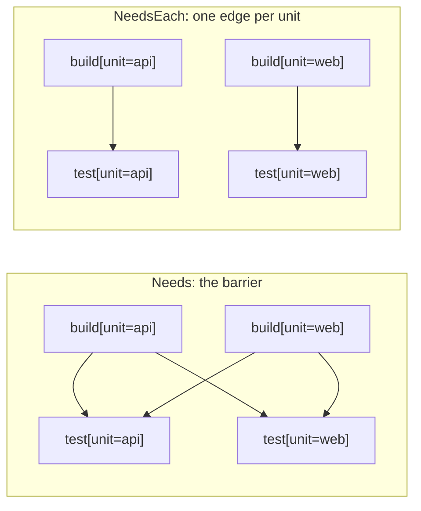

# Per-unit edges: `NeedsEach`

`.Needs(...)` on an expansion and the workflow-level `senro.Needs` are both **barriers**: nothing
downstream starts until *every* child of the fan-out has settled. `.NeedsEach(expansions ...string)`
is the other shape, one edge per unit.

```go
verify := p.Workflow("verify")
verify.Expand("build", gowork.Modules()).
	Template(func(u senro.Unit) *senro.StepBuilder {
		return senro.NewStep(exec.Command("go", "build", "./...")).WorkDir(u.Dir)
	})
verify.Expand("test", gowork.Modules()).
	NeedsEach("build").
	Template(func(u senro.Unit) *senro.StepBuilder {
		return senro.NewStep(exec.Command("go", "test", "./...")).WorkDir(u.Dir)
	})
```

`test[unit=api]` waits on `build[unit=api]` and nothing else, so it starts the moment that one
finishes, while `build[unit=web]` is still running. The fan-out pipelines instead of stalling.

## The two shapes



A barrier is right when the downstream step consumes the whole fan-out, for example a step that
publishes a manifest of every built image. It is wrong when the downstream work is itself per
unit: one slow module then holds up every other module's tests.

## Rules

- It takes **expansion ids**, the id you gave `Expand`, not step ids (`Needs` takes those). A name
  matching no expansion is refused at build time, since a `NeedsEach` that quietly added no edges
  would be a fan-out with no ordering at all.
- It is an **addition**. The barrier is still available, the two compose (a child can have both
  `Needs("install")` and `NeedsEach("build")`), and a pipeline using neither behaves as before.
- **Naming an empty expansion** (a glob that matched nothing) gains no edges.

> **Put both expansions in one workflow.** Two expansions in two workflows joined by the
> workflow-level `senro.Needs` get entry-to-exit edges on top of the per-unit ones, and those
> edges *are* the barrier, so nothing pipelines.

## When the two unit sets differ

A module with no tests, or two expansions over two different graphs, leaves units without a
counterpart. Dropping the edge would let a step run before its input exists; dropping the step
would silently drop work. So neither happens:

- **A unit here with no counterpart there** keeps its step and falls back to the whole-expansion
  barrier: it waits for *every* child of the named expansion. That can only order more, never
  less. Two fully disjoint expansions degenerate back to the plain barrier.
- **A unit there with no counterpart here** is ordinary, not an error. It has no per-unit
  dependent.

## With a partitioned expansion

`NeedsEach` pairs a [partitioned](/docs/monorepo/partition/) expansion by unit **set**: a shard
waits on every upstream child covering any of its own units.

## Where to go next

- **[Fan out with `Expand`](/docs/monorepo/fan-out/)**: `Needs` and the rest of the expansion
  surface.
- **[Ordering steps](/docs/steps/ordering/)**: `Needs` on a step versus `senro.Needs` on a
  workflow.
- **[Partition](/docs/monorepo/partition/)**: fewer steps than units.
