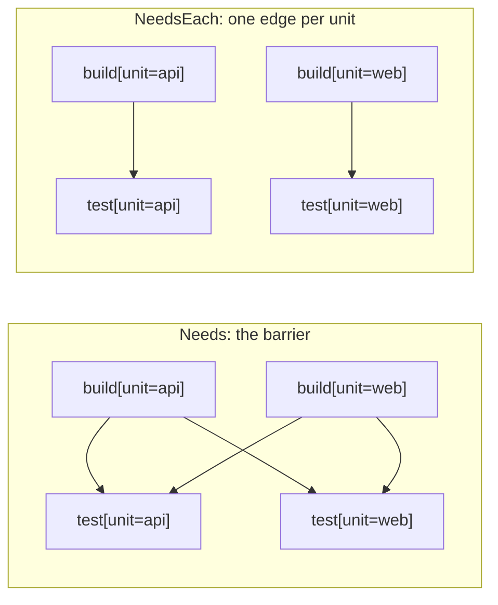

# Per-unit edges: `NeedsEach`

`.Needs(...)` on an expansion, and the workflow-level `senro.Needs`, are both **barriers**:
nothing downstream starts until *every* child of the fan-out has finished. `.NeedsEach(expansions
...string)` works differently. It adds one edge per unit.

```go
verify := p.Workflow("verify")
verify.Expand("build", gowork.Modules()).
	Template(func(u senro.Unit) *senro.StepBuilder {
		return senro.NewStep(exec.Command("go", "build", "./...")).WorkDir(u.Dir)
	})
verify.Expand("test", gowork.Modules()).
	NeedsEach("build").
	Template(func(u senro.Unit) *senro.StepBuilder {
		return senro.NewStep(exec.Command("go", "test", "./...")).WorkDir(u.Dir)
	})
```

`test[unit=api]` waits only on `build[unit=api]`. It starts the moment that one finishes, even
while `build[unit=web]` is still running. The fan-out pipelines instead of stalling.

## The two shapes



A barrier is right when the downstream step consumes the whole fan-out, for example a step that
publishes a manifest of every built image. It's wrong when the downstream work is itself per
unit: one slow module then holds up every other module's tests.

## Rules

- It takes **expansion ids**: the id you gave `Expand`, not step ids (`Needs` takes those). A
  name that matches no expansion is rejected at build time. Otherwise a `NeedsEach` could silently
  add no edges at all, leaving the fan-out with no ordering.
- It's an **addition**, not a replacement. The barrier is still available, and the two work
  together: a child can have both `Needs("install")` and `NeedsEach("build")`. A pipeline that
  uses neither behaves exactly as before.
- **Naming an empty expansion** (a glob that matched nothing) adds no edges.

> **Put both expansions in the same workflow.** If they're in two separate workflows joined by
> the workflow-level `senro.Needs`, you get entry-to-exit edges on top of the per-unit ones.
> Those edges *are* a barrier, so nothing pipelines.

## When the two unit sets differ

A module with no tests, or two expansions built over different graphs, can leave some units
without a counterpart. Dropping the edge would let a step run before its input exists. Dropping
the step would silently drop work. So senro does neither:

- **A unit here with no counterpart there** keeps its step, and falls back to the whole-expansion
  barrier: it waits for *every* child of the named expansion. This can only add ordering, never
  remove it. If the two expansions are fully disjoint, this degenerates back to a plain barrier.
- **A unit there with no counterpart here** is ordinary, not an error. It has no per-unit
  dependent.

## With a partitioned expansion

`NeedsEach` pairs a [partitioned](/docs/monorepo/partition/) expansion by unit **set**: a shard
waits on every upstream child covering any of its own units.

## Where to go next

- **[Fan out with `Expand`](/docs/monorepo/fan-out/)**: `Needs` and the rest of the expansion
  surface.
- **[Ordering steps](/docs/steps/ordering/)**: `Needs` on a step versus `senro.Needs` on a
  workflow.
- **[Partition](/docs/monorepo/partition/)**: fewer steps than units.
