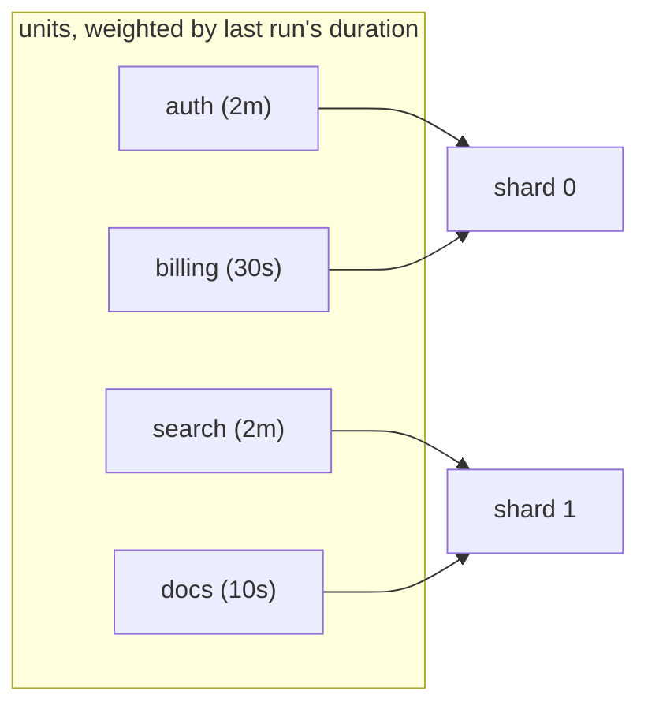

# `Partition`: fewer steps than units

Some fan-outs want fewer steps than units: fifty modules but only eight machines, say, or a
per-unit step whose startup cost dwarfs the actual work. `.Partition(n, history)` groups the
units into at most `n` buckets and makes **one step per bucket**.

```go
import "github.com/xavidop/senro/duration"

verify.Expand("test", gowork.Modules()).
	Partition(8, duration.FromFile(".senro/durations.json")).
	TemplateShard(func(sh senro.Shard) *senro.StepBuilder {
		return senro.NewStep(exec.Command(append([]string{"go", "test"}, sh.Dirs()...)...)).
			Pure().Inputs(sh.Sources()...)
	})
```

A partitioned expansion takes `TemplateShard` rather than
[`Template`](/docs/monorepo/fan-out/#what-a-template-receives), since a bucket holds several
units. A `senro.Shard` carries `Index`, `Total` and `Units`, plus `IDs()`, `Names()`, `Dirs()` and
`Sources()` for handing the whole bucket to a command or to `.Inputs(...)`.

> **Why balance by duration.** A round-robin or alphabetical split often puts the three slowest
> modules in the same shard, and then the whole fan-out takes as long as that one shard. Weighing
> each unit by how long its step took last time keeps that bounded, where a naive split doesn't.



The two slow units land in different shards instead of stacking up in one, so no single shard is
stuck carrying both.

## Where the history comes from

`duration.Record(runDir, path)` folds a previous run's event stream into a small JSON file.
`duration.FromFile(path)` reads it back. Record it deliberately, after a run, and **commit the
file like a lockfile**.

- Per-machine histories would give two machines two different plan digests and two sets of cache
  keys, so your shared cache would stop being shared. A committed file also makes the effect
  reviewable in a diff.
- **`Record` merges** rather than replacing, so a run narrowed by
  [`Affected`](/docs/monorepo/affected/) doesn't discard the modules it never touched.
- **Only steps that ran to completion are recorded.** A cached step finishes in milliseconds, and
  recording that time would make the slowest module look free.

## The first run, and unmeasured units

- **No history** (first run, or a missing file) is fine. Every unit weighs the same, and the split
  falls back to round robin over the sorted unit set: the same split you'd have had anyway.
- **A unit missing from a non-empty history** is estimated at the **median** of the units that are
  there. Zero would make it weightless, and using the maximum would treat every new module as the
  slowest one.
- **A file that can't be read or parsed, or whose format version is unknown,** is an **error**,
  and fails the build. Treating it as empty would quietly revert the whole fleet to balancing by
  count.
- **`duration.None()`** is the explicit "there is no history".

## Shard ids don't move when the history does

A child is named `test[shard=0]`: numbered, never named after its contents. The number of shards
is `min(n, number of units)`. Two machines with different histories still build the same step
ids. If an id moved along with the timing, it would drag every cache key hanging off it along
too.

What the history *does* move is which unit lands in which bucket, and with it each shard's
command, inputs, cache key and the plan digest. That is correct: a step that runs three modules is
not the step that ran two.

## Limits of a partitioned run

- A shard's ten minutes can't be split back out among its five modules, so `duration.Record`
  **ignores** shard steps. When the numbers go stale, re-record from a run of the same expansion
  without partitioning: a nightly build, say, or a run with partitioning turned off.
- **`MaxNodes` is still checked against the whole graph**, before partitioning. It's not a way
  around the guard.
- [`NeedsEach`](/docs/monorepo/needs-each/) pairs a partitioned expansion by unit **set**: a shard
  waits on every upstream child covering any of its own units.

## Where to go next

- **[Fan out with `Expand`](/docs/monorepo/fan-out/)**: the unpartitioned surface, `MaxNodes`
  included.
- **[Caching](/docs/data/caching/)**: `Pure()`, `Inputs` and what a shard's cache key covers.
- **[Running only what changed](/docs/monorepo/affected/)**: narrowing the unit set before it is
  bucketed.
