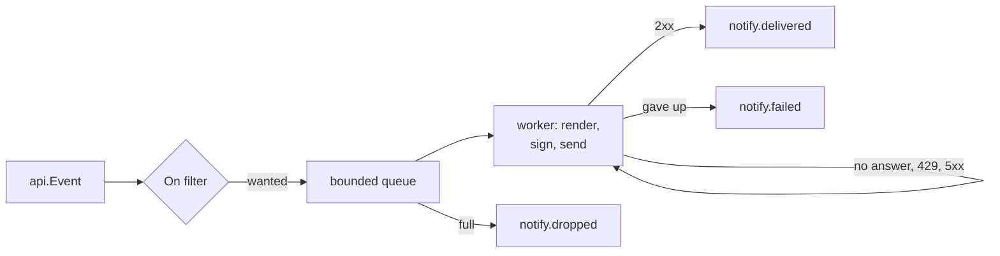

# Notifications

Telling the outside world how a run went: the built-in destinations in the `notify` package
(webhook, Slack, GitHub Checks) and `senro.WithSink`, which hands the raw event stream to your own
code. You need this when a run finishes with nobody watching.

## Send a run's events somewhere

```go
import "github.com/xavidop/senro/notify"

n := notify.New(
	notify.Slack(os.Getenv("SLACK_WEBHOOK_URL")),
	notify.Webhook("https://ci.example.com/hooks/senro",
		notify.Sign(os.Getenv("SENRO_HOOK_SECRET")),
		notify.On(api.RunStarted, api.StepFinished, api.RunFinished)),
)
defer func() { _ = n.Close() }()

err := senro.Run(ctx, p, senro.WithSink(n))
```

A `*notify.Notifier` is a `senro.Sink`, so it goes in through `senro.WithSink`. `Run` flushes it
before returning, so `run.finished` is on its way out before your process is; the `defer n.Close()`
covers a notifier you never hand to `Run` and is harmless after a flush. A runnable version with a
receiving endpoint lives at `examples/notify` (`go run ./examples/notify`).

### The built-in destinations

- **`notify.Webhook(url, opts...)`** posts each event as JSON: the `api.Event` exactly as it
  appears in the run's ledger and as [`event.schema.json`](/docs/reference/api/) describes it, so a
  receiver needs no senro-specific knowledge. Receives **every** event unless narrowed with `On`.
- **`notify.Slack(url, opts...)`** posts a short line a person can read in a channel, to a Slack
  incoming webhook. Receives **`run.finished` only** unless widened with `On`.
- **`notify.GitHubChecks(owner, repo, sha, token, name)`** maintains a check run on a commit. See
  [GitHub Checks](#github-checks).

> The opposite defaults are deliberate: a webhook receiver is a program and can drop what it does
> not want; a person in a channel cannot. A widened Slack destination on a two hundred step fan-out
> is two hundred messages.

## Options

Every one of these applies to any destination.

| Option | What it does | Default |
| --- | --- | --- |
| `On(types...)` | Deliver only these event types. `On()` with no arguments delivers nothing, a tidy way to switch a destination off from configuration. | per destination |
| `Sign(secret)` | HMAC-SHA256 sign every request. See [Verify a signed webhook](#verify-a-signed-webhook). | off |
| `Named(name)` | The name in `notify.*` events and the shutdown report. Set it when two webhooks would both be called "webhook". | the constructor's |
| `Retry(attempts, base)` | Total requests one event gets (not extras after the first), and the first backoff interval. | 3, 250ms |
| `Timeout(d)` | Bounds one request. | 5s |
| `Client(c)` | Your own `*http.Client`, for a proxy or a pinned CA. | - |
| `ContentType(ct)` | The `Content-Type` header. | `application/json` |
| `Header(name, value)` | An extra request header, for an API key or a routing key. Repeatable; repeating a name replaces its value. | - |

On the notifier itself: `WithGrace(d)` sets how long the end-of-run flush waits for queued
notifications before giving up (10s by default), and `WithReportWriter(w)` redirects the shutdown
report away from standard error.

## What a receiver gets

Every request, whatever the destination, carries:

| Header | Meaning |
| --- | --- |
| `X-Senro-Event` | The event's type, so a receiver can route without parsing the body. |
| `X-Senro-Run` | The run ID. |
| `X-Senro-Seq` | The event's sequence number within that run. |
| `X-Senro-Delivery` | `<run>/<seq>`: the deduplication key. |
| `X-Senro-Timestamp` | Unix seconds, on a signed request only. |
| `X-Senro-Signature` | The signature, on a signed request only. |

**Delivery is at-least-once.** A request that times out may well have been processed, and there is
no way to tell from this side, so it is retried. A receiver that must act exactly once should
deduplicate on `X-Senro-Delivery`, which identifies an event permanently.

No answer at all, a 429 or any 5xx is retried, because those say the far end is unavailable; any
other 4xx is not, because a 400 will be a 400 next time too. Waits double and are jittered, so a
fleet of coordinators does not retry in lockstep.

### Verify a signed webhook

`Sign` adds, over the raw request body:

```
X-Senro-Timestamp: <unix seconds>
X-Senro-Signature: v1=<hex(HMAC_SHA256(secret, timestamp + "." + body))>
```

To verify: recompute the same HMAC over the exact bytes you received, compare with a constant-time
comparison (`hmac.Equal` in Go, never `==`), and reject a timestamp too far from your own clock,
which stops a captured request being replayed forever.

## Secrets never reach a destination

**The engine redacts every event payload before the event exists**, upstream of every sink, so a
notifier receives an already-redacted event and has nothing left to do about it. See
[Secrets](/docs/secrets/) for what that covers and what senro refuses outright instead.

The one thing the redactor cannot know is the destination URL, which for a Slack incoming webhook
is the whole credential. Go's HTTP client puts the URL into every error it returns, so `notify`
strips it out of every error it records or prints: it never appears in an event, in the shutdown
report, or in a log line.

## A failed notification is visible

Delivery never blocks the run. Each destination has a bounded queue and its own goroutine, and a
full queue drops the event rather than waiting for room, so a wedged endpoint costs a build nothing.



What that loses is not lost quietly. Every outcome is an event in the run's own stream, carrying an
`api.NotifyBody`: which destination, which event and its sequence number, the attempts, HTTP status,
duration, the error, or a running total of drops.

So `senro attach --run <id>`, your own sink, or `events.jsonl` after the fact all show that the
Slack message did not go out. A notifier never notifies about `notify.*` events, so the outcomes do
not feed themselves.

### The one outcome that is not an event

`run.finished` is appended and the ledger sealed in a single step, which makes it the run's last
event by construction. So the outcome of delivering it cannot be an event: by the time that is
known, the stream has closed behind the very event it describes.

It is also the outcome you most want, so it is printed on standard error as the run shuts down:

```
senro notify: 1 delivery outcome arrived after this run's event stream closed, so it is
reported here instead of in the ledger:
  slack: run.finished NOT delivered after 3 attempts in 6.2s: Post: context deadline exceeded
```

Only what the ledger genuinely could not take is printed, decided by asking the ledger rather than
by guessing which event is which.

## GitHub Checks

```go
senro.WithSink(notify.New(
    notify.GitHubChecks("acme", "web", sha, os.Getenv("GITHUB_TOKEN"), ""),
))
```

`notify.GitHubChecks` closes the loop a [trigger](/docs/triggers/) opens: the result goes back on
the commit as a check run with a conclusion and per-step annotations, from the same event stream
that drives the TUI.

- The token needs `checks:write`. senro discovers neither it nor the commit SHA: it holds no GitHub
  credential of its own and does not read the environment looking for one.
- The check is created when the run starts and completed when it ends. **Steps do not each cost a
  request**: a thousand-step run would be a thousand calls into GitHub's secondary rate limits, so
  failures accumulate as annotations and travel with the completion.
- Past GitHub's cap of 50 annotations, the summary says how many were left out rather than showing a
  short list that reads like a complete one.
- A status this build does not recognise becomes `neutral`, not `failure`: blocking a merge over a
  status GitHub's own UI cannot explain would be worse than saying nothing.
- Point it at GitHub Enterprise with `notify.GitHubChecksAPI(base)`.

## Watch a run from your own code

```go
err := senro.Run(ctx, p, senro.WithSink(senro.SinkFunc(func(e api.Event) {
	log.Printf("%d %s %s", e.Seq, e.Type, e.Step)
})))
```

`senro.WithSink` gives you every event the run appends to its ledger, in ledger order, on the
engine's own goroutine. It is repeatable and composes with `senro.WithAttach`: a run given both
feeds the attach socket and every sink from one stream. `senro.SinkFunc` adapts a plain function;
anything with an `Emit(api.Event)` method works.

> **`Emit` must not block.** The engine calls it inline, holding the lock that makes an append and
> its delivery a single atomic step, so a slow `Emit` slows the whole run and a wedged one stops it.
> If your sink talks to anything, hand the event to a goroutine of your own and return.

## Write your own destination

A destination is a URL plus a `notify.Renderer`, one method: `Render(api.Event) ([]byte, error)`.
The built-ins take the same path with no shortcut past it. A destination whose endpoint moves per
event implements `notify.Requester` instead, and GitHub Checks is one. Both seams, with a complete
PagerDuty example, are in **[Writing a notifier](/docs/extend/notifier/)**.

## Where to go next

- **[Writing a notifier](/docs/extend/notifier/)**: a destination of your own.
- **[The event stream](/docs/reference/event-stream/)**: the events a sink receives.
- **[Writing a trace exporter](/docs/extend/exporter/)**: the other thing built on `WithSink`.
- **[Secrets](/docs/secrets/)**: what redaction covers, and what senro refuses outright instead.
