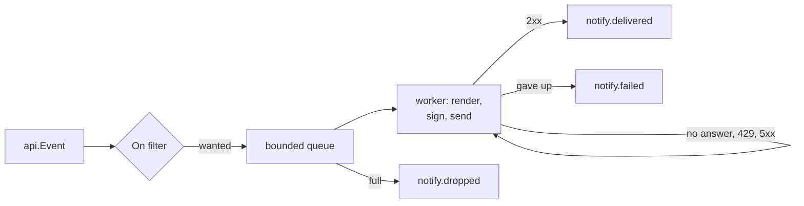

# Notifications

Telling somebody how a run went, when nobody is watching the terminal. senro ships three
destinations, and one small interface for writing a fourth.

```go
import "github.com/xavidop/senro/notify"

n := notify.New(
	notify.Slack(os.Getenv("SLACK_WEBHOOK_URL")),
)
defer func() { _ = n.Close() }()

err := senro.Run(ctx, p, senro.WithSink(n))
```

That is the whole setup: build a `*notify.Notifier` with the destinations you want, and hand it to
`senro.Run` as a sink. `Run` flushes it before returning, so `run.finished` is on its way out
before your process is.

A runnable version with a receiving endpoint lives at `examples/notify`
(`go run ./examples/notify`).

## The destinations

| Destination | Sends | Gets, by default |
|---|---|---|
| **[Slack](/docs/notifications/slack/)** | A short line a person reads in a channel | `run.finished` only |
| **[Webhook](/docs/notifications/webhook/)** | The raw `api.Event` as JSON, to any HTTP endpoint | Every event |
| **[GitHub Checks](/docs/notifications/github-checks/)** | A check run on the commit, with annotations | The whole run |
| **[Your own](/docs/notifications/custom/)** | Whatever bytes you render | What you declare |

The opposite defaults for Slack and Webhook are deliberate: a webhook receiver is a program and
can drop what it does not want; a person in a channel cannot. A Slack destination widened to every
event on a two hundred step fan-out is two hundred messages.

## Options

Every option below works on every destination, built-in or your own.

| Option | What it does | Default |
| --- | --- | --- |
| `On(types...)` | Deliver only these event types. `On()` with no arguments delivers nothing, which is a tidy way to switch a destination off from configuration. | per destination |
| `Named(name)` | The name used in `notify.*` events and the shutdown report. Set it when two webhooks would both be called "webhook". | the constructor's |
| `Sign(secret)` | HMAC-SHA256 sign every request. See [Webhook](/docs/notifications/webhook/#verify-a-signed-request). | off |
| `Retry(attempts, base)` | Total requests one event gets (not extras after the first), and the first backoff interval. | 3, 250ms |
| `Timeout(d)` | Bounds one request. | 5s |
| `Client(c)` | Your own `*http.Client`, for a proxy or a pinned CA. | - |
| `ContentType(ct)` | The `Content-Type` header. | `application/json` |
| `Header(name, value)` | An extra request header, for an API key or a routing key. Repeatable; repeating a name replaces its value. | - |

Two more live on the notifier rather than a destination: `WithGrace(d)` sets how long the
end-of-run flush waits for queued notifications before giving up (10s by default), and
`WithReportWriter(w)` redirects the shutdown report away from standard error.

```go
n := notify.New(
	notify.Slack(slackURL, notify.On(api.RunFinished, api.StepFinished)),
	notify.Webhook(hookURL,
		notify.Named("ci-bus"),
		notify.Sign(os.Getenv("SENRO_HOOK_SECRET")),
		notify.Retry(5, time.Second)),
	notify.WithGrace(30*time.Second),
)
```

## What every request carries

Whatever the destination, senro sets these headers:

| Header | Meaning |
| --- | --- |
| `X-Senro-Event` | The event's type, so a receiver can route without parsing the body. |
| `X-Senro-Run` | The run ID. |
| `X-Senro-Seq` | The event's sequence number within that run. |
| `X-Senro-Delivery` | `<run>/<seq>`: the deduplication key. |
| `X-Senro-Timestamp` | Unix seconds, on a signed request only. |
| `X-Senro-Signature` | The signature, on a signed request only. |

**Delivery is at-least-once.** A request that times out may well have been processed, and there is
no way to tell from this side, so senro retries it. A receiver that must act exactly once should
deduplicate on `X-Senro-Delivery`, which identifies an event permanently.

No answer at all, a 429 or any 5xx is retried. Any other 4xx is not, because a 400 will be a 400
next time too. Waits double and are jittered.

## A failed notification is visible

Delivery never blocks the run. Each destination has a bounded queue and its own goroutine, and a
full queue drops the event rather than waiting for room, so a wedged endpoint costs a build
nothing.



Nothing is lost quietly. Every outcome becomes an event in the run's own stream carrying an
`api.NotifyBody`: which destination, which event and its sequence number, the attempts, the HTTP
status, the duration, the error, or a running total of drops.

So `senro attach --run <id>`, your own sink, or `events.jsonl` after the fact all show that the
Slack message did not go out.

### The one outcome that is not an event

`run.finished` is the run's last event by construction, so the outcome of delivering it cannot
itself be an event: by the time it is known, the stream has closed. It is also the outcome you
most want, so it is printed on standard error as the run shuts down:

```
senro notify: 1 delivery outcome arrived after this run's event stream closed, so it is
reported here instead of in the ledger:
  slack: run.finished NOT delivered after 3 attempts in 6.2s: Post: context deadline exceeded
```

## Secrets never reach a destination

The engine redacts every event payload **before the event exists**, upstream of every sink, so a
notifier receives an already-redacted event and has nothing left to do about it. See
[Secrets](/docs/secrets/).

The one thing the redactor cannot know is the destination URL, which for a Slack incoming webhook
is the whole credential. Go's HTTP client puts the URL into every error it returns, so `notify`
strips it out of every error it records or prints: it never appears in an event, in the shutdown
report, or in a log line.

## Watching a run from your own code

If you want the events themselves rather than an HTTP request, skip `notify` and use a sink
directly:

```go
err := senro.Run(ctx, p, senro.WithSink(senro.SinkFunc(func(e api.Event) {
	log.Printf("%d %s %s", e.Seq, e.Type, e.Step)
})))
```

`senro.WithSink` gives you every event the run appends to its ledger, in ledger order. It is
repeatable and composes with `senro.WithAttach`.

> **`Emit` must not block.** The engine calls it inline, holding the lock that makes an append and
> its delivery a single atomic step, so a slow `Emit` slows the whole run and a wedged one stops
> it. If your sink talks to anything, hand the event to a goroutine of your own and return.

## Where to go next

- **[Slack](/docs/notifications/slack/)**, **[Webhook](/docs/notifications/webhook/)**,
  **[GitHub Checks](/docs/notifications/github-checks/)**: each destination in full.
- **[Write your own](/docs/notifications/custom/)**: one method, with a complete PagerDuty example.
- **[The event stream](/docs/reference/event-stream/)**: the events a destination renders.
- **[Writing a trace exporter](/docs/extend/exporter/)**: the other thing built on `WithSink`.
