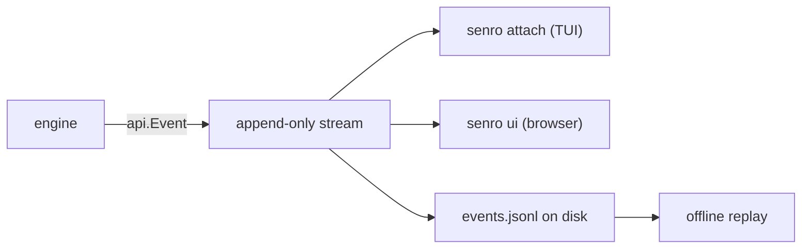

# The event stream

Every observable fact about a run is one `api.Event`, appended to an ordered, append-only stream.
This page is the envelope, the event types sent today, and `Apply`, the function that folds the
stream into something a client can render. The types live in
[`github.com/xavidop/senro/api`](/docs/reference/api/).

Every view of a run reads this one stream:



## The envelope

```go
type Event struct {
	V       int             `json:"v"`
	Seq     uint64          `json:"seq"`
	TS      time.Time       `json:"ts"`
	Type    Type            `json:"type"`
	Run     string          `json:"run,omitempty"`
	Step    string          `json:"step,omitempty"`     // stable base ID, never "id@2"
	Attempt int             `json:"attempt,omitempty"`  // 0 when not step-scoped
	Group   string          `json:"group,omitempty"`    // expansion parent, for aggregation
	TraceID string          `json:"trace_id,omitempty"` // W3C trace, identical on every event
	Payload json.RawMessage `json:"payload,omitempty"`
}
```

The routing fields (`Type`, `Step`, `Attempt`, `Group`) are flat so you can filter without
decoding `Payload`, whose shape is specific to `Type` and evolves additively. `(Event).Decode(v
any)` unmarshals `Payload` into a typed struct and is a no-op on a nil payload, so call it
unconditionally.

### The trace

`TraceID` is the [W3C Trace Context](https://www.w3.org/TR/trace-context/) trace the run belongs
to: 32 lowercase hex characters, never the all-zero reserved value, identical on every event of a
run and different for every run.

It is taken from a valid inbound `traceparent`, so a run started by a CI job or a webhook delivery
joins that job's trace rather than starting its own.

The span structure lives in the payloads, because unlike the trace ID it is not constant:

- `run.started` carries `span_id`, `parent_span_id`, `trace_flags` and `tracestate`.
- `step.started`, `step.finished` and the `handler.*` events carry their own `span_id` and
  `parent_span_id`.

The same context goes back **out**, into the environment of every step's command, so a traced tool
inside a step joins the run's trace as a child of that step. See
[Writing a trace exporter](/docs/extend/exporter/) for how these fold into spans.

## Types sent today

All thirty-four, which is what `api.DeclaredTypes()` returns (sorted, straight from the code, not
a hand-maintained list):

```
run.started              run.finished
plan.resolved            plan.expanded            plan.expansion_skipped
step.created             step.started             step.finished
step.retried             step.log.appended
cache.hit                cache.miss               cache.saved
cache.degraded
ws.snapshot              ws.restored              ws.evicted
binary.staged
secret.resolved          secret.redacted
control.applied          breakpoint.hit
handler.started          handler.succeeded        handler.failed
handler.superseded
shell.opened             shell.closed
notify.delivered         notify.failed            notify.dropped
analysis.proposed        analysis.applied         analysis.rejected
```

Some appear only under specific configurations:

- **`notify.*`**: the outcome of one outbound notification; a run with no notifier emits none.
  See [Notifications](/docs/notifications/), including the one delivery outcome that cannot be an
  event at all.
- **`cache.degraded`**: a **shared** cache stopped being used (unreachable, refused credentials,
  or returned something other than promised) and the run carried on: slower than it should have
  been, correct regardless, neither a failure nor a miss. Run-scoped, because which step held the
  connection when it broke is an accident of scheduling. See
  [Shared cache](/docs/data/shared-cache/).
- **`breakpoint.hit`**: emitted once per arming, when the scheduler first withholds a step a
  client set a breakpoint on. It is the only thing distinguishing a run stopped on purpose from
  one that has hung (a held step has no `step.started`, no `step.finished`, no state); clients
  fold it into `StepState.Paused`. See [Control operations](/docs/attach/control-ops/).
- **`shell.opened` / `shell.closed`**: bracket one interactive session on a step's workspaces
  (`senro shell`, or the TUI's `s` key). Exactly one close follows every open, so an open with
  nothing after it means the engine died mid-session; neither carries a byte the session produced.
  See [The shell](/docs/attach/shell/).
- **`ws.evicted`**: a [persistent workspace](/docs/data/persistent/) was emptied for going unused
  past its `MaxAge` or growing past its `MaxSize`. It carries the measurement, the bound it hit,
  and a `when` field separating an eviction before the first step from one after the last.
  Run-scoped: nothing is deleted while a step is reading it.
- **`binary.staged`**: one copy of the engine's own binary made available on a target, which a
  [func step off the coordinator](/docs/executors/func-remote/) needs before it can run. Watch
  `reused`: an SSH run whose every func step reports `false` pays a transfer per step instead of
  per host. On the container executor it is `true` every time; the binary is bind-mounted from the
  coordinator's own filesystem.

## Reserved names

`api.Type.Known()` also recognises three names reserved for later, declared now so emitting them
later is additive rather than a breaking change:

```
plan.generated
client.attached          client.detached
```

`breakpoint.hit`, `shell.opened`, `shell.closed` and `binary.staged` all sat on this list until
their features landed: every client already recognised the names, so emitting them was additive,
not a schema revision.

`client.attached` and `client.detached` stay reserved because a client connecting is observed by
the attach server, and an event is not real until it is in the run's persisted ledger, which only
the engine writes.

> **Clients must ignore types they don't recognise.** A newer engine will emit types this build
> has never heard of; erroring instead of skipping breaks forward compatibility. This is why `api`
> stays dependency-free, and `api/nodeps_test.go` enforces it rather than merely asserting it.

## Turning events into `RunState`

```go
func (s *RunState) Apply(e Event) error
```

`Apply` **folds** each event into `RunState`, in the functional-programming sense: a sequence of
events becomes one running summary (the run's status, every step's state, every expansion, every
handler). A renderer never replays the stream itself; it just keeps calling `Apply`. Its rules:

- **A sequence number that goes backwards is an error**: `api: out-of-order event: seq 4 after 7`.
  Silently applying it would produce a state that never existed.
- **The same sequence number twice is allowed**, so a client resuming one seq early replays the
  event it already folded, idempotently.
- **A forward gap is accepted silently.** `Apply` is not a gap detector; if you need one, compare
  sequence numbers yourself.
- **An unknown `Type` is ignored**, and so is an unknown field inside a payload.
- **A malformed payload on a type `Apply` does know is an error**, returned rather than skipped.

This one function backs every client: the live attach server's in-memory state, the terminal UI,
offline replay, and [the browser UI](/docs/attach/browser/), a Go client compiled to WebAssembly
that imports the same `api` package. One fold, so they cannot disagree about what a stream means.

## Attach is a different layer

The event stream is what gets written to disk and folded into `RunState`. **Attach** is the live
protocol a second process speaks to a running engine: request and response frames, a subscription
that streams events, and a resumable snapshot-then-tail sequence. See [Attach](/docs/attach/), and
[Step states](/docs/steps/states/) for what a step's terminal `State` means.
