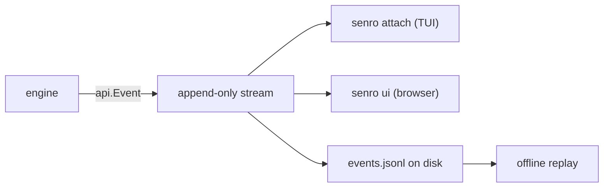

# The event stream

Every observable fact about a run is one `api.Event`, appended to an ordered, append-only stream.
This page covers the envelope, the event types senro sends today, and `Apply`, the function that
turns the stream into something a client can render. The types live in
[`github.com/xavidop/senro/api`](/docs/reference/api/).

Every view of a run reads this one stream:



## The envelope

```go
type Event struct {
	V       int             `json:"v"`
	Seq     uint64          `json:"seq"`
	TS      time.Time       `json:"ts"`
	Type    Type            `json:"type"`
	Run     string          `json:"run,omitempty"`
	Step    string          `json:"step,omitempty"`     // stable base ID, never "id@2"
	Attempt int             `json:"attempt,omitempty"`  // 0 when not step-scoped
	Group   string          `json:"group,omitempty"`    // expansion parent, for aggregation
	TraceID string          `json:"trace_id,omitempty"` // W3C trace, identical on every event
	Payload json.RawMessage `json:"payload,omitempty"`
}
```

The routing fields (`Type`, `Step`, `Attempt`, `Group`) sit outside `Payload` so you can filter
events without decoding the payload first. `(Event).Decode(v any)` unmarshals `Payload` into a
typed struct; it's safe to call even when there's no payload, so just call it every time.

### The trace

`TraceID` identifies the [W3C Trace Context](https://www.w3.org/TR/trace-context/) trace the run
belongs to: 32 lowercase hex characters, the same on every event of a run, and different for every
run.

If the run was started by a CI job or a webhook delivery that carried a `traceparent` header, the
run joins that job's trace instead of starting its own.

The span details live in the payloads, not in the envelope, because they change per event:

- `run.started` carries `span_id`, `parent_span_id`, `trace_flags` and `tracestate`.
- `step.started`, `step.finished` and the `handler.*` events carry their own `span_id` and
  `parent_span_id`.

The same trace context is also passed into every step's command as environment variables, so a
traced tool running inside a step joins the run's trace. See
[Writing a trace exporter](/docs/extend/exporter/) for how this turns into spans.

## Types sent today

All thirty-four, from `api.DeclaredTypes()`:

```
run.started              run.finished
plan.resolved            plan.expanded            plan.expansion_skipped
step.created             step.started             step.finished
step.retried             step.log.appended
cache.hit                cache.miss               cache.saved
cache.degraded
ws.snapshot              ws.restored              ws.evicted
binary.staged
secret.resolved          secret.redacted
control.applied          breakpoint.hit
handler.started          handler.succeeded        handler.failed
handler.superseded
shell.opened             shell.closed
notify.delivered         notify.failed            notify.dropped
analysis.proposed        analysis.applied         analysis.rejected
```

Some only show up in certain situations:

- **`notify.*`**: the outcome of one outbound notification. A run with no notifier configured
  emits none. See [Notifications](/docs/notifications/).
- **`cache.degraded`**: a **shared** cache stopped working (unreachable, bad credentials, or an
  unexpected response) and the run kept going anyway. It's not a failure or a miss, just slower
  than it should have been. See [Shared cache](/docs/data/shared-cache/).
- **`breakpoint.hit`**: fires once, when the scheduler first holds back a step that has a
  breakpoint set on it. It's the only way to tell "stopped on purpose" apart from "hung," since a
  held step never gets a `step.started` or `step.finished`. Clients show it as
  `StepState.Paused`. See [Control operations](/docs/attach/control-ops/).
- **`shell.opened` / `shell.closed`**: mark the start and end of an interactive session on a
  step's workspaces (`senro shell`, or the TUI's `s` key). See [The shell](/docs/attach/shell/).
- **`ws.evicted`**: a [persistent workspace](/docs/data/persistent/) was cleared out because it
  went unused past its `MaxAge`, or grew past its `MaxSize`. The event carries the measurement and
  which limit it hit.
- **`binary.staged`**: senro copied its own binary onto a target host so a
  [func step off the coordinator](/docs/executors/func-remote/) can run there. Its `reused` field
  tells you whether that copy was already there: on SSH, watch for `false` on every step, which
  means you're paying for a fresh transfer each time instead of once per host. On the container
  executor `reused` is always `true`, since the binary is mounted straight from the coordinator.

## Reserved names

`api.Type.Known()` also recognizes a few names reserved for future use:

```
plan.generated
client.attached          client.detached
```

These exist so that when the matching feature ships, adding the event is a compatible change for
existing clients rather than one they need to update for. `breakpoint.hit`, `shell.opened`,
`shell.closed` and `binary.staged` all went through this before their features landed.

> **Clients should ignore types they don't recognize.** A newer engine may emit event types this
> build has never seen. Skip them instead of erroring, so your client keeps working across
> versions.

## Turning events into `RunState`

```go
func (s *RunState) Apply(e Event) error
```

`Apply` takes each event, one at a time, and updates `RunState` with it: the run's status, every
step's state, every expansion, every handler. A renderer never has to replay the raw stream
itself; it just keeps calling `Apply`. Its rules:

- **A sequence number that goes backwards is an error**: `api: out-of-order event: seq 4 after 7`.
- **The same sequence number twice is fine.** If a client resumes one event early, replaying an
  event it already applied doesn't change anything.
- **A forward gap is accepted silently.** `Apply` doesn't detect missing events; check sequence
  numbers yourself if you need that.
- **An unknown `Type` is ignored**, and so is an unknown field inside a payload.
- **A malformed payload on a type `Apply` does recognize is an error**, not something it skips.

The same function backs every client: the attach server's own state, the terminal UI, offline
replay, and [the browser UI](/docs/attach/browser/). They all call `Apply`, so they can't disagree
about what a stream means.

## Attach is a different layer

This page covers the event stream: what's written to disk and turned into `RunState`. **Attach**
is the live protocol a second process uses to talk to a running engine: sending commands,
subscribing to events, and resuming a stream after a disconnect. See [Attach](/docs/attach/), and
[Step states](/docs/steps/states/) for what a step's final `State` means.
