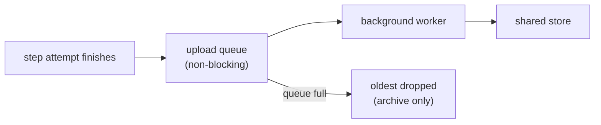

# Archiving a run

A CI runner is destroyed when its job ends, and your build's logs go with it. Archiving is what
gets them back. While the run is still going, senro uploads each step's output to the
[shared cache](/docs/data/shared-cache/), so you can pull the whole run down onto any machine
afterwards and read it exactly as if it had run there.

```sh
senro logs fetch 20260812T151058-540c8ca44b    # into ./runs/20260812T151058-540c8ca44b
senro attach --run 20260812T151058-540c8ca44b  # read it like any other run
```

There is nothing to configure. Archiving turns itself on whenever the shared cache is on, and
`senro logs fetch` reads the same `SENRO_REMOTE_CACHE` variables the original run used, so any
machine already set up for the shared cache can already fetch runs.

## What is uploaded, and when

- **Each step attempt's `stdout` and `stderr`, uploaded as that attempt finishes**, not at the end
  of the run. So a run that crashes or gets cancelled halfway through has already archived
  everything that completed.
- **The event ledger, `events.jsonl`, uploaded once at the end**, after it's sealed. This is the
  file the other logs depend on for meaning: which steps ran, how they ended, and where in each
  stream every write landed.
- **Handler output** (`OnFailure`, `Always`): usually the part someone actually needs, since it's
  the evidence of whether cleanup ran.
- **The logs a cached step replays**, so you can't tell from the archive alone which steps hit the
  cache. The ledger's `cache.hit` events tell you that instead.

## The write path never touches a step

A step's execution never waits on an upload: queuing one is a non-blocking handoff to a background
worker. If the upload queue fills up, the oldest uploads are dropped from the **archive**, never
from local disk, and the run reports this.



When the run ends, senro drains the queue with a bounded grace period (`CleanupGrace`, sixty
seconds by default). A job that can't exit because a store is slow is worse than a lost upload.

## When the store is unreachable

Just like the cache: **nothing fails**. The run's exit code describes the pipeline, never the
store. Logs stay on local disk, still stream live to anything attached, and still print to your CI
log. One `cache.degraded` event and one line on standard error tell you the archive didn't happen.
See
[When the store is unreachable](/docs/data/shared-cache/#when-the-store-is-unreachable).

> **Why not live logs?** Neither store supports appending. Live upload would mean either multipart
> uploads nobody can read until they're complete, or one object per chunk that the reader stitches
> back together, and either way, a store outage would sit inside every log line's write path. Live
> reading is already handled by the attach server streaming straight from the local file.

## Where it lands

Logs are stored content-addressed, like cached objects, with a small mutable pointer naming the
digest. In a bucket:

```
<prefix>/v1/cas/sha256/<aa>/<bb>/<hex>                     the bytes
<prefix>/v1/runs/<run-id>/logs/<step>/<attempt>/<stream>   the digest
<prefix>/v1/runs/<run-id>/events                           the ledger's digest
```

and in a registry, where every name is a tag with a restricted alphabet, so run and step ids are
hashed (see [what a tag costs](/docs/data/cache-stores/#what-a-tag-costs)):

```
senro-v1-sha256-<hex>          the bytes
senro-v1-log-sha256-<hex>      the digest
senro-v1-run-sha256-<hex>      the ledger's digest
```

Two runs that produce identical output store it once. A fetched log is verified against its digest
with the same code that verifies a cached object, so a truncated download or a substituted object
is refused rather than shown to you as if it were your build's real output.

## Reading a run back

What `senro logs fetch` writes is an **ordinary run directory**, so every tool senro has for reading
a run works on it. `DEST` defaults to `./runs/RUN`, the same path `senro attach --run` resolves on
its own, and the fetch prints the command to use once it's done.

- **Read permission is all it needs** (`s3:GetObject` on the prefix, or `pull` on the repository).
  Which streams to fetch comes from the ledger, never from listing the store. That matters more
  on a registry, since senro doesn't implement tag listing at all.
- **A stream the ledger names but the archive doesn't have is reported, not treated as an error.**
  An upload that never finished and one a lifecycle rule expired look the same from here, and the
  rest of the run is still worth having.
- **`DEST` is replaced, not merged into**, exactly as `senro ws pull`'s is. A non-empty destination
  is refused unless `--force`.
- **The exit code describes the fetch, never the archived run.** Fetching the record of a failed
  build is a success. `senro attach --run` turns that run's own outcome into an exit code.

The destination rules, refusals and the full exit code table are in
[`senro logs fetch`](/docs/cli/workspaces/).

## Retention

senro never deletes from a shared store, so expiry is the store's job, exactly as for the cache
itself. On a bucket that is a lifecycle rule:

```json
{ "Rules": [ { "ID": "expire-senro-cache", "Status": "Enabled",
               "Filter": { "Prefix": "senro/" }, "Expiration": { "Days": 30 } } ] }
```

If you archive to a bucket, consider a **longer expiry for the `runs/` prefix than for the cache**.
A stale cache entry is worthless, but the log of a build from six weeks ago might be exactly what
someone needs.

A registry can't express that split, since a tag namespace has no prefix a policy can filter on,
so pick the retention that the logs deserve. Registry retention is whatever the repository offers:
an age-based policy or a periodic sweep. This is the one place a bucket is meaningfully easier to
work with.

An expired log is simply missing when a fetch goes looking. The rest of the run still comes back.

## Where to go next

- **[Shared cache](/docs/data/shared-cache/)**: turning the store on, and how it degrades.
- **[Reading a failed run](/docs/run/debugging/)**: what to do with the run directory once you
  have it.
- **[Attach](/docs/attach/)**: reading a run live instead.
