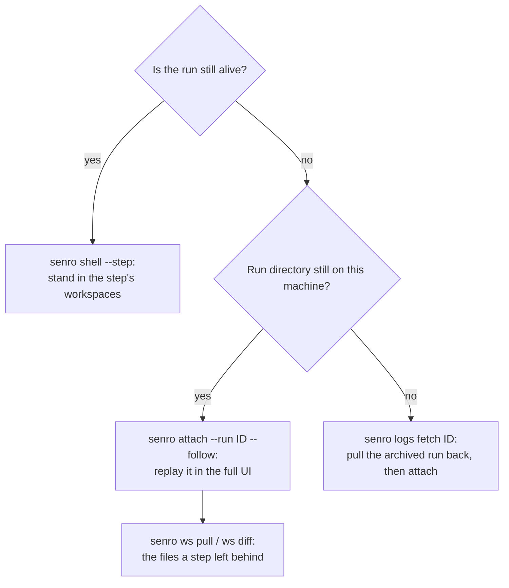

# Reading a failed run

A run that fails ends with one line and a pointer:

```
senro: run failed: step "boom" failed (exit 7); see runs/20260812T152953-84221d6cf4/events.jsonl
```

This page covers what to do next. The fastest fix is to reopen the finished run in the same UI:

```bash
senro attach --run 20260812T152953-84221d6cf4 --follow
```

## The run directory

Every run writes one directory: `runs/<id>`, **relative to the directory the pipeline process
started in**. `<id>` is a UTC timestamp plus a short random suffix. `senro.WithDir` and
`attach.Options.Dir` override the location; `senro.WithRunID` and `attach.Options.RunID` override
the ID.

```
runs/20260812T152953-84221d6cf4/
├── run.json              the run's manifest: id, pipeline name, start time, trigger.
│                         Written before the first event, readable mid-run via
│                         senro.ReadRunManifest. No parameter values, deliberately
├── events.jsonl          the timeline: one JSON object per line, append-only. Safe to
│                         grep, jq or tail -f. Everything below is derived from it
├── plan.json             every node's id, kind, command, workdir, needs and mounts as
│                         Build() resolved them: the command here is the command that ran
├── logs/
│   ├── greet/1/stdout    per step, then per attempt: the step's own output, byte for
│   ├── greet/1/stderr    byte, after redaction. Compiler errors and stack traces
│   ├── boom/1/stdout     live here
│   └── boom/1/stderr
├── work/                 each step's sandbox working directory, kept as the step left
│   ├── greet/1/          it. Local executor only. A handler gets its own under its
│   └── boom/1/           composite id (work/deploy%2Fon_failure%2Fcollect/1/); it
│                         shares its parent's workspaces read-only, never this directory
├── ws/                   workspaces the run materialized. Only for a run that declared one
└── cache/
    ├── scratch.json      scratch cache restore and save records; [] when none mounted
    └── <step>.json       one Pure() step's full cache key, plus whether it hit.
                          senro cache explain reads this for you
```

**`senro` never deletes a run directory.** It stays until you remove it yourself, so the evidence
is still there tomorrow. `senro cache gc` cleans up the *cache root* instead, a separate place, and
its `--keep-failed` flag protects a failed run's cached content there for a week.

Three things to know about `logs/<step>/<attempt>/`:

- **`<attempt>` starts at 1.** A retried step keeps every attempt (`logs/flaky/1/`, `2/`, `3/`), so
  you can compare the first failure against the last.
- **An expanded step's id is percent-encoded** to fit in one path segment: `lint[unit=apps/web]`
  writes to `logs/lint%5Bunit=apps%2Fweb%5D/1/`. Quote it in the shell.
- **Secrets are already redacted.** Every value `senro.WithSecrets` resolved gets replaced before
  it reaches the file, so these logs are safe to attach to a bug report. See
  [Secret channels](/docs/secrets/channels/).

## Finding the failing step

Read `events.jsonl` from the end. The last line is the verdict, whenever the run got far enough to
record one:

```bash
tail -1 runs/20260812T152953-84221d6cf4/events.jsonl
```

```json
{"v":1,"seq":15,"ts":"2026-08-12T15:29:53.636086Z","type":"run.finished","run":"20260812T152953-84221d6cf4","payload":{"status":"failed","steps":{"failed":1,"skipped_upstream_failed":1,"succeeded":1},"duration_ns":24948000}}
```

`status` is one of five values, worst first: `cancelled`, `failed`, `partial`,
`succeeded_with_recovery`, `succeeded`. See [Step states](/docs/steps/states/) for how steps roll
up into it. In this example, one step failed, one succeeded, and one was skipped because its
dependency failed.

To name the failing step, filter for `step.finished` events whose state is a real failure:

```bash
jq -r 'select(.type=="step.finished"
        and (.payload.state=="failed"
          or .payload.state=="timed_out"
          or .payload.state=="panicked"))
       | "\(.step)\t\(.payload.state)\texit \(.payload.exit_code)"' \
   runs/20260812T152953-84221d6cf4/events.jsonl
```

```
boom	failed	exit 7
```

Without `jq`, `grep '"type":"step.finished"' | grep '"state":"failed"'` gets you the same line. For
the whole timeline at a glance, use `jq -r '"\(.seq)\t\(.type)\t\(.step // "-")"'`. Three things to
know when reading this stream:

- **A `step.finished` with no `step.started` never ran.** Its state is `skipped_upstream_failed`,
  which rolls the run up to `partial` on its own, or `failed` if a step genuinely failed too.
- **A `step.finished` payload carries the whole verdict**, including a one-line `error` when there
  is one. A `Func` step that panics settles as `panicked`, message included:
  `{"state":"panicked","exit_code":1,"duration_ns":1623708,"error":"panic: assignment to entry in nil map"}`.
- **`step.log.appended` only records the offset and length** of bytes written, never the bytes
  themselves. Read the actual output from `logs/`: `cat runs/<id>/logs/boom/1/stderr`.

See [The event stream](/docs/run/event-stream/) for the envelope and every event type.

## Which tool, when

Reading files by hand is the fallback. Which tool to reach for depends on one question:



### Replaying it: `senro attach --follow`

`--follow` reads the run **straight from disk**, no socket or live process needed, so it works long
after the pipeline exited. You get the full UI, showing exactly what a live run would have shown.

- **`--follow` requires `--run`**, and **`--run <id>` resolves `runs/<id>` relative to your
  current directory.** Run it from where the pipeline ran.
- Without `--follow`, `senro attach --run <id>` looks for a live run with that ID first, and falls
  back to the recorded directory. Use plain `--run` while a run might still be alive, `--follow`
  once you know it's over.

See [The TUI](/docs/attach/tui/) and [Run and watch](/docs/cli/run/).

### Standing in it: `senro shell`

While a run is **still alive**, `senro shell --step build` opens a session inside that step's own
workspaces: read-only, at the same paths the step saw, on the step's own executor. Pair it with a
breakpoint (`b` in the TUI) to freeze the workspace while you look around. See
[The shell](/docs/attach/shell/).

Once the process has exited, there's no engine left to create a sandbox for you. Instead, use
[`senro ws pull`](/docs/cli/workspaces/) to write those same files out of the content store. `senro
ws diff RUN-A RUN-B src` shows you what changed in a workspace between two runs, file by file.

### Reading it after the machine is gone

A CI runner is destroyed when its job ends, taking `runs/<id>/` with it.
[`senro logs fetch <id>`](/docs/cli/workspaces/) brings it back as an ordinary run directory.

## Errors you will actually hit

Every message is what `senro` prints, verbatim, with where the fix is documented.

| Message | What it means |
|---|---|
| `plan: step "flaky" retry policy allows 1 attempt(s), want at least 2` | `Retry`'s first argument is the *total* number of attempts, not extra ones. "Run it again once" is `Retry(2, ...)`. See [Retries](/docs/steps/retries/) |
| `plan: dependency cycle: a -> b -> a` | Two steps depend on each other, directly or through a chain. The message prints the whole cycle. Nothing ran. See [Ordering](/docs/steps/ordering/) |
| `senro: no live senro runs found. Start one with 'senro run <pkg>', ...` | Bare `senro attach` found no live run. Either it already finished (use `--run <id> --follow`), or the pipeline never called `attach.Listen`. Exit code `2`. If several runs are listed instead, pick one with `--pid` or `--run` |
| `engine: step "publish" puts the value of secret "RegistryToken" in command argument 3` | A credential would have reached a place senro can't redact, so the run was refused before it started. There's no run directory to inspect. The same refusal applies to an env value, `WorkDir`, `Inputs`, `Outputs`, or a mount's name. See [Secrets](/docs/secrets/) |
| `engine: step "install" needs secret "NPMToken", which the struct passed to senro.WithSecrets does not provide (resolved: RegistryToken)` | `SecretEnv`'s **second** argument is a field name on your config struct, not the `source` tag. The message lists which fields did resolve |
| `1 cgo-dependent package(s) in .` | From `senro func check`. Whether this actually breaks anything depends on where your `Func` steps run: a step on the coordinator, or on a target with the same platform, is unaffected. See [A Func step off the coordinator](/docs/executors/func-remote/) |
| `senro: --ui=tui requires a terminal, but stdout is not a TTY.` | You asked for the TUI where there's no terminal. senro never falls back to something else silently, because escape sequences in a CI log would look like a run that worked when it didn't. See [CLI](/docs/cli/) |
| `senro run: no Go toolchain found on PATH` | `senro run` compiles your package first. Install Go, or build the binary yourself and run `./pipeline --tui`. A package that fails to compile stops the same way. Both exit `2`, not `1`, because nothing ran, so there's no run to have failed |
| `senro run: unknown flag "--help"` | Subcommands don't take the top-level `--help`. `senro help`, `-h`, and `--help` print the synopsis and exit `0`; anything else is exit `2`. There's no `senro version` |
| `dockerd: no container runtime socket found` | The container executor needs a compatible daemon running. The message lists every socket it tried, and how to point at one with `DOCKER_HOST`. See [Containers](/docs/executors/containers/) |

### A cache miss you did not expect

`senro cache explain --run <id> measure` compares the step's current cache key against the last
recorded one and names what changed. The first `MISS` for a step is expected, and it says so.
`workspace_digests` moving tells you a workspace changed, but not what changed in it; `senro ws
diff` answers that. See [Cache and verify](/docs/cli/cache/) and
[Cache keys](/docs/data/cache-keys/).

## Getting the same detail from Go

If you call `senro.Run` directly instead of using the CLI, the error it returns carries all of
this:

```go
var runErr *senro.RunError
if errors.As(err, &runErr) {
	log.Printf("%s: %d step(s) to blame, evidence in %s", runErr.Status, len(runErr.Steps), runErr.Dir)
}
```

`runErr.Steps` names up to three of them, each with `ID`, `State` and `ExitCode`. See
[Run options and outcomes](/docs/run/options/) for the full field list.

## Where to go next

- **[Step states](/docs/steps/states/)**: the ten step states and how a run's status rolls up.
- **[The event stream](/docs/run/event-stream/)**: the envelope, and folding a stream in
  your own code.
- **[CLI](/docs/cli/)**: every command and flag, and the exit-code contract.
