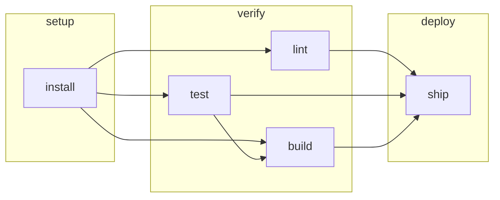

# Ordering

senro has two things called `Needs`, at two levels. They are different, and mixing them up is the
mistake this page exists to prevent.

| Call | Names | What it means |
|---|---|---|
| `(*senro.StepBuilder).Needs(ids ...string)` | **steps** | One edge: this step waits for those steps |
| `senro.Needs(names ...string)`, passed to `Workflow` | **workflows** | A barrier: every step of this workflow waits for every step of those workflows |

**Passing a step id to the workflow-level `Needs` is refused at `Build()`**, naming both the
workflow that asked and the name it asked for. A dangling step-level `Needs` is refused the same
way. Neither one is silently ignored.

```go
setup := p.Workflow("setup")
setup.Step("install", exec.Command("pnpm", "install", "--frozen-lockfile"))

verify := p.Workflow("verify", senro.Needs("setup"))     // a workflow name
verify.Step("lint", exec.Command("pnpm", "lint"))
verify.Step("test", exec.Command("pnpm", "test"))        // runs alongside lint
verify.Step("build", exec.Command("pnpm", "build")).Needs("test")   // a step id

deploy := p.Workflow("deploy", senro.Needs("verify"))
deploy.Step("ship", exec.Command("./deploy.sh"))
```



## A plan has no workflow layer

`Build()` lowers each workflow-level barrier onto step edges like the ones above. What runs is a
flat graph of steps, which is why step ids are unique across the whole pipeline.

Two consequences worth knowing:

- **Grouping is free.** A pipeline of one workflow builds into exactly the plan its steps alone
  describe, and moving steps between workflows does not change the plan's digest, which is what an
  action cache is keyed on.
- **Adding a workflow-level `Needs` is not free.** It adds real edges, so it does change the digest.

## `Needs` on a step

- **Multiple calls accumulate.** `Needs("a").Needs("b")` is `Needs("a", "b")`.
- **`Build()` rejects an id that doesn't exist**, before a single step runs.
- **Unrelated branches are not cancelled when one fails.** A failing step settles its dependents as
  `skipped_upstream_failed`; everything else runs to completion, so a failure produces one clear
  report instead of a half-explored graph. See [Step states](/docs/steps/states/).
- **`ContinueOnError()` on a step lets its dependents run anyway**, receiving whatever outputs it
  produced. See [Step settings](/docs/steps/settings/).

## What `Build()` refuses

| What you wrote | What `Build()` says |
|---|---|
| Two steps that need each other | `plan: dependency cycle: a -> b -> a` |
| The same step id in two workflows | `senro: step id "test" is declared in both workflow "build" and workflow "verify"; step ids are unique across the whole pipeline` |
| `Needs` naming a step that does not exist | The dangling id, named |
| `senro.Needs` naming something that is not a declared workflow | The asking workflow and the name it asked for |
| `Needs` on a handler | `plan: handler "notify" of step "s" must not declare Needs` |

## Ordering a fan-out

An expansion generates many steps at once, and has its own two shapes:

- **`(*ExpandBuilder).Needs(ids ...string)`** orders the whole fan-out after a step: every child
  waits. See [Fan-out](/docs/monorepo/fan-out/).
- **`(*ExpandBuilder).NeedsEach(expansions ...string)`** is one edge per unit, so
  `test[unit=api]` waits on `build[unit=api]` and nothing else. See
  [Per-unit edges](/docs/monorepo/needs-each/).

## Where to go next

- **[Step settings](/docs/steps/settings/)**: `ContinueOnError` and the rest of the builder.
- **[Step states](/docs/steps/states/)**: how a failure or a skip travels down the graph.
- **[Conditions](/docs/steps/conditions/)**: pruning branches of the graph at run start.
