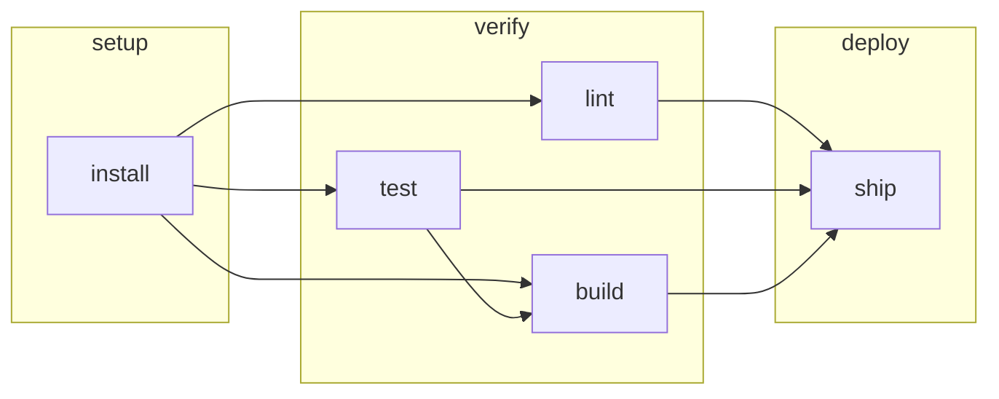

# Ordering

senro has two things called `Needs`, at two levels. They are different, and mixing them up is the
mistake this page exists to prevent.

| Call | Names | What it means |
|---|---|---|
| `(*senro.StepBuilder).Needs(ids ...string)` | **steps** | One edge: this step waits for those steps |
| `senro.Needs(names ...string)`, passed to `Workflow` | **workflows** | A barrier: every step of this workflow waits for every step of those workflows |

**Passing a step id to the workflow-level `Needs` is refused at `Build()`**, naming both the
workflow that asked and the name it asked for. A dangling step-level `Needs` is refused the same
way. Neither one is silently ignored.

```go
setup := p.Workflow("setup")
setup.Step("install", exec.Command("pnpm", "install", "--frozen-lockfile"))

verify := p.Workflow("verify", senro.Needs("setup"))     // a workflow name
verify.Step("lint", exec.Command("pnpm", "lint"))
verify.Step("test", exec.Command("pnpm", "test"))        // runs alongside lint
verify.Step("build", exec.Command("pnpm", "build")).Needs("test")   // a step id

deploy := p.Workflow("deploy", senro.Needs("verify"))
deploy.Step("ship", exec.Command("./deploy.sh"))
```



## Workflows disappear when you build

Workflows are for **you**, not for the engine. `Build()` turns every workflow-level barrier into
ordinary step edges and throws the grouping away. What actually runs is one flat graph of steps.

So this:

```go
setup := p.Workflow("setup")
setup.Step("install", ...)

verify := p.Workflow("verify", senro.Needs("setup"))
verify.Step("lint", ...)
verify.Step("test", ...)
```

builds into exactly the same plan as this:

```go
one := p.Workflow("everything")
one.Step("install", ...)
one.Step("lint", ...).Needs("install")
one.Step("test", ...).Needs("install")
```

Two things follow from that:

- **Reorganizing your workflows is free.** Moving a step from one workflow to another, splitting
  one workflow into three, or renaming them changes nothing about the plan, so nothing about its
  digest, so nothing about your [cache](/docs/data/caching/). Group them however reads best.
- **Adding a workflow-level `Needs` is not free.** It adds real edges between real steps, so it
  does change the plan and does invalidate cache entries downstream of it.

It is also why **step ids must be unique across the whole pipeline**: once the grouping is gone,
`verify`'s `test` and `build`'s `test` would be the same node.

## `Needs` on a step

- **Multiple calls accumulate.** `Needs("a").Needs("b")` is `Needs("a", "b")`.
- **`Build()` rejects an id that doesn't exist**, before a single step runs.
- **Unrelated branches are not cancelled when one fails.** A failing step settles its dependents as
  `skipped_upstream_failed`; everything else runs to completion, so a failure produces one clear
  report instead of a half-explored graph. See [Step states](/docs/steps/states/).
- **`ContinueOnError()` on a step lets its dependents run anyway**, receiving whatever outputs it
  produced. See [Step settings](/docs/steps/settings/).

## What `Build()` refuses

All five are caught before a single step runs.

**A cycle.** Two steps waiting for each other can never both start.

```go
verify.Step("a", ...).Needs("b")
verify.Step("b", ...).Needs("a")
// plan: dependency cycle: a -> b -> a
```

**A duplicate step id.** Because [workflows disappear](#workflows-disappear-when-you-build), two
steps called `test` are one node with two definitions.

```
senro: step id "test" is declared in both workflow "build" and workflow "verify";
step ids are unique across the whole pipeline
```

**A `Needs` naming a step that does not exist.** Usually a typo, and the error names the dangling
id. Silently ignoring it would mean the step runs immediately instead of waiting.

**`senro.Needs` naming something that is not a workflow.** The workflow-level `Needs` takes
**workflow names**; passing it a *step* id is the single most common mistake with this API:

```go
setup := p.Workflow("setup")
setup.Step("install", ...)

verify := p.Workflow("verify", senro.Needs("install"))   // "install" is a STEP, not a workflow
```

```
senro: workflow "verify" needs workflow "install", which pipeline "ci" does not declare.
senro.Needs names workflows, not steps; use (*senro.StepBuilder).Needs for a dependency on
a step
```

Write `senro.Needs("setup")` to wait for the whole workflow, or move the dependency down to the
step: `verify.Step("lint", ...).Needs("install")`.

**A `Needs` on a handler.** A [handler](/docs/steps/handlers/) is the cleanup or diagnostic step
you attach with `OnFailure` or `Always`. It is not a node in the graph: it runs when its parent
step settles, and nothing else can wait for it or be waited on by it. So there is nothing for a
`Needs` on one to mean:

```go
senro.Handler("notify", ...).Needs("build")
// plan: handler "notify" of step "s" must not declare Needs
```

## Ordering a fan-out

A **fan-out** (or expansion) is one `Expand` call that generates many steps at once, one per app,
module or package in your repository. It is the [monorepo](/docs/monorepo/) feature; skip this
section if you are not using it.

An expansion is one declaration but many steps, so it gets two ways to be ordered:

| | |
|---|---|
| `(*ExpandBuilder).Needs(ids...)` | The whole fan-out waits for those steps. Every generated child waits. See [Fan-out](/docs/monorepo/fan-out/). |
| `(*ExpandBuilder).NeedsEach(expansions...)` | One edge **per unit**: `test[unit=api]` waits on `build[unit=api]` and nothing else, so `api` can finish testing while `web` is still building. See [Per-unit edges](/docs/monorepo/needs-each/). |

## Where to go next

- **[Step settings](/docs/steps/settings/)**: `ContinueOnError` and the rest of the builder.
- **[Step states](/docs/steps/states/)**: how a failure or a skip travels down the graph.
- **[Conditions](/docs/steps/conditions/)**: pruning branches of the graph at run start.
