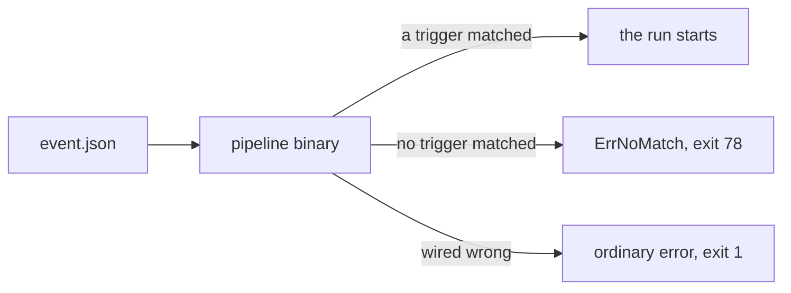

# Triggers

A push to `main` should run your pipeline. A push to somebody's feature branch should not.
`senro.WithTrigger` is how your pipeline binary decides for itself whether an event is its business.

## Gate a run on an event

```go
ev, err := trigger.LoadEvent(*eventPath)
if err != nil {
	return err
}

err = senro.Run(ctx, pipeline,
	senro.WithTrigger(ev,
		trigger.OnPush(trigger.Branches("main"), trigger.Paths("services/**")),
		trigger.OnPullRequest(trigger.Actions("opened", "synchronize")),
		trigger.OnTag(trigger.Semver(">=1.0.0")),
		trigger.OnSchedule("0 3 * * *", trigger.Params{"suite": "full"}),
	))

if errors.Is(err, trigger.ErrNoMatch) {
	os.Exit(78)
}
```

```sh
./pipeline --trigger-event event.json   # 0 if it matched, 78 if it did not
```

The binary is the matcher. Whatever dispatches runs hands it an event file and reads its exit code;
the dispatcher decides nothing, holds no configuration and remembers nothing. A complete, runnable
version is in [`examples/trigger`](https://github.com/xavidop/senro/tree/main/examples/trigger),
with sample events beside it, and [The event file](/docs/triggers/events/) says what to put in one.

> senro never reads `os.Args` and never exits. A library that inspects its host's argv surprises a
> host with flags of its own, so your `main` parses the flag and maps the sentinel error to an exit
> code. 78 is a convention, yours to choose.

## Three outcomes, never two

An event nobody wanted and an event nobody wired correctly must not look the same from outside.



| Outcome | What `Run` returns | Conventional exit code |
| --- | --- | --- |
| A trigger matched | whatever the run itself produced | 0, or 1 if the run failed |
| No trigger matched | `trigger.ErrNoMatch` | 78 (`EX_CONFIG`) |
| The wiring is wrong | an ordinary error | 1 |

The third row is the one worth understanding, because it is what keeps the second row honest:

- **No trigger matched** means the filters worked and the answer was no. This event is simply not
  one you asked to run for, such as a push to a branch other than `main`. `ErrNoMatch`'s message
  says why, one line per declared trigger — which kind it only answers, or which predicate
  rejected the event (`branches=[main]`, say) — so `os.Stderr` alone answers "why didn't this
  fire" without adding a flag or a second binary to run.
- **The wiring is wrong** means senro could not work out an answer at all, and refuses to report
  that as a no.

Two ways to land in the third row:

```go
trigger.OnTag(trigger.Semver("~>1.0"))
// error: Semver("~>1.0"): ...   "~>1.0" is not a constraint senro can parse, so there is
// nothing to compare a tag against. Write ">=1.0.0" or "^1.0.0".

trigger.OnPullRequest(trigger.Paths("services/**"))
// error: Paths was asked of a pull_request event that carries no changed-file list, so it can
// be neither true nor false. A GitHub pull_request payload does not include one; fetching it is
// a separate API call. Put the list in the event's "files" field if you have it.
```

senro could have called either one "no match" and exited 78. Then the pipeline would never run,
every event would look like a clean skip, and nobody would find out until someone asked why the
last release was never built. An ordinary error and exit 1 is loud on the first event instead.

**A no-match is genuinely inert.** No run directory, no `events.jsonl`, no partial state. `Run`
decides before it has opened the cache or started a goroutine, so being fired for every push to
every branch costs a process start and nothing else.

## Declare what you run for

```go
func OnPush(opts ...Option) Trigger
func OnPullRequest(opts ...Option) Trigger
func OnTag(opts ...Option) Trigger
func OnSchedule(cron string, opts ...Option) Trigger
func OnManual(opts ...Option) Trigger
```

Triggers are tried in declaration order and the first match wins. With no options, a trigger
matches every event of its kind.

`OnSchedule` matches the event that says "this is the 03:00 run". **senro grows no scheduler**:
something outside it still starts the binary at 03:00.

The cron string is compared to the event's own as text, whitespace normalised, which is what two
crontab lines pointing at one binary need to select different work. senro does not parse cron, so
`0 3 * * *` and `0 3 * * 0-6` are not equal.

### Matchers

- **`Branches(patterns...)`**: the branch. On a pull request this is the **base** branch, not the
  head, the same question GitHub Actions' `branches:` filter answers.
- **`Paths(patterns...)`**: the event's changed-file list. See below.
- **`Actions(names...)`**: a pull request's action, by exact name. `"synchronize"` fires when an
  open pull request gets new commits, so you usually want it alongside `"opened"`.
- **`Semver(constraint)`**: a tag that is a semantic version satisfying the constraint.
- **`Params{...}`**: not a filter. Parameters a matched trigger contributes to the run.
- **`Matcher{...}`**: a question of your own. See
  [Writing a trigger source](/docs/triggers/custom/).

`Branches` and `Paths` use senro's one glob syntax, the same one workspace excludes and `Inputs`
use: `*` and `?` match within a path segment, `**` spans segments, and a pattern with no `/` is the
whole name. So `main` is not `feat/main`, `release/*` is `release/1.0` but not `release/1.0/hotfix`,
and `feat/**` is everything under `feat/`.

Asking a matcher of a kind that has no answer is an error: a tag has no branch, so
`OnTag(Branches("main"))` is refused rather than left to never match.

### Semver

`trigger.Semver(">=1.0.0 <2.0.0")` takes comparisons separated by spaces or commas, all of which
must hold. The operators are `>=`, `<=`, `>`, `<`, `!=`, `=` and `==`; a bare version means `=`. A
leading `v` is accepted; everything else follows semver 2.0.0, including no leading zeros.

- **A tag that is not a version is not a match, and is never read as zero.** `release-2024`,
  `latest` and `""` are rejected: that is the difference between ignoring a docs tag and deploying
  version 0.0.0 from it.
- Prereleases order the way semver says, so `1.0.0-rc.1` is **below** `1.0.0` and `Semver(">=1.0.0")`
  does not match a release candidate. There is no separate "exclude prereleases" rule on top.

### `Paths` is not an affected set

`Paths` filters on the event's own changed-file list, supplied by the provider. It never looks at
the working tree, which is what lets it run before a checkout exists.

It is **not** a replacement for an [affected set](/docs/monorepo/affected/). A path filter is cheap
and avoids starting a run at all, but cannot tell that a change to a shared library breaks a
service containing none of the changed files. An affected set is precise and narrows a run already
started.

An event whose provider supplied no changed-file list is an **error**, not a no-match, per
[provider](/docs/triggers/events/).

## What a match carries into the run

Two things, the two an [affected set](/docs/monorepo/affected/) is computed from:

- **The mode**: `all` or `affected`. A pull request is `affected`; a push to the default branch, a
  tag and a scheduled run are `all`; any other push is `affected`.
- **The base**: what to diff against and what to diff. A push supplies its `before` and `after`; a
  pull request supplies its base and head commits. A tag and a schedule supply neither.

`change.FromTrigger(ev)` reads these two and hands them to an expansion's `Affected`. They land in
the run's manifest, not in parameters, and nothing here resolves a ref or computes a merge base: a
trigger reports what the event said.

The matched trigger's `Params`, laid over the event's own, become the run's
[parameters](/docs/steps/conditions/), read by a condition such as
`senro.ParamIs("suite", "full")`. The event's branch becomes the `branch` parameter `senro.Branch`
reads. `senro.WithParams` wins over both, so you can override a trigger without editing it.

## Provenance: `runs/<id>/run.json`

Every run writes a manifest beside its ledger, before its first event, saying what triggered it:

```json
"trigger": {
  "kind": "push", "provider": "github", "repo": "acme/app",
  "ref": "refs/heads/main", "branch": "main", "mode": "all",
  "matched": "push(branches=[main], paths=[services/**])",
  "base": {"from": "737d38c5...", "to": "fd489864..."}, "files": 2
}
```

Read it with `senro.ReadRunManifest("runs/<id>")`. A run nobody triggered still gets a manifest,
with no `trigger` field, so a reader never has to ask whether this run happens to have one.

> **The manifest carries no parameter values.** `senro.WithParams` promises that a parameter value
> lands in nothing durable, and this file is durable with no redactor in front of it. `files` is a
> count for the same reason, and is `-1` when the provider supplied no list.

## Through the CLI

`senro run ./ci --trigger-event event.json` **forwards** the flag to the pipeline binary it builds
and propagates that binary's exit code; the pipeline is the matcher. On a 78 it adds one line of
explanation, because a bare exit 78 with no output reads like a crash.

This assumes your pipeline accepts `--trigger-event`, the convention `examples/trigger`
establishes; if yours spells it differently, pass it yourself after `--`. See
[`senro run`](/docs/cli/run/).

## Wire a dispatcher

A dispatcher is a lock and an exec: take a per-repository lock (`flock` will do), write the event
file, start the binary, read `$?`. senro ships one in
[`contrib/dispatcher`](https://github.com/xavidop/senro/tree/main/contrib/dispatcher), which is
that plus an HMAC check in front:

```sh
dispatcher -addr :8080 -secret-file /etc/senro/webhook-secret \
           -pipeline ./ci -group ci-main
```

- A delivery arriving while another holds the group is **rejected with a reason**, not buffered:
  concurrency is a lock, never a queue. `-cancel-in-progress` is the other honest answer, and still
  not a queue, since the displaced run is gone rather than deferred.
- `-namespace` makes the lock a `coordination.k8s.io` `Lease` instead of a file, so several
  replicas exclude each other.
- It stays deliberately small, with a standing size limit, because buffering is the first feature
  of a CI platform and senro is not becoming one.

## Where to go next

- **[Run it as a server](/docs/triggers/server/)**: your pipeline binary as the webhook endpoint,
  with no event file in between.
- **[The event file](/docs/triggers/events/)**: the envelope, the providers and their traps.
- **[Writing a trigger source](/docs/triggers/custom/)**: a provider and a matcher of your own.
- **[Affected sets](/docs/monorepo/affected/)**: what consumes the mode and base a match carries.
